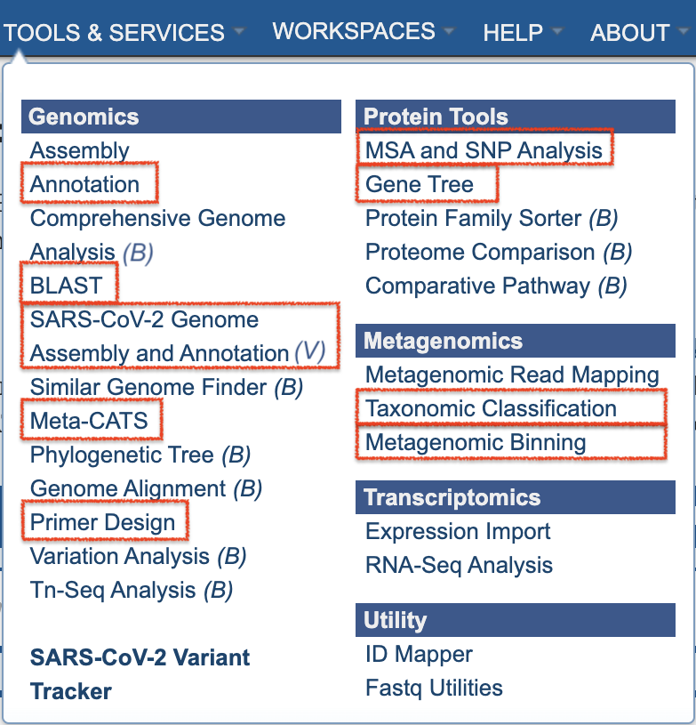

# BV-BRC Data and Functionality Overview 
## (A Guide for PATRIC Users)

BV-BRC has been developed by starting with the legacy PATRIC data, tools, services, website, and infrastructure, and augmenting it with integrated viral data, tools, and features from the legacy IRD (influenza) and ViPR (other pathgenic viruses) BRCs. PATRIC users Will be able to do all of the same searches, analyses, workspace that they have used at PATRIC. In BV-BRC, there are additional data, tools, and services at their disposal for more comprehensive review and analyses. A few changes in website layout and terminology have been made to assist IRD/ViPR users in make the transition to BV-BRC. Summaries of the changes in BV-BRC with respect to PATRIC are presented below. 

## Data 

### Organisms

In addition to bacterial pathogens and other bacterial and archaeal species (as in PATRIC), BV-BRC includes viral genomes and other data for influenza and other pathogenic viruses. The ORGANISMS top menu reflects these new options (see below). Website pages, searches, services, and tools can also access, display, and use these data. 

As in PATRIC, eukaryotic host genomes are included as well. 

### Genomes

Bacterial genomes (~500K annotated bacterial genomes and associated data) have been augmented with a comparable volume of **viral genomes** (~5M viral genomes and associated data). Many of the viral genomes have **additional metadata attributes**, which have be been added to the overall set of genome metadata fields. A summary of available genome metadata fields and how to access them is available in the [Genome Metadata Quick Reference Guide](../quick_references/organisms_taxon/genome_metadata.html).

In response to the COVID epidemic, a custom resource for tracking associated genomic variants and lineages of concern (VoCs/LoCs) has been created and is available in BV-BRC at [SARS-CoV-2 Variants and Lineages of Concern](https://bv-brc.org/view/VariantLineage/#view_tab=overview).

### Other Data

Along with the viral genomes, corresponding **genes/proteins**, **protein domains and motifs**, and **protein structure** data have been integrated with the bacterial data.

The viral data brings with it two unique data types, not formerly available in PATRIC: **surveillance** and **serology**. Information regarding these data types is available from the following user documentation:

* [Surveillance Data Quick Reference Guide](../quick_references/organisms_taxon/surveillance_data.html)

* [Serology Data Quick Reference Guide](../quick_references/organisms_taxon/serology_data.html)

## Tools and Services

Analysis tools from IRD/ViPR have been integrated with the PATRIC bacterial analysis service infrastructure. Where practical, complementary tools from both resources have been merged into one, or the tool has been extended (if necessary) to support the other data type. These are available from the TOOLS & SERVICES TOP menu, shown below. The letter "B" or "V" beside the service name indicates that the service is only available for bacterial *(B)* or viral *(V)* data.

Summaries for the new and extended tools and services are below, with links to corresponding quick reference guides and tutorials: 

* **Genome Annotation** - extended to support annotation of viral genomes.
   *  [Genome Annotation Service Quick Reference Guide](../quick_references/services/genome_annotation_service.html)
   *  [Genome Annotation Service Tutorial](../tutorial/genome_annotation/genome_annotation.html)

* **BLAST (Homology Search)** - extended to include viral sequences and short sequence search/
   * 

* 