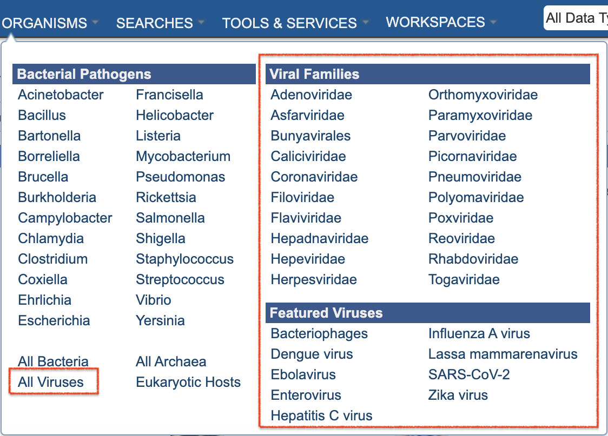

# BV-BRC Data and Functionality Overview 
## (A Guide for PATRIC Users)

BV-BRC has been developed by starting with the legacy PATRIC data, tools, services, website, and infrastructure, and augmenting it with integrated viral data, tools, and features from the legacy IRD (influenza) and ViPR (other pathgenic viruses) BRCs. PATRIC users Will be able to do all of the same searches, analyses, workspace that they have used at PATRIC. In BV-BRC, there are additional data, tools, and services at their disposal for more comprehensive review and analyses. A few changes in website layout and terminology have been made to assist IRD/ViPR users in make the transition to BV-BRC. Summaries of the changes in BV-BRC with respect to PATRIC are presented below. 

## Data 

### Organisms

In addition to bacterial pathogens and other bacterial and archaeal species (as in PATRIC), BV-BRC includes viral genomes and other data for influenza and other pathogenic viruses. The ORGANISMS top menu option reflects these new options (see below). Website pages, searches, services, and tools can also access, display, and use these data. 

As in PATRIC, eukaryotic host genomes are included as well. 

### Genomes

Bacterial genomes (~500K annotated bacterial genomes and associated data) have been augmented with a comparable volume of viral genomes (~5M viral genomes and associated data). Many of the viral genomes have additional metadata fields, which have be been added to the overall set. A summary of available genome metadata fields and how to access them is available in the [Genome Metadata](../quick_references/organisms_taxon/genome_metadata.html) quick reference guide.

### Other Data

## Tools and Services

 