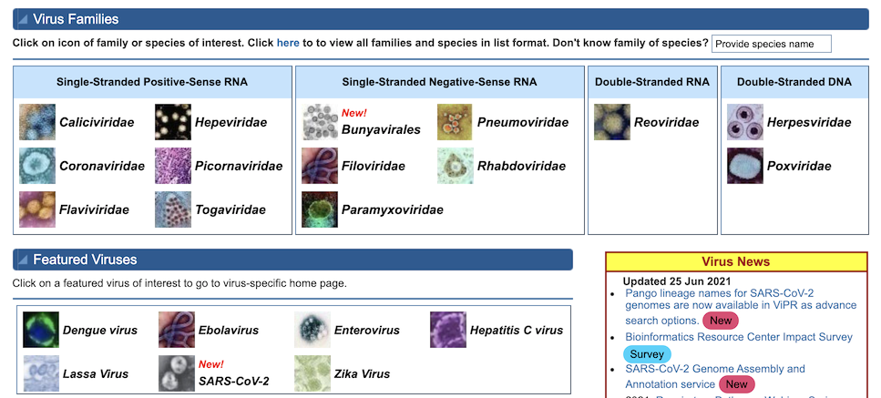
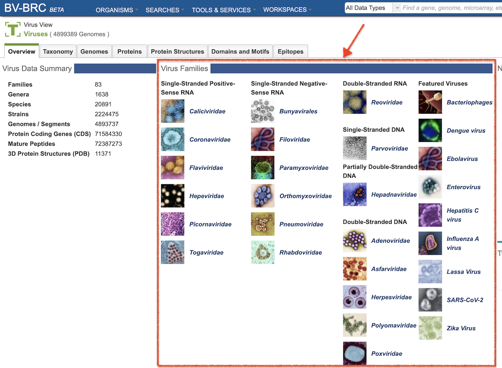
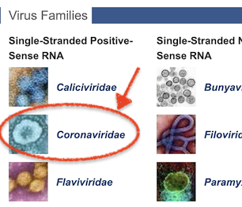
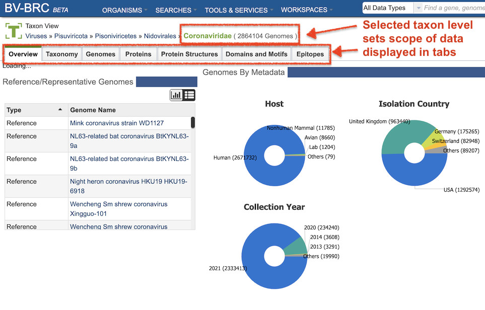
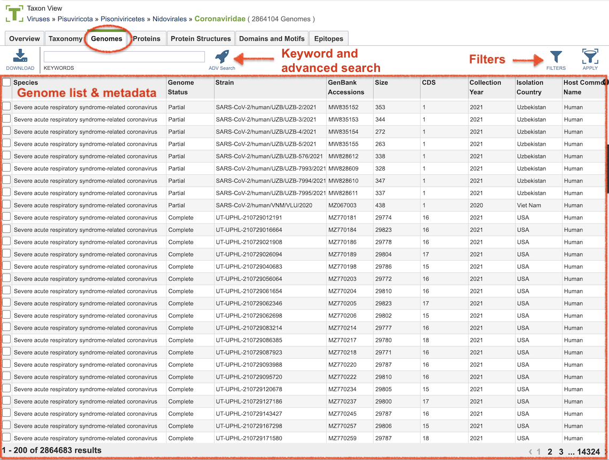

# IRD/ViPR to BV-BRC Mapping of Features and Terminology
## Guide for IRD/ViPR Users

BV-BRC integrates key IRD and ViPR viral data and tools with bacterial data and tools from PATRIC. The BV-BRC system is built on the PATRIC system infrastructure (database, services, and website). As a result, the interfaces for accessing and using data and tools differ substantially from IRD and ViPR. To aid researchers in making this transition, the table below provides a mapping of IRD and ViPR features to the corresponding BV-BRC features. Links to relevant BV-BRC help documentation are provided as well.

* [Viral Genomes and Other Data](#data)
* [Searches](#searches)
* [Viral Analysis Tools](#tools)
* [Workbench](#workbench)

Additional details are presented below. 

## Data

As in ViPR, viral data in BV-BRC are organized by families, with additional links to subsets of featured viruses including Influenza A (focus of IRD), Dengue, Ebolavirus, Enterovirus, Hepatitis C, Lassa mammarenavirus, SARS-CoV-2, Zika, and bacteriophages.

In **ViPR**, users can directly access viral data by family by clicking the appropriate link in the middle of the [ViPR Homepage](https://www.viprbrc.org/brc/home.spg?decorator=vipr) homepage. (The [IRD homepage](https://www.fludb.org/brc/home.spg?decorator=influenza) is already scoped to Influenza.) 

**ViPR Homepage:**

**BV-BRC** provides a landing page with access to viral data at the same levels. It can be reached by clicking the VIRUSES button on the [BV-BRC homepage](https://bv-brc.org/): 

**BV-BRC Homepage:**

This will display the [BV-BRC Viruses landing page](https://beta.bv-brc.org/view/Virus/10239):

**BV-BRC Viruses Landing Page:**

Clicking on one of these links (e.g., "Coronaviridae") will display the corresponding viral data in BV-BRC, scoped to that viral family or subset. 

The **Data Tabs** (Overview, Taxonomy, Genomes, Proteins, Protein Structures, Domains and Motifs, Epitopes, etc.)  will be similarly scoped to the selected taxon as well. 

Clicking on the tabs (e.g., "Genomes") will display a list of all of the data and associated metadata of that type in BV-BRC for the selected Taxon. Keyword Search, Advanced Search, and Filter tools are available to refine the list. Also, the metadata columns can be resized, rearranged, added, removed, and sorted. 

Detailed instructions for using the Taxon-level data pages is available from the [BV-BRC Organisms Quick Reference Guide](../quick_references/organisms_menu.html).

## Searches

<table style="width:100%">
  <tr>
    <th style="width:40%">IRD/ViPR</th>
    <th style="width:40%">BV-BRC</th>
    <th style="width:20%">Documentation</th>
  </tr>
 <tr>
    <td>
      <a href="https://www.fludb.org/brc/search_landing.spg?decorator=influenza">Quick Search</a> (upper right)
    </td>
    <td><a href="https://beta.bv-brc.org/view/Taxonomy/10239">Global Search</a> (top right)</td>
    <td><a href="../quick_references/global_search.html">Quick Reference</a></td>
  </tr>
  <tr>
    <td>
      <a href="https://www.fludb.org/brc/influenza_sequence_search_segment_display.spg?method=ShowCleanSearch&decorator=influenza">Nucleotide Search (IRD)</a> 
      <a href="https://www.fludb.org/brc/influenza_sequence_search_segment_display.spg?method=ShowCleanSearch&decorator=influenza">Genome Search (ViPR)</a>
    </td>
    <td><a href="https://beta.bv-brc.org/searches/GenomeSearch">Genome Search</a></td>
    <td></td>
  </tr>
  <tr>
    <td>
      <a href="https://www.fludb.org/brc/influenza_surveillanceRecord_search.spg?method=ShowCleanSearch&decorator=influenza">Animal Surveillance Search (IRD)</a> 
      <a href="https://www.fludb.org/brc/influenza_humanSurveillanceData_search.spg?method=ShowCleanSearch&decorator=influenza">Human Surveillance Records (IRD)</a>
    </td>
    <td><a href="https://beta.bv-brc.org/searches/SurveillanceSearch">Surveillance Search</a></td>
    <td></td>
  </tr>
  <tr>
    <td><a href="https://www.fludb.org/brc/influenza_surveillanceRecord_search.spg?method=ShowCleanSearch&decorator=influenza">3-D Protein Structure Search</a></td>
    <td><a href="https://beta.bv-brc.org/searches/ProteinStructureSearch">Protein Structure Search</a></td>
    <td></td>
  </tr>
  <! --- Insert Anti-Viral Drugs Search when available --->
  <tr>
    <td><a href="https://www.fludb.org/brc/serology_experiment_search.spg?method=ShowCleanSearch&decorator=influenza">Serology Experiment Search (IRD)</a></td>
    <td><a href="https://beta.bv-brc.org/searches/SerologySearch">Serology Search</a></td>
    <td></td>
  </tr>
  <tr>
    <td><a href="https://www.fludb.org/brc/hostFactorExperiments.spg?method=SubmitForm&decorator=influenza&navRoot=true">Host Factor Experiments</a></td>
    <td></td>
    <td></td>
  </tr>
  <tr>
    <td><a href="https://www.fludb.org/brc/influenza_epitope_search.spg?method=ShowCleanSearch&decorator=influenza">Immune Epitope Search</a></td>
    <td><a href="https://beta.bv-brc.org/searches/EpitopeSearch">Epitope Search</a></td>
    <td></td>
  </tr>
  <! --- Insert Phenotypes Search if/when available --->
  <! --- Insert PCR Primer Probe Search if/when available --->
  <! --- Insert Sequence Feature Variant Type Search if/when available --->
  <! --- Insert Human Clinical Studies Search if/when available --->
  <! --- Insert ORFeome Plasmid Data Search if/when available --->
  <tr>
    <td><a href="https://www.viprbrc.org/brc/vipr_virusDomain_search.spg?method=ShowCleanSearch&decorator=corona">Protein Domains Search</a></td>
    <td><a href="https://beta.bv-brc.org/searches/ProteinFeatureSearch">Domain and Motif Search</a></td>
    <td></td>
  </tr>
</table>

## Analysis Tools

<table style="width:100%">
  <tr>
    <th style="width:40%">IRD/ViPR</th>
    <th style="width:40%">BV-BRC</th>
    <th style="width:20%">Documentation</th>
  </tr>
  <tr>
    <td>
      <a href="https://www.fludb.org/brc/blast.spg?method=ShowCleanInputPage&decorator=influenza">Identify Similar Sequences (BLAST)</a> 
      <a href="https://www.fludb.org/brc/sssearch.spg?method=ShowCleanInputPage&decorator=influenza&preSelectDB=true">Identify Short Peptides in Proteins</a>
    </td>
    <td><a href="https://beta.bv-brc.org/app/Homology">BLAST (Homology)</a></td>
    <td>
      <a href="../quick_references/services/blast.html">Quick Reference</a> 
      <a href="../tutorial/blast/blast.html">Tutorial</a>
    </td>  
  </tr>
  <tr>
    <td><a href="https://www.fludb.org/brc/tree.spg?method=ShowCleanInputPage&decorator=influenza">Generate Phylogenetic Tree</a></td>
    <td><a href="">Phylogenetic Tree (Gene Tree)</a></td>
    <td>
      <a href="../quick_references/services/genetree.html">Quick Reference</a> 
      <a href="../tutorial/genetree/genetree.html">Tutorial</a>
    </td>  
  </tr>
  <tr>
    <td>
      <a href="https://www.fludb.org/brc/msa.spg?method=ShowCleanInputPage&decorator=influenza">Align Sequences (MSA)</a> 
      <a href="https://www.fludb.org/brc/snpAnalysis.spg?method=ShowCleanInputPage&decorator=influenza">Analyze Sequence Variation</a> 
      <a href="https://www.fludb.org/brc/jalviewUsingFasta.spg?method=ShowCleanInputPage&decorator=influenza">Visualize Aligned Sequences</a>
    </td>
    <td><a href="https://beta.bv-brc.org/app/MSA">MSA and SNP Analysis</a></td>
    <td>
      <a href="../quick_references/services/msa_snp_variation_service.html">Quick Reference</a> 
      <a href="../tutorial/msa_snp_variation/msa_snp_variation.html">Tutorial</a>
    </td>  
  </tr>
  <tr>
    <td><a href="https://www.viprbrc.org/brc/vigorAnnotator.spg?method=ShowCleanInputPage&decorator=corona">Genome Annotation (VIGOR4)</a></td>
    <td><a href="https://beta.bv-brc.org/app/Annotation">Genome Annotation</a></td>
    <td>
      <a href="../quick_references/services/genome_annotation_service.html">Quick Reference</a> 
      <a href="../tutorial/genome_annotation/genome_annotation.html">Tutorial</a>
    </td>  
  </tr>
  <tr>
    <td><a href="https://www.fludb.org/brc/mgc.spg?method=ShowCleanInputPage&selectionContext={selectionContext}&decorator=influenza">Metadata-driven Comparative Analysis Tool (Meta-CATS)</a></td>
    <td><a href="https://beta.bv-brc.org/app/MetaCATS">Metadata-driven Comparative Analysis Tool (Meta-CATS)</a></td>
    <td>
      <a href="../quick_references/services/metacats.html">Quick Reference</a> 
      <a href="../tutorial/metacats/metacats.html">Tutorial</a>
    </td>  
  </tr>
  <tr>
    <td><a href="https://www.fludb.org/brc/primer3.spg?method=ShowCleanInputPage&decorator=influenza">Polymerase Chain Reaction (PCR) Primer Design</a></td>
    <td><a href="https://beta.bv-brc.org/app/PrimerDesign">Primer Design</a></td>
    <td>
      <a href="../quick_references/services/primer_design_service.html">Quick Reference</a> 
      <a href="../tutorial/primer_design/primer_design.html">Tutorial</a>
    </td>  
  </tr>
</table>  

## Workbench

<table style="width:100%">
  <tr>
    <th style="width:40%">IRD/ViPR</th>
    <th style="width:40%">BV-BRC</th>
    <th style="width:20%">Documentation</th>
  </tr>  
  <tr>
    <td></td>
    <td></td>
    <td></td>
  </tr>
  <tr>
    <td></td>
    <td></td>
    <td></td>
  </tr>
  <tr>
    <td></td>
    <td></td>
    <td></td>
  </tr>
  <tr>
    <td></td>
    <td></td>
    <td></td>
  </tr>
  <tr>
    <td></td>
    <td></td>
    <td></td>
  </tr>
</table>