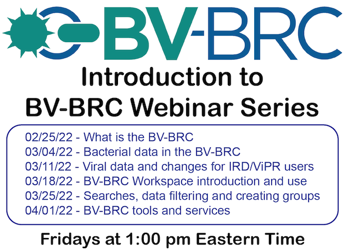

:github_url: https://github.com/BV-BRC/bvbrc_docs/blob/master/docroot/news/2022/20220223-bv-brc-intro-webinars.rst

Introduction to BV-BRC Webinar Series
=====================================

.. feed-entry::
   :date: 2022-02-23

As part of the launch of the new BV-BRC Beta website, we are offering a webinar series to help new users, as well as PATRIC and IRD/ViPR users, become acquainted with the new website. 

.. cut::

The first set of webinars will be focused on introduction to the site. We will have follow-on webinars that dive more deeply into functionality and analysis tools. The link below provides additional details and Zoom information.

`CLICK HERE to go to webinar series details page <../../webinar/bv-brc_intro.html>`_
