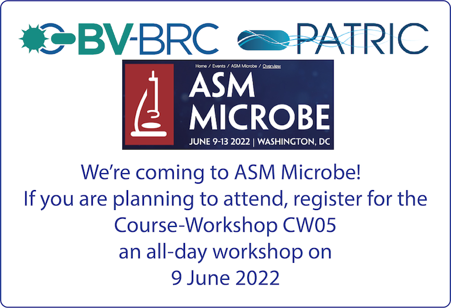

:github_url: https://github.com/BV-BRC/bvbrc_docs/blob/master/docroot/news/2022/20220422-bv-brc-workshop-asm-microbe.rst

BV-BRC (PATRIC) Workshop at ASM Microbe
=======================================

.. feed-entry::
   :date: 2022-04-22

BV-BRC is presenting a workshop on June 9 at ASM Microbe 2022 in Washington, DC entitled, **Genomic, Transcriptomic and Metagenomic Analysis of Bacterial Data in the BV-BRC (aka PATRIC)**. 

.. cut::

The 1-day workshop (8:00am - 4:00pm) will include hands-on training designed to teach you to how to do the following in BV-BRC:

* Examine read quality
* Assemble a genome
* Annotate a genome
* Generate a genome alignment
* Build a phylogentic tree
* Analyze RNA-Seq data
* Analyze SNPs
* Analyze metagenomic samples to classify the organisms present and extract whole genome data from mixed read samples

Additional Instructors will be present to help individuals as needed. 

`Full workshop description (Course CW05) <https://www.abstractsonline.com/pp8/#!/10522/session/54>`_
----------------------------------------------------------------------------------------------------

`ASM Microbe 2022 information page <https://asm.org/Events/ASM-Microbe/Home>`_
==============================================================================