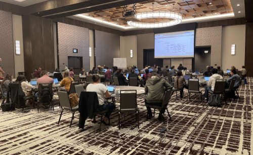

BV-BRC/PATRIC Workshop at Argonne National Laboratory, July 19-21, 2022
========================================================================

.. feed-entry::
   :date: 2019-02-06

The BV-BRC team will be offering a Bioinformatics Workshop on July 19-21, 2022, at Argonne National Laboratory in the suburbs of Chicago, IL. The workshop will show researchers how to use the new BV-BRC website, which is a merger of the two long running bacterial and viral BRC resources, PATRIC and IRD/ViPR, respectively. The workshop will consist of interactive hands-on training sessions, during which researchers will learn how to search for public datasets of interest and perform genomic, comparative genomic, metagenomic, and transcriptomic analysis using various analysis services and tools at BV-BRC. The workshop will have interactive hand-on training sessions, with third day devoted to users working with their own data and analysis problems with the help from the BV-BRC team members.  

.. cut::

The workshop will be limited to 40 people on a first-come, first-served basis. There is no fee for the workshop, but participants are responsible for their own travel expenses, accommodation, and meals. 

If you wish to participate, please fill out the “Argonne Visitor Request” form at: https://apps.anl.gov/registration/visitors as soon as possible — especially non-U.S. Citizens, since they will take additional time to be cleared. Please enter Lisa Hundley, lhundley@anl.gov, for the “Sponsor’s E-mail Address.”

After you have completed registration, please send a mail to Lisa Hundley ( lhundley@anl.gov ) to confirm your registration.

**Note:** Please note the COVID-19 restrictions and safety guidance currently in place at the Argonne National Laboratory.
* All visitors must be fully vaccinated or provide accepted proof of negative COVID-19 test results that are less than 72 hours old. 
* Face coverings are required, except to the extent necessary to eat or drink when maintaining appropriate physical distance, or when an individual is isolated in an enclosed space.
* We will keep the desks at least 6 feet apart from each other at the workshop venue to maintain safe physical distance.   
* There are outdoor seating areas with gazebos, which can be used during breaks and lunch time. Face coverings may be removed while outside and socially distancing.   

**LOCATION**

| Building 240 Conference Center - Room 1416
| Argonne National Laboratory
| 9700 Cass Avenue
| Lemont, IL 60439

**AGENDA**

Day 1 - Tuesday, July 19
::

   9:00 am   Argonne information, BV-BRC registration, Overview (www.bv-brc.org)           

   9:30 am   FASTQ Utilities
              * Desription of FASTQ files and service 
              * Selecting pipeline (Trim, FastQC, Paired read, Align)
              * Uploading reads and submitting job
              * Viewing and interpreting results

  10:30 am   Taxonomic Classification
              * Description of Kraken2
              * Uploading reads or contigs and submitting job
              * Saving classified or unclassified sequences
              * Viewing and Interpreting the results

  11:00 am   Break

  11:15 am   Comprehensive Genome Analysis Service
              * Description of assembly and annotation algorithms
              * Uploading reads or contigs and submitting job
              * Viewing and interpreting results
  
  12:00 pm   Lunch

   1:00 pm   Metagenomic Binning
              * Description of algorigthm
              * Uploading reads or contigs and submitting the job
              * Viewing and interpreting the results

   1:45 pm   Similar Genome Finder Service
              * Description of MASH/MinHash
              * Uploading genome sequences, reads or contigs
              * Submitting job
              * Viewing  and interpreting results

   2:00 pm   Break

   2:15 pm   Phylogenetic Tree Building Service
              * Creating a genome group
              * Determining if selected genomes are “treeable”
              * Description of algorithm and submitting tree-building job
              *	Viewing and interpreting results
              *	Newick file download 

   3:00 pm   Protein Family Sorter
              *	Description of PATRIC protein families and job submission
              *	Finding the pan, core and accessory genomes 
              *	Visualizing and manipulating the heatmap viewer 
              *	Finding specific differences, downloading and saving results into private workspace

   3:45 pm   Proteomic Comparison
              *	Selecting genomes for a study
              *	Visualization of compared genomes
              *	Download and analysis of results

   4:30 pm   Question and Answer Session and Hands on Work

   5:00 pm   Day 1 Adjourn

Day 2 - Wednesday, July 20

::

   9:00 am   Review of Day 1

   9:15 am   Metagenomic Read Mapping service
              * Uploading reads
              * Description of CARD and VFDB
              *	Submitting the job
              *	Interpreting the results

   9:45 am   Comparative Pathways Viewer
              *	Genome selection and job selection
              *	Comparing pathways on pathway map and heatmap
              *	Finding specific differences, downloading and saving results into private workspace

  10:15 am   Genome Alignment
              *	Description of MAUVE
              *	Selection of genomes and job submission
              *	Viewing the results

  10:45 pm   Break

  11:00 pm   SNP and MNP Variation Service
              *	Description of SNP callers and aligners
              *	Uploading reads 
              *	Discussion and selection of target genomes
              *	Viewing and interpreting the results

  12:00 pm   Lunch

   1:00 pm   BLAST
              *	Description of BLAST
              *	Choosing BLAST database, parameters and job submission
              *	Viewing and interpreting the results

   1:30 pm   Primer Design
              *	Description of algorithm
              *	Adjusting parameters and job submission
              *	Viewing and interpreting the results

   2:00 pm   Break

   2:15 pm   Multiple Sequence Alignment and SNP view
              *	Description of algorithm
              *	Selection of genes and job submission
              *	Viewing and interpreting the results

   2:45 pm   Gene Tree
              *	Description of algorithm
              *	Selection of data and job submission
              *	Viewing and interpresting the results

   3:15 pm   RNA-Seq Pipeline
              *	Discussion of algorithm and choosing a strategy
              *	Uploading RNA-seq data
              *	Selecting genomes  and job submission
              *	Viewing and interpreting the results

   4:15 pm   Question and Answer Session and Hands on Work

   5:00 pm   Day 2 Adjourn

Day 3 - Thursday, July 21
::

   9:00 am   Command Line Interface

  10:30 am   Break

  10:45 am   Job submission via the command line

  11:45 am   Question and Answer Session and Hands on Work

  12:30 pm   Workshop Concludes
