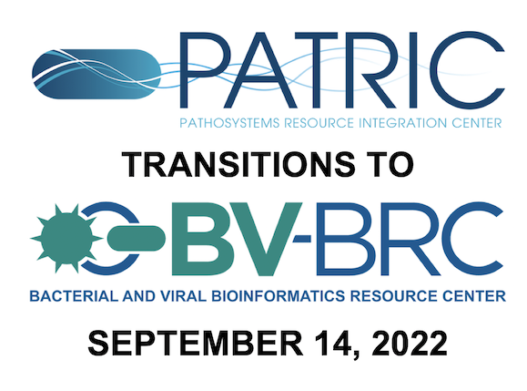

:github_url: https://github.com/BV-BRC/bvbrc_docs/blob/master/docroot/news/2022/20220816-bv-brc-patric-redirect.rst

PATRIC to BV-BRC Final Transition Schedule
==========================================

.. feed-entry::
   :date: 2022-08-16

We are now in the final phase of transitioning `PATRIC <https://www.patricbrc.org>`_ to the `Bacterial and Viral Bioinformatics Resource Center (BV-BRC) <https://www.bv-brc.org>`_. Website redirects will start in mid-September, and PATRIC will go offline by mid-December of this year. Here is what you need to know.

.. cut::

As `announced previously <https://www.bv-brc.org/docs/news/2022/20220215-bv-brc-public-beta.html>`_, `PATRIC <https://www.patricbrc.org>`_, the bacterial BRC, and `IRD <https://www.fludb.org>`_ / `ViPR <https://www.viprbrc.org>`_, the viral BRCs, are being merged into the new `Bacterial and Viral Bioinformatics Resource Center (BV-BRC) <https://www.bv-brc.org>`_. BV-BRC combines the data, tools, and technologies from these BRCs to provide an integrated resource for bacterial and viral genomics-based infectious disease research.

For PATRIC users, the migration will be relatively straightforward bacause BV-BRC is built on the PATRIC platform. This includes the PATRIC private workspace, so all data and analysis service jobs that have been stored and created in PATRIC are available in the BV-BRC workspace. PATRIC users can use the same login credentials in BV-BRC.  

New Features
------------

The new data and features in BV-BRC that are not in PATRIC include the following:

* Viral pathogen data 
   * 8.5M viral genomes
   * SARS-CoV-2 variants and lineages of concern
   * Influenza surveillance and serology data
   * Proteins and protein structures
   * Domains and motifs
   * Epitopes
   * Experiment data
* New analysis tools and services
   * Specialized advanced searches
   * MetaCATS (Metadata-driven Comparative Analysis Tool)
   * Primer Design
   * MSA and SNP Analysis
   * Gene Tree
   * Taxonomic Classification (with support for viral data)
   * Metagenomic Binning (with support for viral data)
   * 3-D Protein Structure Viewer (new)
   * SARS-CoV-2 Genome Assembly and Annotation

`Click here to download a brochure PDF summarizing the BV-BRC transition and features <../../_static/files/news/2022/bv-brc-overview-brochure-aug-2022.pdf>`_.

Transition Schedule
-------------------

**February 15, 2022: BV-BRC Beta Release** - This release is complete and available at `BV-BRC <https://www.bv-brc.org>`_.
 
**September 14, 2022: BV-BRC Production Release** - The PATRIC website will automatically redirect users to the BV-BRC website. The PATRIC website will still be available, but with minimal updates and maintenance.

.. raw:: html

    

.. role:: red

:red:`December 14, 2022 - PATRIC goes offline`
- The PATRIC website will *permanently go offline* and the patricbrc.org website domain will redirect to bv-brc.org.

Help Documentation
------------------

In addition to full `BV-BRC Help Documentation <https://www.bv-brc.org/docs/>`_, the following additional information is available to aid users in making the transition from PATRIC and IRD/ViPR to BV-BRC:

* `BV-BRC Quick Start Videos <../../quick_start/quick_start.html>`_
* `BV-BRC Data and Functionality Overview (Guide for PATRIC Users) <../../quick_start/data_functionality_overview.html>`_
* `Mapping of IRD/ViPR Features and Terminology to BV-BRC (Guide for IRD and ViPR Users) <../../quick_start/ird-vipr_bv-brc_mapping.html>`_ 

Users can ask questions and provide feedback `here <mailto:help@bv-brc.org>`_.

Live Help
---------

In order to help users that are having difficulty with transitioning, we are offering office hours via Zoom every Friday at 11:00am - 12:00 pm ET, from August 19 through October 14, 2022. During that time, one or more of the BV-BRC team members will be logged in to the Zoom meeting below and available to provide one-on-one help as needed.

| Topic: BV-BRC Office Hours
| Time: Aug 19, 2022 11:00 AM Eastern Time (US and Canada)
| Every week on Fri, until Oct 14, 2022, 9 occurrence(s)

| Please download and import the following iCalendar (.ics) files to your calendar system.
| Weekly: https://virginia.zoom.us/meeting/tJItdeGprToqE9FIBQA8m0LmY0ai1B7oqEdK/ics?icsToken=98tyKuCurjkiG9eUsBCCRowAAojoWevztn5fj_p7tT3UInheMi_7D7JDO-NdR9fB

| Join Zoom Meeting
| https://virginia.zoom.us/j/96028131095?pwd=VVFMc0E4ZlZzd2pldkRwdFJiSVV6QT09

| Meeting ID: 960 2813 1095
| Passcode: 256049
| One tap mobile
| +13017158592,,96028131095# US (Washington DC)
| +13126266799,,96028131095# US (Chicago)