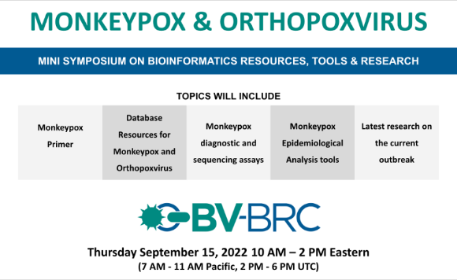

:github_url: https://github.com/BV-BRC/bvbrc_docs/blob/master/docroot/news/2022/20220907-monkeypox-and-orthopoxvirus-symposium.rst

Monkeypox and Orthopoxvirus Mini-Symposium
=========================================

.. feed-entry::
   :date: 2022-09-07

Discussion of bioinformatic resources and tools available and in development for the purpose of studying monkeypox virus. Will also include a brief primer on monkeypox virus, as well as research presentations focusing on the recent outbreak.

.. cut::

Event Information
-------------------

**Date:** September 15, 2022

**Time:** 7 AM – 11:30 AM Pacific, 10 AM – 2 PM:30 Eastern , 4 PM – 8:30 PM CET

**Scope:** Discussion of bioinformatic resources and tools available and in development for the purpose of studying monkeypox virus. Will also include a brief primer on monkeypox virus, as well as research presentations focusing on the recent outbreak.

**Audience:** Bioinformaticians, public health practitioners, bench scientists in the field of Monkeypox or poxvirus research

**Downloadable PDF of the event** --- `Click Here <../../_static/event_files/monkeypox-mini-symposium-agenda.pdf>`_

Confirmed Speakers and Tentative Agenda
----------------------------------------
*(subject to change)*

| **10:00 EDT / 16:00 CET**
| *Introduction and Welcome*
| Richard Scheuermann & Anna Maria Niewiadomska
| BV-BRC & J. Craig Venter Institute
|
| **10:05 EDT / 16:05 CET**
| *Monkeypox virus primer*
| Paula Traktman
| Medical University of South Carolina
|
| **10:20 EDT / 16:20 CET**
| *Phylogenomic characterization and signs of microevolution*
| *in the 2022 multi-country outbreak of monkeypox virus* --- `Click Here to visit <https://www.nature.com/articles/s41591-022-01907-y>`_
| Vitor Borges
| National Institute of Health - Portugal
|
| **10:35 EDT / 16:35 CET**
| *Monkeypox virus sequencing in the 2022 outbreak reveals*
| *multiple independent lineages and unique mutational signatures* --- `Click here to visit <https://www.biorxiv.org/content/10.1101/2022.06.10.495526v1>`_
| Crystal Gigante
| CDC/DDID/NCEZID/DHCPP
|
| **10:50 EDT / 16:50 CET**
| *A distinct phylogenetic cluster of Monkeypox genomes*
| *suggests an early and cryptic spread of the virus* --- `Click here to visit <https://linkinghub.elsevier.com/retrieve/pii/S0163-4453(22)00476-5>`_
| Bani Jolly
| CSIR-IGIB, New Delhi, India
|
| **11:05 EDT / 17:05 CET**
| *Genetic variability, including gene duplication and deletion,*
| *in early sequences from the 2022 global monkeypox outbreak* --- `Click here to visit <https://www.biorxiv.org/content/10.1101/2022.07.23.501239v1>`_
| Terry Jones
| Charité - Universitätsmedizin Berlin
|
| **11:20 EDT / 17:20 CET**
| `Nextclade <https://clades.nextstrain.org>`_, `Nextstrain <https://nextstrain.org>`_ and New Monkeypox `Sublineages <https://github.com/mpxv-lineages/lineage-designation>`_
| Emma Hodcroft & Cornelius Roemer
| Nextstrain
|
| **11:35 EDT / 17:35 CET**
| *Detection of monkeypox viral DNA in a routine wastewater monitoring* --- `Click here to visit <https://doi.org/10.1101/2022.09.06.22279312>`_
| Marlene Wolfe
| Emory University
|
| **11:50 EDT / 17:50 CET**
| *Monkeypox virus whole genome sequencing using combination of*
| *NextGenPCR and Oxford Nanopore* --- `Click here to visit <https://www.protocols.io/view/monkeypox-virus-whole-genome-sequencing-using-comb-n2bvj6155lk5/v1>`_
| Matthijs Welkers
| Amsterdam UMC, Amsterdam, the Netherlands
|
| **12:05 EDT / 18:05 CET**
| *Break*
|
| **12:15 EDT / 18:15 CET**
| *Amplicon-based sequencing of human monkeypox virus* --- `Click here to visit <https://www.protocols.io/view/monkeypox-virus-multiplexed-pcr-amplicon-sequencin-5qpvob1nbl4o/v2>`_
| Chantal Vogels
| Yale School of Public Health
|
| **12:30 EDT / 18:30 CET**
| *Applying the COVID-19 Lessons Learned to Other*
| *Pathogens of Public Health Concern*
| Kevin Libuit
| `Thieagen <https://theiagen.com>`_
|
| **12:45 EDT / 18:45 CET**
| *International Committee on Taxonomy of Viruses: ICTV* --- `Click here to visit <http://ictv.global>`_
| *ictv.global*
| Elliot Lefkowitz
| University of Alabama Birmingham
|
| **13:00 EDT / 19:00 CET**
| *Monkeypox/Orthopox data and tools in NCBI Virus* --- `Click here to visit <http://ncbi.nlm.nih.gov/labs/virus/vssi>`_
| *ncbi.nlm.nih.gov/labs/virus/vssi*
| Eneida Hatcher
| NIH/NLM/NCBI
|
| **13:15 EDT / 19:15 CET**
| *Monkeypox/Orthopox data and tools in the Bacterial and Viral*
| *Bioinformatics Resource Center (BV-BRC)* --- `Click here to visit <https://www.bv-brc.org>`_
| Anna Maria Niewiadomska
| J. Craig Venter Institute
|
| **13:30 EDT / 19:30 CET**
| *Viral Bioinformatics Research Center: Bioinformatics for*
| *Poxviruses - 4virology.net* --- `Click here to visit <http://4virology.net/>`_
| Rachel Roper
| East Carolina University
|
| **13:45 EDT / 19:45 CET**
| *Advanced Genomic Sequencing for H2H Transmission*
| *Analysis of Poxvirus*
| Gustavo Palacios
| Icahn School of Medicine at Mount Sinai
|
| **14:00 EDT / 20:00 CET**
| *Plumbing a Monkeypox virus genome sequence assembly,*
| *annotation, and public database submission pipeline*
| Michael Weigand
| CDC/DDID/NCIRD/DBD
|
| **14:15 EDT / 20:15 CET**
| *Diagnostic assays (PCR and POC) for monkeypox*
| Christina Hutson
| CDC/DDID/NCEZID/DHCPP
|
| **14:30 EDT / 20:30 CET**
| (5 minute talk) `UCSC Genome Browser <https://genome.ucsc.edu>`_ & `hgPhyloPlace/Usher-web <https://genome.ucsc.edu/cgi-bin/hgPhyloPlace>`_
| Maximilian Haeussler
| UCSC
|
| **14:30 EDT / 20:30 CET**
| *End*
|