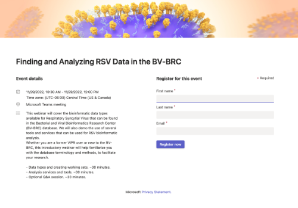

:github_url: https://github.com/BV-BRC/bvbrc_docs/blob/master/docroot/news/2022/20221122-rsv-and-influenza-webinars.rst

Upcoming BV-BRC Online Webinars: RSV and Influenza: Nov 29 and Dec 13, 2022
============================================================================

.. feed-entry::
   :date: 2022-11-22

The BV-BRC (Bacterial and Viral Bioinformatics Resource Center) team will be offering 2 **Bioinformatics Webinars** on **November 29 and December 13, 2022**. These webinars will cover the bioinformatic data types available for Respiratory Syncytial Virus and Influenza Virus that can be found in the Bacterial and Viral Bioinformatics Research Center (BV-BRC) database. We will also demo the use of several tools and services that can be used for RSV bioinformatic analysis.

.. cut::

Whether you are a former ViPR or IRD user, or new to the BV-BRC, these introductory webinars will help familiarize you with the database terminology and methods, facilitating your research on RSV and Influenza.

- Data types and creating working sets. ~30 minutes.
- Analysis services and tools. ~30 minutes.
- Optional Q&A session. ~30 minutes.

Registration is free and open to all. 

**November 29, 2022** (8:30 AM - 10:00 AM (UTC-08:00) Pacific Time)
*Finding and Analyzing RSV Data in the BV-BRC*
`Registration <https://teams.microsoft.com/registration/8WfZJNg-SES6plYOxXKssw,AJkK0CmkKEGUEXKyRbCvQg,TYu45NWMGk2twb7xvkq5yA,b_MrO8f2F0SQlFbu8OU0dA,xfV2vcX8BUS5fnuYBYpdbA,VTPoSsuVLkmKnY50HK9Osw?mode=read&tenantId=24d967f1-3ed8-4448-baa6-560ec572acb3>`_

**December 13, 2022** (8:30 AM - 10:00 AM (UTC-08:00) Pacific Time)
*Finding and Analyzing Influenza Data in the BV-BRC*
`Registration <https://teams.microsoft.com/registration/8WfZJNg-SES6plYOxXKssw,AJkK0CmkKEGUEXKyRbCvQg,TYu45NWMGk2twb7xvkq5yA,FemxHCDcmk-SfG8FFIAfnw,8pexGm8LWEaowJbk_e8Yeg,yQnoJy9T00a7Pf5xdrIh5w?mode=read&tenantId=24d967f1-3ed8-4448-baa6-560ec572acb3>`_