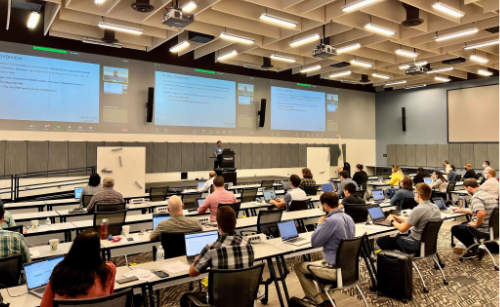

BV-BRC Workshop at Argonne National Laboratory, June 26-30, 2023
=====================================================================

.. feed-entry::
   :date: 2023-03-02

The BV-BRC (Bacterial and Viral Bioinformatics Resource Center) team will be offering a **Bioinformatics Workshop on June 26-30, 2023, at Argonne National Laboratory** in the suburbs of Chicago, IL. The workshop will show researchers how to analyze and explore **bacterial and viral pathogen data** using the BV-BRC website, which is a merger of the two long running bacterial and viral BRC resources - PATRIC and IRD/ViPR.

This workshop will have two separate components, and researchers can register for one or both. The bacterial component, concentrating on analyzing antimicrobial resistance data, will take place on Monday, June 26th to mid-day on Wednesday, June 28th. The viral component will begin in the afternoon of Wednesday, June 28th and concludes on Friday, June 30th. 

**Researchers can sign up for one or both of these sessions and must state their preference(s) when they register (see Registration below).**

The workshop will consist of interactive hands-on training sessions. During Days 1-2 (June 26-27) the workshop will concentrate on exploring and analyzing bacterial antimicrobial resistance data.  Participants will learn how to search for public datasets of interest and perform genomic, comparative genomic, metagenomic, and transcriptomic analyses using various analysis services and tools at BV-BRC. The morning session of Day 3 (June 28) will focus on using the BV-BRC command-line interface for programmatic search and retrieval of data and submission of analysis jobs. Users will also have the opportunity to work with their own data and analysis problems with assistance from the BV-BRC team members.  

The viral component begins on the afternoon of Day 3 (June 28), concentrating on searching for data performing phylogenetic and comparative genomic analyses.  Day 4 (June 29) focuses on sequence assembly and annotation, subspecies classification, protein structure, surveillance data exploration, and transcriptomic analysis. Day 5 (June 30) includes metagenomic analysis, an introduction to the command line interface, and hands-on exercises.

**REGISTRATION**

To register for the workshop, send an email to lhundley@anl.gov. Registration is limited to 75 people, and will be accepted based on the order the emails are received. **Be sure to indicate whether you plan to attend the bacterial or viral session, or both.** You should receive a confirmation email within 2 business days. If you don’t receive one, you can also reach us at help@bv-brc.org. BV-BRC workshops tend to fill up very quickly, so please register soon if you would like to attend.

The workshop is free to attend, but participants must arrange and pay for their own travel, meals, and lodging. Light refreshments will be available. There is also a cafe and grill in a nearby building. There are outdoor seating areas with gazebos, which can be used during breaks and lunch time.

**REAL ID REQUIREMENT**

Starting Wednesday, May 3, 2023, Argonne National Laboratory visitors who are 18 years old or older **MUST have a form of identification compliant with the REAL ID Act** to enter the site. This updated identification policy puts the Lab in compliance with the REAL ID Act, passed by the United States Congress in 2005, which establishes minimum security standards for people accessing federal facilities. Acceptable forms of ID include:

* REAL ID-compliant driver’s license/ state identification card from Illinois or another state
* U.S. passport/U.S. passport card
* Foreign government-issued passport
* HSPD-12 PIV card
* Permanent resident card
* DHS trusted traveler cards (Global Entry, NEXUS, SENTRI, FAST)
* U.S. Department of Defense ID, including IDs issued to dependents
* Border crossing card
* State-issued enhanced driver’s license (MI, MN, NY, VT, WA)
* Federally recognized, tribal-issued photo ID
* Canadian provincial driver’s license or Indian and Northern Affairs Canada card
* Transportation worker identification credential
* U.S. Citizenship and Immigration Services Employment Authorization Card (I-766)
* U.S. Merchant Mariner Credential
* Veterans Health Identification Card

If visitors cannot provide one of the above forms of identifications, they can show one document from List B AND one document from List C of the USCIS I-9 form:

LIST B:

* Non-compliant state issued driver’s license/ID
* Voter’s registration card
* U.S. military card (including dependent’s IDs)
* School or university ID

LIST C:

* Social Security card
* Birth certificate
* Certification of report of birth
* U.S. c ID card (I-197)
* Resident citizen ID card(I-179)
* DHS employment authorization

**COVID-19 SAFETY PROTOCOLS**

*Please note the COVID-19 safety protocols currently in place at the Argonne National Laboratory. They are subject to change based on COVID levels at the time of the workshop.*

* Face coverings are not required.
* Social distancing is optional. The desks in the workshop venue will be spread out to allow social distancing if desired.
* Participants should self monitor for symptoms.
* Vaccine boosters are recommended. 
 
**LOCATION**

| Building 240 Conference Center - Room 1416
| Argonne National Laboratory
| 9700 Cass Avenue
| Lemont, IL 60439

**AGENDA**

**Day 1 - Monday, June 26 - Bacterial**
::

   9:00 am   Bacteria - Information, registration, and overview
              * Welcome
              * BV-BRC registration
              * Overview (www.bv-brc.org)
              * Creating genome groups           

  10:15 am   Taxonomic Classification
              * Description of Kraken2
              * Uploading reads or contigs and submitting job
              * Saving classified or unclassified sequences
              * Viewing and interpreting the results

   10:45 am  Metagenomic Read Mapping
              * Description of CARD and VFDB
              * Uploading reads and submitting job
              * Viewing and interpreting results

   11:00 am  Break

   11:15 am  FASTQ Utilities
              * Description of FASTQ files and service 
              * Selecting pipeline (Trim, FastQC, Paired read, Align)
              * Uploading reads and submitting job
              * Viewing and interpreting results

   12:00 pm  Lunch

   1:00 pm   Metagenomic Binning
              * Description of algorithm
              * Uploading reads or contigs and submitting the job
              * Viewing and interpreting the results

   2:00 pm   Comprehensive Genome Analysis Service
              * Description of assembly and annotation algorithms
              * Uploading reads or contigs and submitting job
              * Viewing and interpreting results

   3:15 pm   Break

   3:30 pm   Similar Genome Finder Service
              * Description of MASH/MinHash
              * Uploading genome sequences, reads, or contigs
              * Submitting job
              * Viewing  and interpreting results

   3:45 pm   Phylogenetic Tree Building Service
              * Creating a genome group
              * Determining if selected genomes are "treeable"
              * Description of algorithm and submitting tree-building job
              * Viewing and interpreting results
              * Newick file download 

   4:45 pm   Question and Answer Session and Hands-on Work

   5:00 pm   Day 1 Adjourn

**Day 2 - Tuesday, June 27 - Bacterial**
::

   9:00 am   Review of Day 1

   9:15 am   BLAST
              * Description of BLAST
              * Choosing BLAST database, parameters, and job submission
              * Viewing and interpreting the results

   10:00 am  Comparative Services (Protein Families, Pathways, and Subsystems)
              * Description of protein families and job submission
              * Finding the pan, core, and accessory genomes 
              * Visualizing and manipulating the heatmap viewer 
              * Finding specific differences, downloading, and saving results into private workspace
              * Comparing pathways on pathway map and heatmap
              * Finding specific differences, downloading, and saving results into private workspace
              * Description of Subsystems
              * Exploring subsystems using the tabular and heatmap views
              * Finding specific differences, downloading, and saving results

   11:00 am  Break

   11:15 am  Proteome Comparison
              * Selecting genomes for study
              * Visualization of compared genomes
              * Download and Analysis of Results

   12:00 pm  Lunch

   1:00 pm   Compare Region Viewer
              * Feature overview
              * Description of calculations for gene neighborhoods
              * Adjusting the view
              * Viewing data of interest (genome and feature groups)

   1:30 pm   SNP and MSA Variation Service
              * Description of algorithm
              * Selection of genes and job submission
              * Viewing and interpreting the results

   2:00 pm   Gene Tree
              * Description of algorithm
              * Selection of data and job submission
              * Viewing and interpreting the results

   2:30 pm   Break

   2:45 pm   Primer Design
              * Description of algorithm
              * Adjusting parameters and job submission
              * Viewing and interpreting the results

   3:00 pm   Variation Service
              * Uploading reads 
              * Description of aligners and SNP callers
              * Discussion and selection of target genomes
              * Downloading and using data
              * Interpreting results

   3:45 pm   RNA-Seq Pipeline
              * Discussion of algorithm and choosing a strategy
              * Uploading RNA-seq data
              * Selecting genomes and job submission
              * Viewing and interpreting the results

   4:30 pm   Install Command Line Interface

   4:45 pm   Question and Answer Session and Hands-on Work

   5:00 pm   Day 2 Adjourn

**Day 3 - Wednesday, June 28 - Bacterial and Viral**
::

   9:00 am   Command Line Interface 
              * Logging in
              * Searching for data
              * Creating groups from data selections
              * Downloading data

   10:00 am  Job submission via command line 
              * Uploading private data (singular or batch)
              * Submitting assembly jobs (singular or batch)
              * Submitting annotation jobs (singular or batch)
              * Discussion of command line submission to other services 

   11:00 am  Break

   11:15 am  Final demo on job submission via command line

   12:00 pm  Lunch

   1:00 pm   Viruses - Information, registration, and overview
              * Welcome
              * Registration
              * BV-BRC overview (www.bv-brc.org)
              * SARS-CoV-2 variant tracking

   2:00 pm   Sequence search and workspace
              * Genome filtering
              * Advanced search
              * Workspace groups
              * Uploading sequences to workspace

   3:15 pm   Break
   
   3:30 pm   Phylogenetic analysis 
              * Genomic sequence selection
              * Multiple sequence alignment
              * Phyogenetic inferencing
              * Viewing and interpreting results	

   4:15 pm   Statistical sequence comparison 
              * Protein sequence selection
              * Metadata-drive comparative analysis service
              * Viewing and interpreting results

   4:45 pm   Question and Answer Session and Hands-on Work	

   5:00 pm   Adjourn

**Day 4 -Thursday, June 29 – Viral**
::

   9:00 am   Review of Day 3 

   9:15 am   BLAST 
              * Description of BLAST
              * Choosing BLAST database, parameters, and job submission
              * Viewing and interpreting the results

   10:00 am  Sequence assembly and annotation
              * Description of assembly and annotation algorithms
              * Uploading reads or contigs and submitting job
              * Viewing and interpreting results
              * Preparing Genbank submission

   10:45 am  Break

   11:00 am  Subspecies classification
              * Overview of pplacer and reference trees
              * Viruses covered
              * Classification of user sequences
              * Search by subspecies

   11:30 am  Primer Design 
              * Description of algorithm
              * Adjusting parameters and job submission
              * Viewing and interpreting the results

   12:00 pm  Lunch

   1:00 pm   Immune epitope exploration 
              * Description of SNP callers and aligners
              * Uploading reads 
              * Discussion and selection of target genomes
              * Viewing and interpreting the results

   1:30 pm   3D protein structures
              * Experimentally-determine protein structures
              * Predicted protein structures
              * Predicting structures using AlphaFold2
              * Comparative structure analysis 	

   2:30 pm   Break

   2:45 pm   Other data – Influenza surveillance
              * Selecting surveillance records
              * GoogleMap view

   3:00 pm   Other data – host response omics data
              * Overview of host response experiments
              * Host factor biosets
              * Enrichment analysis
              * Heatmap and clustering

   3:45 pm   RNA-Seq analysis service 
              * Discussion of algorithm and choosing a strategy
              * Uploading RNA-seq data
              * Selecting genomes and job submission
              * Viewing and interpreting the results	

   4:30 pm   Install Command line interface
              * Installing the Command Line Interface

   4:45 pm   Question and Answer Session and Hands-on Work	

   5:00 pm   Adjourn

**Day 5 - Friday, June 30 – Viral**
::

   9:00 am   Review of Day 4 

   9:15 am   Comparative genomics exercise overview 
              * OneHealth – influenza virus at the human-animal interface

   9:30 am   Comparative genomics exercise (students exercise)

   10:45 am  Break

   11:00 am  Command Line Interface 
              * Logging in
              * Searching for data
              * Creating groups from data selections
              * Downloading data
              * Other CLI services

   12:00 pm  Lunch

   1:00 pm   Metagenomics analysis
              * Metagenomic read mapping for bacteria
              * Taxonomic classification
              * Metagenomic binning

   2:30 pm   Workshop concludes
