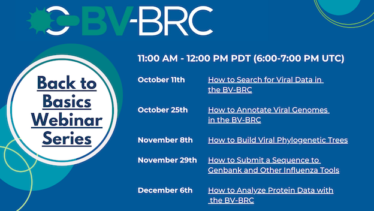

BV-BRC Viral Pathogen Data Webinar Series
=========================================

.. feed-entry::
   :date: 2023-10-16

The BV-BRC (Bacterial and Viral Bioinformatics Resource Center) team will be offering a **Bioinformatics Webinar Series on October 11 (passed but recording will be made available), 25, November 8, 29th and December 6th.**  The webinars will show researchers how to analyze and explore **viral pathogen data** using the BV-BRC website. 
This webinars will have individual components, and researchers can register for any and all.
The webinar topics include a basic overview (October 11th), Viral Annotation Services (October 25th), Phylogenetic Analysis (November 8th), Sequence Submission (November 29th) and Protein Data (December 6th). All webinars will be at 11:00 AM PT (UTC 6:00 PM). 
Each Webinar will contain information about the resource and get users more comfortable with the specific topics. Each webinar will be recorded for later review.
 The first webinar focused on an overview of the BV-BRC and showed tips and tricks for searching for data, as well as creating a workspace and sharing it and private data with collaborators. The second focuses on the annotation tools within the BV-BRC. The third focuses on the phylogenetic tree tools and ways that you can see metadata on those trees. The fourth will showcase our sequence submission tool to accurately submit sequences to GenBank. Finally, we will finish up with our protein tools. These webinars are meant as a brief introduction and explanation of the resource. We hope to see you there!

**REGISTRATION**
To register for the webinars please click the following links.

`How to Annotate Viral Genomes in the BV-BRC <https://events.teams.microsoft.com/event/03b997b9-d1fd-4252-a747-34f11013cff5@24d967f1-3ed8-4448-baa6-560ec572acb3>`_

`How to Build Viral Phylogenetic Trees <https://events.teams.microsoft.com/event/e9be648d-6fe0-4fe6-9fe7-a2f84b21492e@24d967f1-3ed8-4448-baa6-560ec572acb3>`_

`How to Submit a Sequence to Genbank and Other Influenza Tools <https://events.teams.microsoft.com/event/5f1a0818-8a57-41c9-9a86-b7b8ffc57268@24d967f1-3ed8-4448-baa6-560ec572acb3>`_

`How to Analyze Protein Data with the BV-BRC <https://events.teams.microsoft.com/event/fc91ffaf-67c8-4ef0-8d55-ced394c67420@24d967f1-3ed8-4448-baa6-560ec572acb3>`_

As always, if you need any help you can reach us at `help@bv-brc.org <mailto:help%40bv-brc.org>`_. 