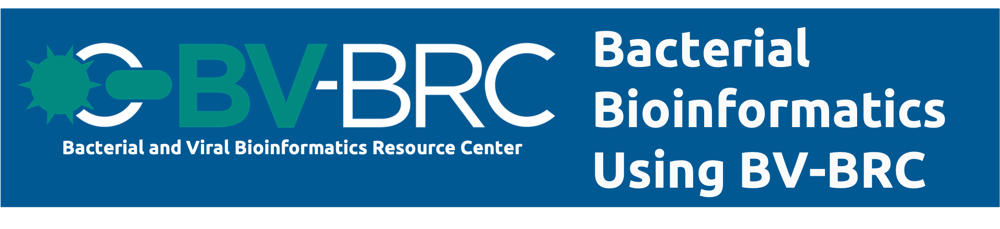

:github_url: https://github.com/BV-BRC/BV-BRC-Docs/docroot/news/2023/bacterial-bioinformatics-mooc-course.rst

BV-BRC Bacterial Bioinformatics Course on Coursera
==================================================

.. feed-entry::
   :date: 2023-03-17

The BV-BRC offers an online Bacterial Bioinformatics course, freely available through Coursera. This course provides demonstrations and exercises for performing common genomics-based analysis tasks of bacterial sequence data.  

This course was originally designed using PATRIC BRC as platform. However, all the tools and functinality mentioned in this course are now available via BV-BRC. 

Course participants will gain skills needed to do comparative analysis of bacterial genomes, starting with raw sequence data. The lessons in the first module cover genome assembly, annotation, phylogenetic tree construction, and protein family / proteome comparisons. Each lesson builds on the previous, creating a complete baseline analysis workflow.

You can register for this course for free `here <https://www.coursera.org/learn/informatics#about>`_.
