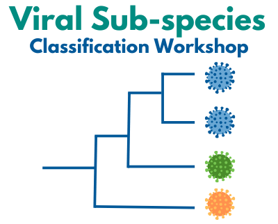
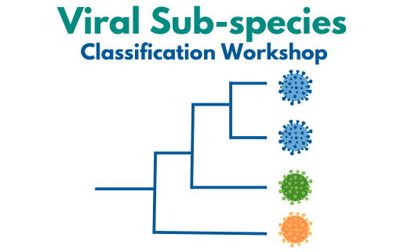

BV-BRC Viral Sub-species Classification Workshop at NIAID Rockville, MD, April 8-10, 2024
=========================================================================================

.. raw:: html

    
Published on <em class="feed-date">2024-02-23 00:00:00</em>

    
Updated on <em class="feed-date">2024-02-27 00:00:00</em>

|

.. raw:: html

    

    

      <b>Meeting dates:</b> April 8-10, 2024
      <a href="https://nih.zoomgov.com/meeting/register/vJIsf-ippzguHcTtuKi3fB43SsWf-mIbgrc#/registration"
        class="btn" title="BV-BRC Viral Sub-species Classification Workshop Link" target="_blank"
        style="background-color: #018c81;">Registration&nbsp;&nbsp;
      </a>
    

    <table id="viral-subspecies-ws-logo-table">
      <tbody><tr>
          <td></td>
          <td>
              
              
Bacterial and Viral Bioinformatics Resource Center

          </td>
          <td></td>
      </tr>
      </tbody>
    </table>

    
Workshop is funded in part by National Institute of Allergy and Infectious Diseases, National Institutes of Health, Department of Health and Human Services, under Contract No. 75N93019C00076, in collaboration with the Centers for Disease Control and Prevention (CDC) and
          The National Center for Biotechnology Information, National Library of Medicine.

- `Introduction <#introduction-section>`_
- `Workshop Logistics <#logistics-section>`_
- `Registration <#registration-section>`_
- `Pathogens <#pathogens-section>`_
- `Workshop Speakers <#speakers-section>`_
- `Workshop Agenda <#agenda-section>`_

.. _introduction-section:

------------------
Introduction
------------------

---------------------

A critical aspect of the response to the COVID-19 pandemic was to trace, classify, and understand the evolving virus lineages, their phenotypic differences, and their impact on diagnostics, vaccines, and therapeutics. Classification and tracing of sub-species level variation has also been similarly important in outbreaks of viruses such as influenza, HIV, and monkeypox, and has informed public health risk assessment and communication strategies. To prepare for the next, inevitable outbreak of virus disease, the Bacterial and Viral Bioinformatics Resource Center (BV-BRC) along with the CDC, NCBI, and NIAID, are hosting a hybrid workshop on viral sub-species classification. Workshop objectives include the review of various classification schemes developed for SARS-CoV-2 and other viruses, examination of the methods and tools developed for classification, discussion of the utility and impact of classification schemes on the public health response, and review of lessons learned from past and current outbreaks. The outcome of the workshop will be to define best practices for establishing sub-species classification systems for these and other viruses that will be important in controlling future out breaks and potential pandemics. The valuable insights and best practices from this workshop will be widely disseminated.

.. _logistics-section:

------------------
Workshop Logistics
------------------

--------------------------

.. raw:: html

    
    

        

Date &amp; Time

        

            <ul>
                <li>
Apr 8, 2024 | 09:30 AM - 6:00 PM
</li>
                <li>
Apr 9, 2024 | 09:30 AM - 5:30 PM
</li>
                <li>
Apr 10, 2024 | 09:00 AM - 12:00 PM
</li>
                <li> </li>
                <li>
Time shows in <b>Eastern Time (US and Canada)</b></li>
            </ul>
        

    

.. _registration-section:

------------------
Registration
------------------

---------------------

.. |registration_link| raw:: html

  <a class="reference external" href="https://nih.zoomgov.com/meeting/register/vJIsf-ippzguHcTtuKi3fB43SsWf-mIbgrc#/registration" target="_blank">here <i class="fa fa-external-link" aria-hidden="true"></i></a>

Please register for virtual workshop participation |registration_link|. The virtual workshop participants can actively participate by providing feedback and ask questions throughout the event.

.. _pathogens-section:

---------
Pathogens
---------

---------------------

The focus of the workshop will be on viral pathogens. The viruses discussed will include those with established classification schemes as well as viruses defined by NIH/NIAID as prototype pathogens with pandemic potential (PMCID: PMC9384504).

.. _speakers-section:

------------------
Workshop Speakers
------------------

---------------------

.. list-table::
   :widths: 30 70
   :header-rows: 1

   * - Name
     - Affiliation
   * - **Anderson, Tavis**
     - U.S. Department of Agriculture
   * - **Bahl, Justin**
     - University of Georgia, U.S.
   * - **Donato, Celeste**
     - Monash University, Murdoch Children's Research Institute, Australia
   * - **Hatcher, Eneida**
     - National Center for Biotechnology Information, U.S.
   * - **Hinrichs, Angie**
     - University of California Santa Cruz, U.S.
   * - **Korber, Bette**
     - Los Alamos National Labs, U.S.
   * - **Kuhn, Jens**
     - NIH/NIAID Integrated Research Facility, U.S.
   * - **Le Mercier, Philippe**
     - Swiss-Prot group, Swiss Institute of Bioinformatics, Switzerland
   * - **Lefkowitz, Elliot**
     - University of Alabama at Birmingham, U.S.
   * - **Neher, Richard**
     - University of Basel, Switzerland
   * - **Njau, Emma Peter**
     - Sokoine University of Agriculture, Tanzania
   * - **Parker, Edyth**
     - Harvard, Redeemer's University, Nigeria
   * - **Rachel Colquhoun**
     - University of Edinburgh, U.K.
   * - **Roemer, Cornelius**
     - University of Basel, Switzerland
   * - **Rota, Paul**
     - U.S. Centers of Disease Control and Prevention
   * - **Seto, Don**
     - George Mason University
   * - **Simmonds, Peter**
     - University of Oxford, U.K.
   * - **Smith, Derek J**
     - University of Cambridge, U.K.
   * - **Wang, Sean**
     - Minnesota Department of Health, U.S.
   * - **Warren, Andrew**
     - University of Virginia, U.S.
   * - **Zmasek, Christian**
     - J.Craig Venter Institute, U.S.

.. _agenda-section:

---------------
Workshop Agenda
---------------

---------------------

Detailed workshop agenda will be released soon.

