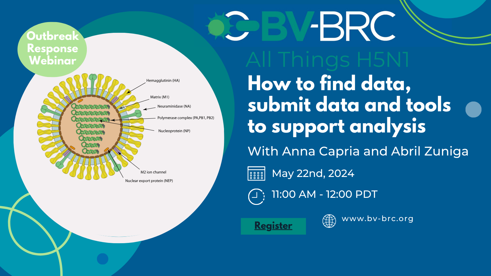

H5N1 Webinar: All things H5N1
=========================================

View Recording of Webinar Here: https://youtu.be/hsmG5uxTJ4k?si=dpFmDDtqNR70FzrM

Given the current situation surrounding increased cases of H5N1, and transmission in new hosts, the BV-BRC team updated the community on how to find data and submit data and tools to support analysis on the BV-BRC. Check out the video to learn more about searching for H5N1 data, submitting influenza sequences, and generating a tree or sub-species classification tool and our new outbreak pages here: https://www.bv-brc.org/outbreaks/H5N1...

Further Information In 2020, highly contagious bird flu (HPAI) A(H5N1) viruses emerged from existing strains. They spread mainly through migrating birds across Africa, Asia, and Europe, causing significant wild bird deaths and poultry outbreaks. By late 2021, these viruses reached North America and South America in 2022. A recent outbreak in a mink farm in Spain has also affected other animals, like mammals.

Globally, there have been 26 human cases from Jan 2022-April 2024, and these are tracked. More information about this can be seen in a technical report from the CDC. The cases are a mix between different H5N1 clades including 2.3.2.1c and 2.3.4.4b. Most human cases have been related to individuals who are in contact with dead or sick poultry.

There has been no reported or identified human-to-human transmission. Since 2020, six human cases of A(H5N1) linked to the 2.3.4.4b clade have been reported to WHO. This assessment focuses on the latest strains of A(H5N1) from the 2.3.4.4b clade.
