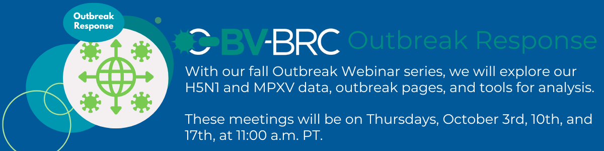

Outbreak Webinars: MPOX and H5N1 Analysis in BV-BRC
=========================================

With our fall outbreak webinar series, we will analyze our H5N1 and MPOX data, outbreak pages, and tools. These meetings will be on Thursdays, October 3rd, 10th, and 17th, at 11:00 a.m. PT.

**REGISTRATION**

`Register now for Data Searching <https://events.teams.microsoft.com/event/8d96a83b-0a2e-4b96-95f6-0670d574984c@24d967f1-3ed8-4448-baa6-560ec572acb3>`_ (October 3rd) 

`Register now for Outbreak pages & phylogenetics Searching <https://events.teams.microsoft.com/event/cd3018c1-1765-4304-afcd-1571717148a9@24d967f1-3ed8-4448-baa6-560ec572acb3>`_ (October 10th) 

`Register now for BV-BRC Influenza & Monkeypox Virus Tools <https://events.teams.microsoft.com/event/4daf21f7-fa86-4675-bf50-89a607a29e7a@24d967f1-3ed8-4448-baa6-560ec572acb3>`_ (October 17th) 
