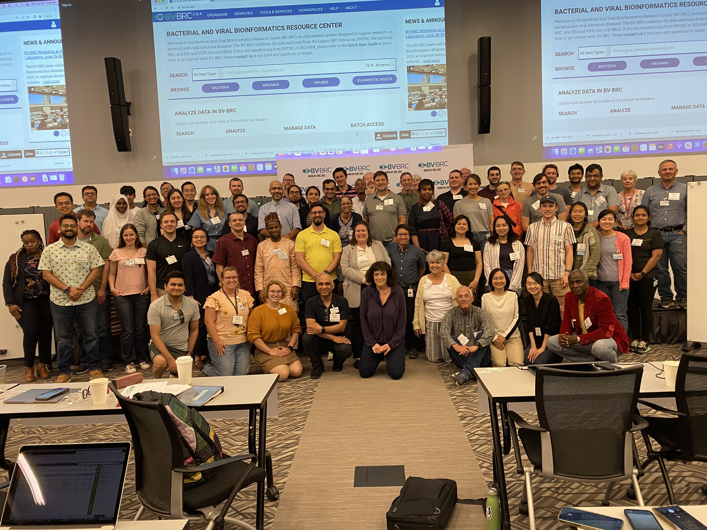

BV-BRC Workshop at Argonne National Laboratory, February 24-28, 2025
=====================================================================

The BV-BRC (Bacterial and Viral Bioinformatics Resource Center) team will be offering a **Bioinformatics Workshop on February 24-28, 2025, at Argonne National Laboratory** in the suburbs of Chicago, IL. The workshop will show researchers how to analyze and explore **bacterial and viral pathogen data** using the BV-BRC website, focusing on bacterial, and viral examples and workflows.

This workshop will have two separate components, and researchers can register for one or both. The bacterial component, concentrating on analyzing antimicrobial resistance data, will take place on Monday, February 24th to mid-day on Wednesday, February 26th. The viral component will begin Wednesday, February 26th and concludes on Friday, February 28th. 

**Researchers can sign up for one or both of these sessions and must state their preference(s) when they register (see Registration below).**

The workshop will consist of interactive hands-on training sessions. During Days 1-2 (February 24-25) the workshop will concentrate on exploring and analyzing bacterial antimicrobial resistance data. Participants will learn how to search for public datasets of interest and perform genomic, comparative genomic, metagenomic, and transcriptomic analyses using various analysis services and tools at BV-BRC. 

The morning session of Day 3 (February 26) will focus on using the BV-BRC command-line interface for programmatic search and retrieval of data and submission of analysis jobs. Users will also have the opportunity to work with their own data and analysis problems with assistance from the BV-BRC team members.  

The viral component begins on the afternoon of Day 3 (February 26), concentrating on searching for data performing phylogenetic and comparative genomic analyses.  Day 4 (February 27) focuses on sequence assembly and annotation, subspecies classification, protein structure, surveillance data exploration, sequence feature variant data and transcriptomic analysis. Day 5 (February 28) includes the docking service, and hands-on exercises.

**REGISTRATION**

Registration is now closed for this workshop. If you are interested in attending a future BV-BRC workshop- check back in soon to hear about upcoming workshops. 

 
**LOCATION**

| Building 240 Conference Center - Room 1416
| Argonne National Laboratory
| 9700 Cass Avenue
| Lemont, IL 60439
| Update! Day Five (Friday) Will be held in Room 1501

**AGENDA**

===============================
BV-BRC Workshop Schedule
===============================

Day One - Monday, 24 February (Bacterial)
-----------------------------------------

**9:00 am** Bacteria - Information, registration, and overview
  - Welcome and registration
  - Overview (www.bv-brc.org)
  - Creating genome groups

**10:00 am** Taxonomic Classification
  - Description of Kraken2
  - Uploading reads and submitting job
  - Viewing and interpreting the results

**10:45 am** Metagenomic Read Mapping
  - Description of CARD and VFDB and job submission
  - Viewing and interpreting results

**11:00 am** Break

**11:15 am** FASTQ Utilities
  - Description of FASTQ files and service
  - Selecting pipeline (Trim, FastQC, Paired read, Align)
  - Uploading reads and submitting job
  - Viewing and interpreting results

**12:00 pm** Lunch

**1:00 pm** Metagenomic Binning
  - Description of algorithm
  - Uploading reads or contigs and submitting the job
  - Viewing and interpreting the results

**2:00 pm** Comprehensive Genome Analysis Service
  - Description of assembly and annotation algorithms
  - Uploading reads or contigs and submitting job
  - Viewing and interpreting results

**3:00 pm** Break

**3:30 pm** Similar Genome Finder Service
  - Description of MASH/MinHash
  - Submitting job
  - Viewing and interpreting results

**3:45 pm** Phylogenetic Tree Building Service
  - Creating a genome group
  - Determining if selected genomes are "treeable"
  - Description of algorithm and submitting tree-building job
  - Viewing and interpreting results
  - Newick file download

**4:45 pm** Question and Answer Session and Hands-on Work

**5:00 pm** Day 1 Adjourn

Day Two - Tuesday, 25 February (Bacterial)
------------------------------------------

**9:00 am** Review of Day 1

**9:15 am** BLAST
  - Choosing BLAST database, parameters, and job submission
  - Viewing and interpreting the results

**10:00 am** Comparative Services (Protein Families, Pathways, and Subsystems)
  - Description of protein families and job submission
  - Finding the pan, core, and accessory genomes
  - Visualizing and manipulating the heatmap viewer
  - Finding specific differences, downloading, and saving results into private workspace
  - Comparing pathways on pathway map and heatmap
  - Finding specific differences, downloading, and saving results into private workspace
  - Description of Subsystems
  - Exploring subsystems using the tabular and heatmap views
  - Finding specific differences, downloading, and saving results

**11:00 am** Break

**11:15 am** Proteome Comparison
  - Selecting genomes for study and job submission
  - Visualization of compared genomes and analysis results

**12:00 pm** Lunch

**1:00 pm** Compare Region Viewer
  - Feature overview
  - Description of calculations for gene neighborhoods
  - Adjusting the view
  - Viewing data of interest (genome and feature groups)

**2:00 pm** SNP and MSA Variation Service
  - Description of algorithm, selection of genes and job submission
  - Viewing and interpreting the results

**2:45 pm** Gene Tree
  - Description of algorithm, selection of data and job submission
  - Viewing and interpreting the results

**3:15 pm** Break

**3:30 pm** Variation Service
  - Description of aligners and SNP callers
  - Discussion and selection of target genomes
  - Downloading and using data
  - Interpreting results

**4:30 pm** Install Command Line Interface

**4:45 pm** Question and Answer Session and Hands-on Work

**5:00 pm** Adjourn

Day Three - Wednesday, 26 February (Bacterial and Viral)
---------------------------------------------------------

Note that day three contains modules used by researchers interested in bacterial or viral analysis, so participants should plan to attend this day. As it starts with a Viral Overview, bacterial-only participants may want to plan to start at 9:45 am, although this overview will be useful for all.

**9:00 am** Viruses - Information, registration, and overview
  - Welcome
  - Registration
  - BV-BRC overview (www.bv-brc.org)

**9:45 am** Docking
  - Description and job submission
  - Viewing and interpreting results

**10:45 am** Break

**11:00 am** Primer Design
  - Description and job submission
  - Viewing and interpreting results

**11:45 am** Lunch

**1:00 pm** RNA-Seq Pipeline
  - Description and strategy choice
  - Selecting genomes and job submission
  - Viewing and interpreting results

**2:00 pm** Command Line Interface
  - Logging in
  - Searching for data
  - Creating groups from data selections
  - Downloading data

**3:00 pm** Break

**3:15 pm** Job submission via command line
  - Uploading private data (singular or batch)
  - Submitting assembly jobs (singular or batch)
  - Submitting annotation jobs (singular or batch)
  - Discussion of command line submission to other services

**4:15 pm** Questions, Answers and Hands-on Work

**5:00 pm** Adjourn

Day Four - Thursday, 27 February (Viral)
-----------------------------------------

**9:00 am** Sequence search and workspace
  - Genome filtering and advanced search
  - Workspace groups
  - Uploading sequences to workspace

**10:15 am** Outbreak Pages
  - Explanation and overview

**10:45 am** Break

**11:00 am** Phylogenetic analysis
  - Genomic sequence selection and multiple alignment
  - Phylogenetic inferencing
  - Viewing and interpreting results

**12:00 pm** Lunch

**1:00 pm** Statistical Sequence Comparison
  - Protein sequence selection
  - Metadata-driven comparative analysis service
  - Viewing and interpreting results

**1:30 pm** BLAST
  - Description of BLAST
  - Choosing BLAST database, parameters, and job submission
  - Viewing and interpreting the results

**2:00 pm** Break

**2:15 pm** Sequence assembly and annotation
  - Description of assembly and annotation algorithms
  - Uploading reads or contigs and submitting job
  - Viewing and interpreting results
  - Preparing Genbank submission

**3:15 pm** Subspecies classification
  - Overview of placer and reference trees and viruses covered
  - Classification of user sequences
  - Search by subspecies

**3:45 pm** 3D protein structures
  - Experimentally-determined protein structures
  - Predicted protein structures and predicting using AlphaFold 2
  - Comparative structure analysis

**4:15 pm** Questions, Answers and Hands-on Work

**5:00 pm** Adjourn

Day Five - Friday, 28 February (Viral)
---------------------------------------
** Update! Day Five will be held in Room 1501**

**9:00 am** Review of Day Four

**9:15 am** Other data - Influenza surveillance and SFVT
  - Selecting surveillance records
  - GoogleMap view
  - SFVT Search
  - Epitope Data

**10:00 am** Waste Water Analysis
  - Overview of service
  - SARS-CoV-2 Wastewater Analysis Service Parameter Selection
  - Viewing and interpreting the results

**10:30 am** Break

**10:45 am** Comparative genomics exercise overview
  - OneHealth - influenza virus at the human-animal interface

**12:00 pm** Lunch

**1:00 pm** Comparative genomics exercise (students exercise)

**2:15 pm** Final Closing

**2:30 pm** Workshop Concludes

  
