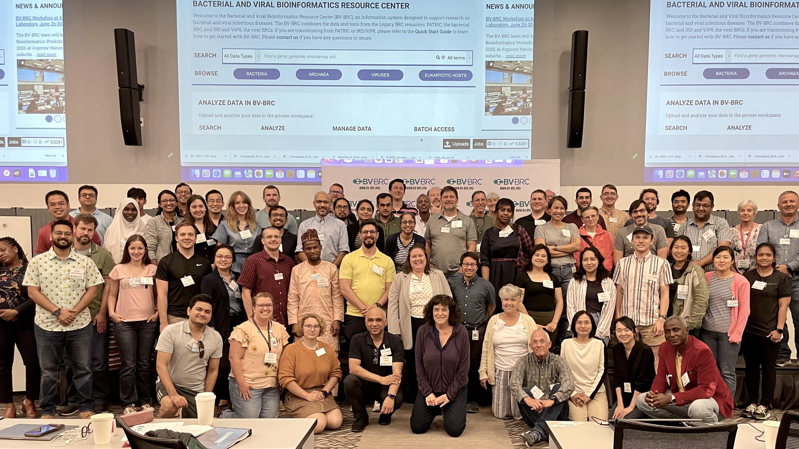

BV-BRC Workshop at J. Craig Venter Institute, May 5-8, 2025
=====================================================================

The BV-BRC (Bacterial and Viral Bioinformatics Resource Center) team will be offering a **Bioinformatics Workshop on May 5-8, 2025, at J. Craig Venter Institute** in La Jolla, California- San Diego County. The workshop will show researchers how to analyze and explore **bacterial and viral pathogen data** using the BV-BRC website, focusing on bacterial, and viral examples and workflows.

This workshop will have two separate components, and researchers can register for one or both. The bacterial component, concentrating on analyzing antimicrobial resistance data, will take place on Monday, May 5th to mid-day on Tuesday, May 6th. The viral component will begin Tuesday, May 6th and concludes on Wednesday, May 7th. Thursday morning will include a command line activity and an activity to tie together BV-BRC analysis.

**Researchers can sign up for one or both of these sessions and must state their preference(s) when they register (see Registration below).**

The workshop will consist of interactive hands-on training sessions. During Days 1-2 (May 5-6) the workshop will concentrate on exploring and analyzing bacterial antimicrobial resistance data . Participants will learn how to search for public datasets of interest and perform genomic, comparative genomic, metagenomic, and transcriptomic analyses using various analysis services and tools at BV-BRC. 

The viral component begins on the afternoon of Day 2 (May 6), concentrating on searching for data performing phylogenetic and comparative genomic analyses.  Day 3 (May 7) focuses on sequence assembly and annotation, subspecies classification, protein structure, surveillance data exploration, sequence feature variant data and transcriptomic analysis. 
Day 4 (May 8) will focus on using the BV-BRC command-line interface for programmatic search and retrieval of data and submission of analysis jobs. Users will also have the opportunity to work with their own data and analysis problems with assistance from the BV-BRC team members.  

**REGISTRATION**

Registration is now closed for this workshop. We hope to see you at a future BV-BRC Workshop.
 

**FAQ**
1) Is there a fee for registraion? No, registration is free!
2) Do I need prior bioinformatic experience? No prior experience is necessary.
3) Will I need to bring my own computer? Yes you will need to bring your own computer. 
4) Are there room blocks for the workshop? We are currently working on room blocks with local hotels- more information to come soon. This page will be updated with hotel information.
5) Do I need to bring my own data? No, the examples will all use publically available data. However if you have a question about your data, please ask and we are happy to help you use the BV-BRC for it. 
6) Do you offer any scholarships for attendance? Unfortunately we do not offer scholarships for attendance but recommend seeking out opportunities on your own. Here are a few options outside of the BV-BRC that might be worth considering, this list is not exhaustive nor supported by us.
https://www.biologists.com/grants/dmm-conference-travel-grants/
https://www.sebiology.org/grants/apply-for-funding.html
Graduate student travel funds from universities

 
**LOCATION**

| Room 306
| J. Craig Venter Institute
| 4120 Capricorn Lane
| La Jolla, CA 92037

**AGENDA**

Day One - Monday, 5 May (Bacterial)
====================================

**9:00 am** Bacteria - Information, registration, and overview
- Welcome and registration
- Overview (www.bv-brc.org)
- Creating genome groups

**10:00 am** Taxonomic Classification
- Description of Kraken2
- Uploading reads and submitting job
- Viewing and interpreting the results
- Work on assignment

**10:45 am** Break

**11:00 am** Metagenomic Read Mapping
- Description of CARD and VFDB and job submission
- Viewing and interpreting results
- Interaction between genes and antibiotics

**11:30 pm** Lunch

**12:30 pm** Comprehensive Genome Analysis Service
- Description of assembly and annotation algorithms
- Uploading reads or contigs and submitting job
- Viewing and interpreting results

**1:30 pm** Similar Genome Finder Service
- Description of MASH/MinHash
- Submitting job
- Viewing and interpreting results

**2:00 pm** Break

**2:15 pm** Phylogenetic Tree Building Service
- Creating a genome group
- Determining if selected genomes are "treeable"
- Description of algorithm and submitting tree-building job
- Viewing and interpreting results

**3:00 pm** Break

**3:15 pm** BLAST
- Choosing BLAST database, parameters, and job submission
- Viewing and interpreting the results

**4:30 pm** Question and Answer Session and Hands-on Work
- Other services
- Work on assigned homework questions

**5:00 pm** Day 1 Adjourn

Day Two - Tuesday, 6 May (Bacterial and Viral)
===============================================

**9:00 am** Comparative Services (Protein Families)
- Description of protein families and job submission
- Finding the pan, core, and accessory genomes
- Visualizing and manipulating the heatmap viewer
- Finding specific differences, downloading, and saving results into private workspace
- Comparing pathways on pathway map and heatmap

**10:00 am** Proteome Comparison
- Selecting genomes for study and job submission
- Visualization of compared genomes and analysis results

**10:30 am** Break

**10:45 am** Compare Region Viewer
- Feature overview
- Description of calculations for gene neighborhoods
- Adjusting the view
- Viewing data of interest (genome and feature groups)

**11:30 am** Gene Tree
- Description of algorithm, selection of data and job submission
- Viewing and interpreting the results

**12:00 pm** Lunch

**1:00 pm** SNP and MSA Variation Service
- Description of algorithm, selection of genes and job submission
- Viewing and interpreting the results

**2:00 pm** Viruses - Information, registration, and overview
- Welcome
- BV-BRC overview (www.bv-brc.org)
- Outbreak Response, Priority Pathogen and Pages

**2:45 pm** Sequence Search and Workspace
- Tool and Service Overview
- Genome filtering
- Data: Overview SFVT
- Advanced search
- Workspace groups
- Uploading sequences to workspace

**3:45 pm** Break

**4:00 pm** Phylogenetic Analysis
- Genomic sequence selection
- Multiple sequence alignment
- Phylogenetic inferencing
- Viewing and interpreting results

**5:00 pm** Adjourn

Day Three - Wednesday, 7 May (Viral)
====================================

**9:00 am** Statistical Sequence Comparison
- Protein sequence
- Metadata-drive comparative analysis service
- Viewing and interpreting results

**9:30 am** BLAST
- Selecting genomes for study and job submission
- Visualization of compared genomes and analysis results

**10:00 am** Sequence Assembly and Annotation
- Description of assembly and annotation algorithms
- Uploading reads or contigs and submitting job
- Viewing and interpreting results
- Preparing Genbank submission

**10:45 am** Break

**10:50 am** Subspecies Classification
- Overview of pplacer and reference trees
- Viruses covered
- Classification of user sequences
- Search by subspecies

**11:30 am** 3D Protein Structure
- Experimentally-determined protein structures
- Predicted protein structures and predicting using AlphaFold 2
- Comparative structure analysis

**12:00 pm** Lunch

**1:00 pm** Other Data – Influenza surveillance and SFVT
- SFVT Search
- Epitope Data
- Selecting surveillance records
- GoogleMap view

**1:45 pm** Waste Water Analysis
- Overview of service
- SARS-CoV-2 Wastewater Analysis Service Parameter Selection
- Viewing and interpreting the results

**2:15 pm** Break

**2:30 pm** RNA-Seq Pipeline
- Description and strategy choice
- Selecting genomes and job submission
- Viewing and interpreting results

**3:30 pm** Docking
- Description and job submission
- Viewing and interpreting results

**4:15 pm** Primer Design
- Description and job submission
- Viewing and interpreting results

**4:30 pm** Command Line Install

**5:00 pm** Adjourn

Day Four - Thursday, 8 May (Activity and Command Line)
======================================================

**9:00 am** Command Line Interface
- Logging in
- Searching for data
- Creating groups from data selections
- Downloading data

**10:00 am** Job submission via command line
- Uploading private data (singular or batch)
- Submitting assembly jobs (singular or batch)
- Submitting annotation jobs (singular or batch)
- Discussion of command line submission to other services

**11:00 am** Break

**11:15 am** Closing Cumulative Activity: Comparative genomics exercise overview
- OneHealth - influenza virus at the human-animal interface

**12:00 pm** Working Lunch

**1:00 pm** Closing Remarks / Workshop Concludes

