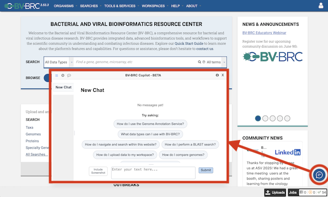

BV-BRC August 2025 Website Release
==================================

AI Copilot
-----------

The BV-BRC team is pleased introduce our new AI Copilot - an AI‑powered chat assistant embedded throughout the BV‑BRC website. It is designed to serve as a virtual helpdesk, guiding users through data, tools, analysis services, and job results in real-time. It also acts as a virtual knowledge hub, answering questions related to biology and bioinformatics concepts without leaving the site. The BV‑BRC Copilot is currently in beta, we seek your feedback to help us improve its capabilities. You can access the Copilot through the small chat icon at the bottom right corner of the website. 

Enhanced Bacterial Annotations
------------------------------
The following enhancements have been made to the bacterial genome annotation service and applied to all public bacterial genomes in BV-BRC.

* Enhanced AMR phenotype prediction using expanded collection of machine learning classifiers, which now includes 191 SIR and 165 MIC prediction models.
* Enhanced AMR gene prediction using AMRFinderPlus and RGI-CARD to enhance detection accuracy using HMM profiles and point mutations and will replace similarity-based AMR gene prediction using BLAT.
* Enhanced specialty gene prediction using latest reference gene catalogs from Virulence Factor Database (VFDB), Therapeutic Target Database (TTD), and Transporter Classification Database (TCDB).
* New metal-resistant gene prediction using BacMet in the BV-BRC specialty gene prediction module to support the annotation of antimicrobial biocide and metal resistance genes.

Outbreak Phylogenetic Trees
---------------------------
Recent updates include a new `N gene tree for measles 2025 <https://www.bv-brc.org/outbreaks/Measles/#view_tab=phylogenetics>`_, `expanded data for Mpox 2024 <https://www.bv-brc.org/outbreaks/Mpox/#view_tab=phylogenetics>`_, `segment-based and concatenated trees for Influenza H5N1 <https://www.bv-brc.org/outbreaks/H5N1/#view_tab=phylogenetics>`_, and a new `clustered tree for SARS-CoV-2 <https://www.bv-brc.org/outbreaks/SARSCoV2/#view_tab=clusteredPhylogeny>`_.

New Analysis Services
---------------------
**Core Genome MLST:** Performs core-genome multi-locus sequence typing (cgMLST) analysis using chewBBACA to identify allelic differences across a defined set of conserved genes shared among a group of bacterial genomes. The output includes an allele matrix, phylogenetic tree, and minimum spanning tee, which help infer population structure and genetic relatedness. This service is suitable for comparing closely related strains from the same or different outbreaks. `Core Genome MLST Service <https://www.bv-brc.org/app/CoreGenomeMLST>`_

**Whole Genome SNP Analysis:** Performs whole-genome SNP analysis, without requiring a reference genome, using kSNP4 to identify core and unique SNPs for a set of input genomes. The output includes SNP distance matrices, heatmaps, and phylogenetic trees. This service is useful for comparing nearly identical isolates from clinical outbreaks. `Whole Genome SNP Analysis Service <https://www.bv-brc.org/app/WholeGenomeSNPAnalysis>`_

New Tutorials
-------------
New tutorial videos are now available on the `BV-BRC YouTube channel <https://www.youtube.com/c/BVBRC>`_, including `Genome Annotation Service <https://www.youtube.com/playlist?list=PLWfOyhOW_Oav3zsNKRx_4EMJQjvY7q_U3>`_, `Genome Assembly Service <https://www.youtube.com/playlist?list=PLWfOyhOW_Oat3lYK7hXorV9jPZxgwBw32>`_, `Similar Genome Finder <https://www.youtube.com/playlist?list=PLWfOyhOW_OashHfld0w1DUkO7rQz6s8SA>`_, `Bacterial Genome Tree Service <https://www.youtube.com/playlist?list=PLWfOyhOW_Oavr0PDosswbQ6tfHBLCMBXZ>`_, `Metagenomic Read Mapping Service <https://www.youtube.com/playlist?list=PLWfOyhOW_Oaurdhs675JawVb4LIcAncKc>`_, and `Metagenomic Binning Service <https://www.youtube.com/playlist?list=PLWfOyhOW_OasTc7mmLSXZvQYrO_R5se47>`_, and more. These walkthroughs highlight how to explore and analyze data efficiently. 
