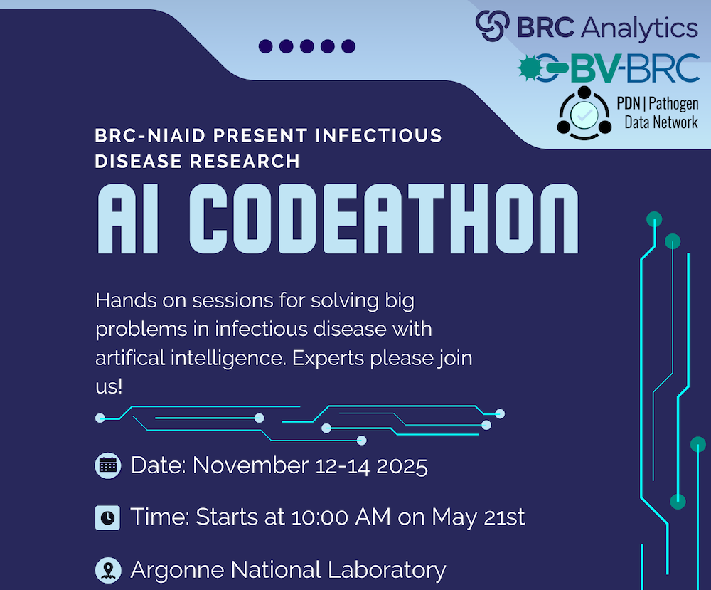

BRC-NIAID AI Codeathon
======================

**When: November 12-14, 2025**

**Where: Argonne National Laboratory, 9700 S Cass Ave, Lemont, IL (outside of Chicago)**

**Apply Here**

**Goals and Topics**

**Logistics and Registration Application**

Accelerating FAIR Data and Tools with AI
----------------------------------------
The NIAID Bioinformatics Resource Centers (BRCs) invite researchers, data scientists, and developers to apply for a three-day AI Codeathon focused on improving Findability, Accessibility, Interoperability, Reusability (FAIR-ness) of BRC data and tools using artificial intelligence (AI) and large language models (LLMs).
This event will bring together participants from diverse backgrounds to build prototypes that lower the learning barrier for new users, streamline data integration, and accelerate infectious disease science.

Codeathon Goals
---------------

* Apply **AI and LLMs** to improve accessibility and usability of BRC data and tools.
* Enhance **interoperability and reuse** of BRC resources.
* Foster collaboration between infectious disease researchers, AI developers, and bioinformaticians.
* Deliver openly available prototypes that can serve as seeds for long-term community solutions.

*NOTE: This is not an AI training session with tutorials and instruction for those that want to learn AI. Rather, it is a hands-on codeathon where participants are expected to work in groups to generate working prototype code and tools that employ AI technologies to advance FAIR-ness and utility of BRC tools and data.*  

Potential Project Topics
------------------------

Participants will form teams and select from proposed themes or pitch new ideas:

* **Virtual BRC Helpdesk**
  
  Navigating the many organisms, datasets, and tools within the BRCs can be challenging. This project will build an AI-powered helpdesk to guide users in real time, helping them discover and use resources more effectively. By lowering the learning barrier, the outcome will be a user-friendly virtual assistant integrated across BRC platforms.

* **Automated Workflow Generation and Execution**

  Researchers often face difficulties turning biological questions into executable workflows. This project will develop AI tools that generate and run workflows from user descriptions or data, connecting BRC and external resources. The outcome will be a prototype that enables fast, reproducible, end-to-end analysis.

* **Automated Knowledge Extraction and Curation from Literature**

  Key biological insights, such as interactions between proteins, pathogens, drugs, and phenotypes, are often hidden in an ever-growing body of publications and hard to extract without spending significant manual curation effort. This project will apply AI to extract and curate such knowledge automatically. The outcome will be a continuously updated, machine-readable knowledge base to support infectious disease research.

* **Assign Functions to Uncharacterized Genes**

  Many genes in priority and prototype pathogens lack functional annotation, slowing discovery of new biology. This project will use AI-driven approaches to predict functions for these uncharacterized genes. The outcome will be a scalable pipeline that provides functional insights to guide research into virulence, drug targets, and biomarkers.

* **Outbreak Monitoring and Tracking**

  Outbreak information is fragmented across surveillance reports, news articles, and scientific publications. This project will develop an AI system to track, collect, filter, and process outbreak data from diverse sources in real-time. The outcome will be a prototype dashboard for near real-time monitoring of emerging infectious threats, generation of comprehensive outbreak reports, or daily alerts.

* **Virtual AI Co-scientist**

  Formulating and refining research hypotheses is labor-intensive and requires deep expertise. This project will create a multi-agent AI system that generates, debates, and ranks hypotheses based on user-defined goals. The outcome will be a prototype “virtual co-scientist” that helps accelerate hypothesis-driven research.

Expected Outcomes
-----------------
At the conclusion of the event, teams will

* Present their projects to the group and other invited stakeholders.
* Share code and documentation publicly.
* Contribute prototypes for potential integration into BRC resources.

Logistics and Registration
--------------------------

Who Should Apply?

* Infectious disease researchers and clinicians
* Bioinformaticians and computational biologists
* AI/ML researchers and engineers
* Students and trainees interested in data science

**Dates: November 12-14, 2025**

**Format: In-person at Argonne National Laboratory, Lemont, Illinois, USA.** 

**Duration: 3 days comprised of intensive group discussions, coding, prototyping, testing, and presentations**

Application and Registration
----------------------------

*Participation is free but space is limited.* **Apply by October 12, 2025**

`Apply Here <https://forms.gle/qQ8usRPUkpGyuLD19>`_
