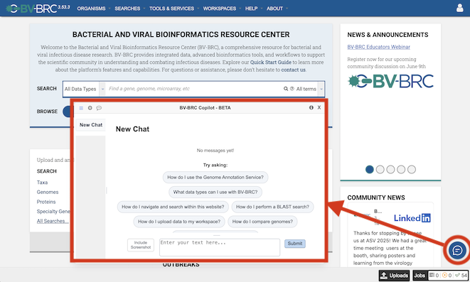

BRC-NIAID AI Codeathon
======================

The NIAID Bioinformatics Resource Centers (BRCs) invite researchers, data scientists, and developers to apply for a three-day AI Codeathon focused on improving Findability, Accessibility, Interoperability, Reusability (FAIR-ness) of BRC data and tools using artificial intelligence (AI) and large language models (LLMs).
This event will bring together participants from diverse backgrounds to build prototypes that lower the learning barrier for new users, streamline data integration, and accelerate infectious disease science.

When: November 12-14, 2025
--------------------------

Where: Argonne National Laboratory, 9700 S Cass Ave, Lemont, IL (outside of Chicago)
------------------------------------------------------------------------------------

Register Here
--------------

Goals and Topics
----------------

Logistics and Registration Application
--------------------------------------

Accelerating FAIR Data and Tools with AI
----------------------------------------

The NIAID Bioinformatics Resource Centers (BRCs) invite researchers, data scientists, and developers to apply for a three-day AI Codeathon focused on improving Findability, Accessibility, Interoperability, Reusability (FAIR-ness) of BRC data and tools using artificial intelligence (AI) and large language models (LLMs).
This event will bring together participants from diverse backgrounds to build prototypes that lower the learning barrier for new users, streamline data integration, and accelerate infectious disease science.

AI Copilot
-----------

The BV-BRC team is pleased introduce our new AI Copilot - an AI‑powered chat assistant embedded throughout the BV‑BRC website. It is designed to serve as a virtual helpdesk, guiding users through data, tools, analysis services, and job results in real-time. It also acts as a virtual knowledge hub, answering questions related to biology and bioinformatics concepts without leaving the site. The BV‑BRC Copilot is currently in beta, we seek your feedback to help us improve its capabilities. You can access the Copilot through the small chat icon at the bottom right corner of the website. 

Enhanced Bacterial Annotations
------------------------------
The following enhancements have been made to the bacterial genome annotation service and applied to all public bacterial genomes in BV-BRC.

* **Enhanced AMR phenotype prediction** using expanded collection of machine learning classifiers, which now includes 191 SIR and 165 MIC prediction models.
* **Enhanced AMR gene prediction** using AMRFinderPlus and RGI-CARD to enhance detection accuracy using HMM profiles and point mutations and will replace similarity-based AMR gene prediction using BLAT.
* **Enhanced specialty gene prediction** using latest reference gene catalogs from Virulence Factor Database (VFDB), Therapeutic Target Database (TTD), and Transporter Classification Database (TCDB).
* **New metal-resistant gene prediction** using BacMet in the BV-BRC specialty gene prediction module to support the annotation of antimicrobial biocide and metal resistance genes.

Outbreak Phylogenetic Trees
---------------------------
Recent updates include a new `N gene tree for measles 2025 <https://www.bv-brc.org/outbreaks/Measles/#view_tab=phylogenetics>`_, `expanded data for Mpox 2024 <https://www.bv-brc.org/outbreaks/Mpox/#view_tab=phylogenetics>`_, `segment-based and concatenated trees for Influenza H5N1 <https://www.bv-brc.org/outbreaks/H5N1/#view_tab=phylogenetics>`_, and a new `clustered tree for SARS-CoV-2 <https://www.bv-brc.org/outbreaks/SARSCoV2/#view_tab=clusteredPhylogeny>`_.

