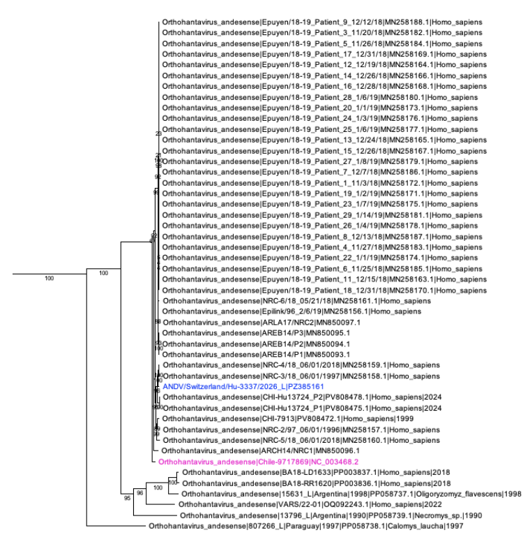
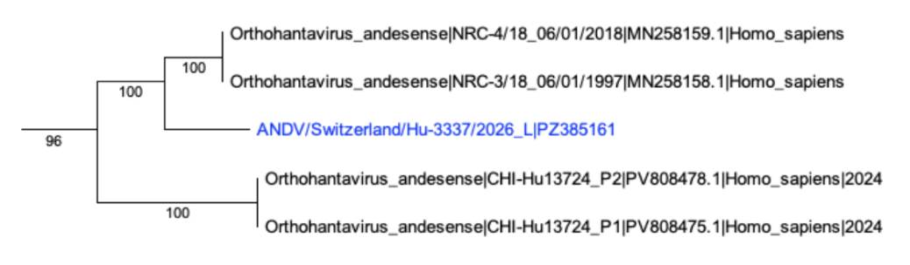
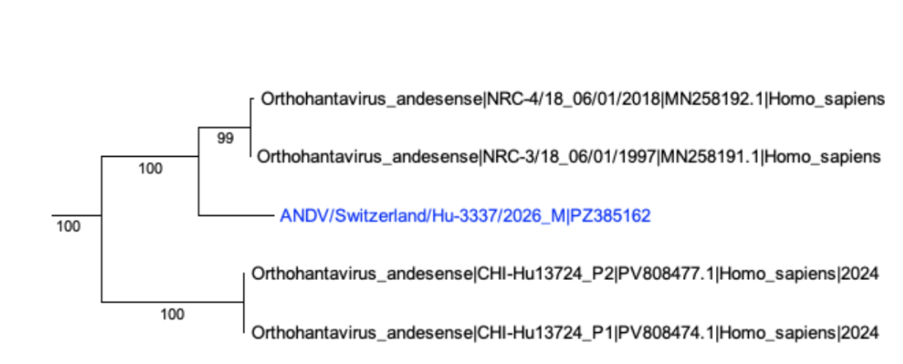
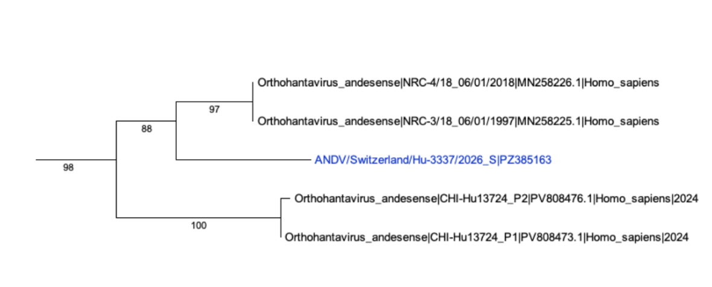

Hantavirus Outbreak 2026- Phylogenetic Analysis
======================================

Christian Zmasek\ :sup:`1`\ , Anna Capria\ :sup:`1`\ , Indresh Singh\ :sup:`1`\ , Elliot J. Lefkowitz\ :sup:`2`\

:sup:`1` Department of Informatics, J. Craig Venter Institute, La Jolla, CA, USA.

:sup:`2` Department of Microbiology, UAB School of Medicine, Birmingham, AL, USA.

Background
----------
Orthohantaviruses (synonym hantaviruses) are a genus belonging to the family Hantaviridae and are carried primarily by rodents, which typically show no symptoms themselves. Humans become infected mainly by breathing in aerosols or droplets from infected rodent excretions, though contaminated food, bites, and scratches can also transmit the virus.

In humans, hantaviruses cause two main diseases. Old World hantaviruses (found in Africa, Asia, and Europe) cause hemorrhagic fever with renal syndrome (HFRS), which affects the kidneys and has a fatality rate of up to 15%. New World hantaviruses (found in the Americas) primarily cause hantavirus pulmonary syndrome (HPS), which starts with flu-like symptoms before progressing to severe respiratory failure, killing roughly 30–40% of those infected. Early treatment is critical for improving survival odds.

In the United States, most circulating hantaviruses cause HPS and are not known to spread person-to-person. A notable exception is the Andes virus in South America, which has shown evidence of human-to-human transmission.

In early May 2026, a hantavirus outbreak on the cruise ship MV Hondius caused three deaths and at least seven total cases among its 147 passengers and crew, prompting authorities to quarantine the vessel off the coast of Cape Verde. The Swiss government confirmed that a man infected with hantavirus was being treated in Zurich, Switzerland. Swiss authorities confirmed that the patient was a passenger on the cruise ship `(Virological Source) <https://virological.org/t/complete-sequence-of-orthohantavirus-andesense-virus-swiss-resident-2026/1023>`_.

Here we provide a preliminary phylogenetic analysis of the species Orthohantavirus andesense with a species focus on the isolate from the Swiss resident.

Data
-----
Public 2026 Hantaviridae strains are available at `BV-BRC <https://www.bv-brc.org/view/Taxonomy/1980413#view_tab=genomes&filter=eq(collection_year,%222026%22)>`_

Results
-------
Our results show that, based on phylogenetic analysis of complete segment sequences at the nucleotide level for Orthohantavirus andesense, the ANDV/Switzerland/Hu-3337/2026 isolate is most closely related to isolates NRC-3/18_06/01/1997 and NRC-4/18_06/01/2018, both originating from Argentina, and is unlikely to be the result of reassortment, since the phylogenetic placement of all three segments is essentially the same. All intermediate and final data is available at BV-BRC workspace `Hantavirus Outbreak 2026- Phylogenetic Analysis <https://www.bv-brc.org/workspace/acapria@bvbrc/Hantavirus%20Outbreak%202026-%20Phylogenetic%20Analysis>`_ These trees and their associated metadata can be reviewed in further detail, downloaded and analyzed as needed. Archeyoptryx, the BV-BRC tree viewing software, has many capabilities including coloring by metadata and changing the display. Users can review the features of Archeyoptryx in more detail `here <https://www.bv-brc.org/docs/quick_references/services/archaeopteryx.html>`_

Maximum likelihood phylogeny for Orthohantavirus andesense large (L) segment. The entire phylogeny as well as the section bracketing ANDV/Switzerland/Hu-3337/2026 (in blue) is shown. Reference sequence NC_003468 is shown in pink.

Maximum likelihood phylogeny for Orthohantavirus andesense medium (M) and small (S) segments. Only the section bracketing ANDV/Switzerland/Hu-3337/2026 (in blue) is shown.

Methods
-------

Reference phylogenies were built with the `vfam_trees pipeline (v1.2.34) <https://github.com/cmzmasek/vfam_trees>`_. For Hantaviridae (NCBI taxid 1980413) species Andes orthohantavirus (taxid 1980456) and Orthohantavirus chocloense (taxid 3052474), all RefSeq + GenBank nucleotide records corresponding to the small (S), medium (M), and large (L) genome segment were retrieved (up to 4000 records per species). Records flagged as synthetic constructs, MAGs, uncultured, unverified, vector, recombinant, or patent sequences, and any record with >1% ambiguous nucleotides, were discarded. Sequences for ANDV/Switzerland/Hu-3337/2026 were injected as raw FASTA sequences. RefSeq absorption (identity ≥0.999) collapsed near-identical RefSeq/GenBank pairs into the RefSeq representative. The filtered set was clustered with MMseqs2 (easy-cluster) at a threshold of 0.999. Two trees were produced: a broad tree and a focused tree. For each, sequences were aligned with MAFFT (--auto), trimmed with trimAl (-automated1), and inferred under GTR+G, using FastTree for the broad tree, and IQ-TREE2 for the focused tree. Terminal-branch outliers were post-filtered iteratively where applicable. Internal nodes were annotated by the species-level LCA of their descendants. Trees were exported as Newick and phyloXML with leaf labels of the form species|strain|accession|host|year|location, omitting absent fields.

References
----------

MMseqs2: Steinegger M, Söding J (2017). MMseqs2 enables sensitive protein sequence searching for the analysis of massive data sets. Nature Biotechnology 35:1026–1028.

MAFFT (v7): Katoh K, Standley DM (2013). MAFFT multiple sequence alignment software version 7: improvements in performance and usability. Molecular Biology and Evolution 30:772–780.

trimAl: Capella-Gutiérrez S, Silla-Martínez JM, Gabaldón T (2009). trimAl: a tool for automated alignment trimming in large-scale phylogenetic analyses. Bioinformatics 25:1972–1973.

FastTree 2: Price MN, Dehal PS, Arkin AP (2010). FastTree 2 - approximately maximum-likelihood trees for large alignments. PLoS ONE 5:e9490.

IQ-TREE 2: Minh BQ, Schmidt HA, Chernomor O, Schrempf D, Woodhams MD, von Haeseler A, Lanfear R (2020). IQ-TREE 2: new models and efficient methods for phylogenetic inference in the genomic era. Molecular Biology and Evolution 37:1530–1534.

phyloXML: Han MV, Zmasek CM (2009). phyloXML: XML for evolutionary biology and comparative genomics. BMC Bioinformatics 10:356.

