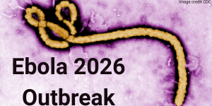
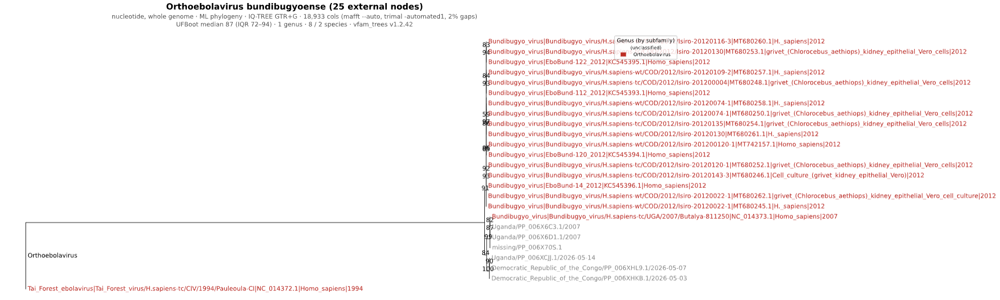

Ebolavirus Outbreak 2026- Phylogenetic Analysis
======================================

Christian Zmasek\ :sup:`1`\ , Anna Capria\ :sup:`1`\ , Indresh Singh\ :sup:`1`\ , Elliot J. Lefkowitz\ :sup:`2`\

:sup:`1` Department of Informatics, J. Craig Venter Institute, La Jolla, CA, USA.

:sup:`2` Department of Microbiology, UAB School of Medicine, Birmingham, AL, USA.

Background
----------
Ebola disease is a severe, often fatal illness caused by viruses in the genus Orthoebolavirus, family Filoviridae. These viruses are thought to be maintained in wildlife reservoirs, with spillover to humans occurring through contact with infected animals. Once introduced into people, Ebola can spread through direct contact with blood, secretions, organs, or other bodily fluids from infected individuals, as well as contaminated surfaces or materials (https://www.who.int/health-topics/ebola#tab=tab_1).
                                                                                                                                                                                                                                                                                                                                                                                                                                                                      
In humans, Ebola disease typically begins with fever, fatigue, muscle pain, headache, and sore throat, followed by vomiting, diarrhea, rash, impaired kidney and liver function, and in some cases internal or external bleeding. Early supportive care, including fluids, symptom management, and treatment of secondary infections, is critical for improving survival.

In May 2026, the Democratic Republic of the Congo declared an Ebola disease outbreak in Ituri Province, with confirmed spread involving Bundibugyo virus. Uganda also reported imported cases linked to the outbreak. On May 17, 2026, the World Health Organization determined that the Ebola disease outbreak caused by Bundibugyo virus in the Democratic Republic of the Congo and Uganda constituted a Public Health Emergency of International Concern(https://www.who.int/news/item/17-05-2026-epidemic-of-ebola-disease-in-the-democratic-republic-of-the-congo-and-uganda-determined-a-public-health-emergency-of-international-concern).
                                                                                                                                                                                                                                                                                                                                                                                                                                                             
Bundibugyo virus has caused previous Ebola outbreaks with reported case fatality rates of approximately 30–50%. Unlike Ebola virus disease caused by Zaire ebolavirus, there is currently no licensed vaccine or specific therapeutic approved for Bundibugyo virus, making rapid detection, isolation, contact tracing, infection prevention, and supportive care especially important(https://www.who.int/emergencies/disease-outbreak-news/item/2026-DON602).
                                                                                                                                                                                                                                                                                                                                                                                        
Before the current 2026 Bundibugyo virus outbreak, the most recent Ebola outbreak was the 2025 Kasaï Province outbreak in the Democratic Republic of the Congo caused by Zaire ebolavirus. That outbreak began in August 2025 and was officially declared over on December 1, 2025. Reported totals included 81 confirmed cases and 28 deaths.
                                                                                                                                                                                                                                                                                                                                                                                        
Here we provide a preliminary phylogenetic analysis of Bundibugyo virus associated with the 2026 Ebola disease outbreak, with a focus on available sequences from the Democratic Republic of the Congo and Uganda.

Data & Analysis
-----
All public Orthoebolavirus genome data is available at `BV-BRC <https://www.bv-brc.org/view/Taxonomy/3044781#view_tab=genomes>`_

The BV-BRC supports family level phylogenetic trees as well as the specific Ebola Outbreak tree, check out the `Filoviridae tree which includes the Orthoebolavirus Genus <https://www.bv-brc.org/view/Taxonomy/11266#view_tab=phylogenyVirus>`_.                                                                                                                                                                                                                                                                                                                                                                                        

For researchers and public health laboratories generating Ebola virus sequencing data, the BV-BRC Viral Assembly Service powered by the Iterative Refinement Meta-Assembler (IRMA) provides a streamlined workflow for assembling Ebola virus genomes directly from raw sequencing reads. Designed for outbreak and genomic surveillance applications, the service supports filoviruses, including Orthoebolavirus species, and enables rapid recovery of consensus genomes, variant detection, and coverage statistics for downstream phylogenetic and epidemiological analysis.

Results                                                                                                                                                                                                                                                                                                                                                                                        
-------
Our results show that, based on phylogenetic analysis of complete genome nucleotide sequences for Orthoebolavirus bundibugyoense, the three 2026 outbreak isolates cluster together in a distinct monophyletic clade, suggesting a closely related transmission lineage associated with the current outbreak. The 2026 sequences (shown in grey; sourced from Pathoplexus) group most closely with previously characterized Bundibugyo virus isolates from Uganda and the Democratic Republic of the Congo, consistent with the known geographic distribution and evolutionary history of the virus. The phylogenetic tree data for this outbreak can be found on the `Filovirdae phylogeny page <https://www.bv-brc.org/view/Taxonomy/11266#view_tab=phylogenyVirus>`_ .  This data and further analysis must adhere to Pathoplexus terms for use of restricted data which can be explored `here <https://pathoplexus.org/about/terms-of-use/restricted-data>`_. Pathoplexus states "Restricted-Use data remains available for public health and research use, while protecting the attribution and publication opportunities of the teams who generated the data." 
                                                                                                                                                                                                                                                                                                                                                                                        

The three 2026 outbreak sequences from pathoplexus (in grey) form a distinct clade as seen in this figure.

Methods
-------

Reference phylogenies were built with the `vfam_trees pipeline (v1.2.34) <https://github.com/cmzmasek/vfam_trees>`_  using complete nucleotide genome sequences for Orthoebolavirus bundibugyoense retrieved from RefSeq and GenBank. Records flagged as synthetic constructs, uncultured, recombinant, patent, vector-associated, or containing >1% ambiguous nucleotides were excluded from analysis. The three 2026 outbreak sequences obtained from Pathoplexus were injected as raw FASTA sequences.
To reduce redundancy, highly similar RefSeq and GenBank sequence pairs (identity ≥0.999) were collapsed into the RefSeq representative. The filtered dataset was subsequently clustered with MMseqs2 (easy-cluster) at a threshold of 0.999.
Sequences were aligned using MAFFT (--auto), followed by automated alignment trimming with trimAl (-automated1). Maximum likelihood phylogenies were inferred under the GTR+G substitution model using FastTree for broad phylogenetic reconstruction and IQ-TREE2 for focused analyses where appropriate. Terminal branch outliers were iteratively evaluated and filtered when necessary. Internal nodes were annotated using the species-level lowest common ancestor (LCA) of descendant taxa. Final phylogenies were exported as both Newick and phyloXML files with leaf labels formatted as species|strain|accession|host|year|location, omitting unavailable metadata fields.
  
For Hantaviridae (NCBI taxid 1980413) species Andes orthohantavirus (taxid 1980456) and Orthohantavirus chocloense (taxid 3052474), all RefSeq + GenBank nucleotide records corresponding to the small (S), medium (M), and large (L) genome segment were retrieved (up to 4000 records per species). Records flagged as synthetic constructs, MAGs, uncultured, unverified, vector, recombinant, or patent sequences, and any record with >1% ambiguous nucleotides, were discarded. Sequences for ANDV/Switzerland/Hu-3337/2026 were injected as raw FASTA sequences. RefSeq absorption (identity ≥0.999) collapsed near-identical RefSeq/GenBank pairs into the RefSeq representative. The filtered set was clustered with MMseqs2 (easy-cluster) at a threshold of 0.999. Two trees were produced: a broad tree and a focused tree. For each, sequences were aligned with MAFFT (--auto), trimmed with trimAl (-automated1), and inferred under GTR+G, using FastTree for the broad tree, and IQ-TREE2 for the focused tree. Terminal-branch outliers were post-filtered iteratively where applicable. Internal nodes were annotated by the species-level LCA of their descendants. Trees were exported as Newick and phyloXML with leaf labels of the form species|strain|accession|host|year|location, omitting absent fields.

References
----------

MMseqs2: Steinegger M, Söding J (2017). MMseqs2 enables sensitive protein sequence searching for the analysis of massive data sets. Nature Biotechnology 35:1026–1028.

MAFFT (v7): Katoh K, Standley DM (2013). MAFFT multiple sequence alignment software version 7: improvements in performance and usability. Molecular Biology and Evolution 30:772–780.

trimAl: Capella-Gutiérrez S, Silla-Martínez JM, Gabaldón T (2009). trimAl: a tool for automated alignment trimming in large-scale phylogenetic analyses. Bioinformatics 25:1972–1973.

FastTree 2: Price MN, Dehal PS, Arkin AP (2010). FastTree 2 - approximately maximum-likelihood trees for large alignments. PLoS ONE 5:e9490.

IQ-TREE 2: Minh BQ, Schmidt HA, Chernomor O, Schrempf D, Woodhams MD, von Haeseler A, Lanfear R (2020). IQ-TREE 2: new models and efficient methods for phylogenetic inference in the genomic era. Molecular Biology and Evolution 37:1530–1534.

phyloXML: Han MV, Zmasek CM (2009). phyloXML: XML for evolutionary biology and comparative genomics. BMC Bioinformatics 10:356.
