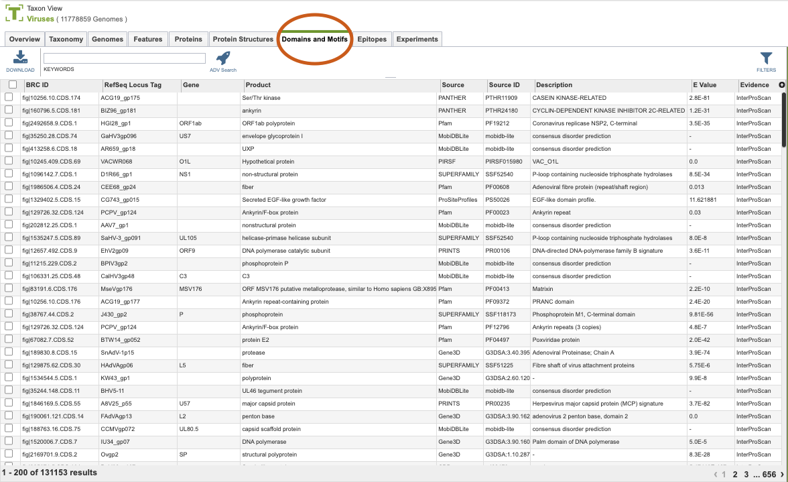
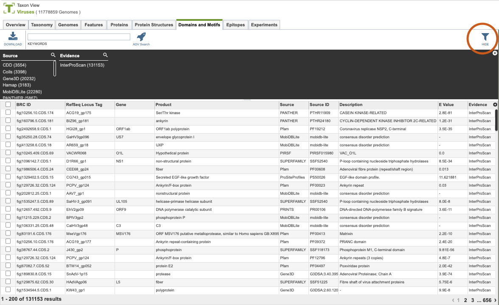

# Domains and Motifs

## Overview
The Domains and Motifs Tab provides a table of all the annotated protein domains and motifs corresponding to the selected Taxon View level or user-defined Group. From this page, domains and motifs can be sorted, filtered, collected into groups, and downloaded. 

## See also
  * [Genome Annotations](/quick_references/organisms_taxon/genome_annotations)
  * [Genome Page Overview](/quick_references/organisms_gene/overview)

## Accessing the Features Table
Clicking the Features Tab in a Taxon View displays the Features Table (shown below), listing all the annotated genomics features corresponding to the set of genomes in the selected taxon level.

The list in the Domain and Motifs table includes annotations of protein domains and motifs sourced from databases such as Pfam, SMART, and others. Annotations are derived from [InterProScan - InterPro at EMBL-EBI](https://www.ebi.ac.uk/interpro/search/sequence/), which provides functional analysis of proteins by classifying them into families and predicting domains and important sites. 

### Domain and Motifs Table Tools
Within this table you may do the following:

* **Download** the entire contents of the table in text, CSV, or Excel format by clicking the Download button above the table on the left side.
[
* **Rearrange and narrow** the list of sequences in the table via sorting (using column headers), keywords (using the Keyword box), and filtering (using the Filters tool).

### Filter Tool

As with all tables, the Filters tool is available to narrow the display of the items in the table, shown below:
  

Clicking on the Filters button at the top right of the table opens the Filter Panel above the table, displaying column names from the table and values for those columns with counts of occurrence.  Clicking on the filter values narrows the list displayed in the table to those matching the chosen filter values.  Clicking the Hide button closes the Filter Panel. More details are available in the [Filter Tool](../other/filter_tool.html) Quick Reference Guide.

### Action buttons

After selecting one or more of the features by clicking the checkbox beside the Genome Name in the table, a set of options becomes available in the vertical green Action Bar on the right side of the table.  These include

* **Hide/Show:** Toggles (hides) the right-hand side Details Pane.
* **Download:**  Downloads the selected items (rows).
* **Copy:** Copies the selected items to the clipboard.
* **Feature:** Loads the Feature Page for the selected feature. *Available only if a single feature is selected.*
* **Genome:** Loads the Genome View Overview page corresponding to the selected feature.  *Available only if a single feature is selected.*
* **FASTA:** Provides the FASTA DNA or protein sequence for the selected feature(s).
* **ID Map:** Provides the option to map the selected feature(s) to multiple other identifiers, such as RefSeq and UniProt.
* **Pathway:** This function Loads the Pathway Summary Table, which contains a list of all the pathways in which the selected features are found.
* **Group:** Opens a pop-up window to enable adding the selected sequences to an existing or new group in the private workspace.

## Sources for Domains and Motifs
* [CDD](https://www.ncbi.nlm.nih.gov/cdd)
* [Coils](https://www.ch.embnet.org/software/COILS_form.html)
* [Gene3D](https://gene3d.biochem.ucl.ac.uk/Gene3D/)
* [Hamap](https://hamap.expasy.org/)
* [MobiDBLite](https://mobidb.bio.unipd.it/)
* [PANTHER](http://www.pantherdb.org/)
* [PIRSF](https://pir.georgetown.edu/pirwww/dbinfo/pirsf.shtml)
* [PRINTS](http://130.88.97.239/cgi-bin/dbbrowser/PRINTS/)
* [Pfam](http://pfam.xfam.org/)
* [ProSitePatterns](https://prosite.expasy.org/)
* [ProSiteProfiles](https://prosite.expasy.org/)
* [SMART](http://smart.embl-heidelberg.de/)
* [SUPERFAMILY](https://supfam.org/SUPERFAMILY/)
* [TIGRFAM](http://www.jcvi.org/cgi-bin/tigrfams/index.cgi)

More details are available in the [Action Buttons](/quick_references/action_bar) Quick Reference Guide.
