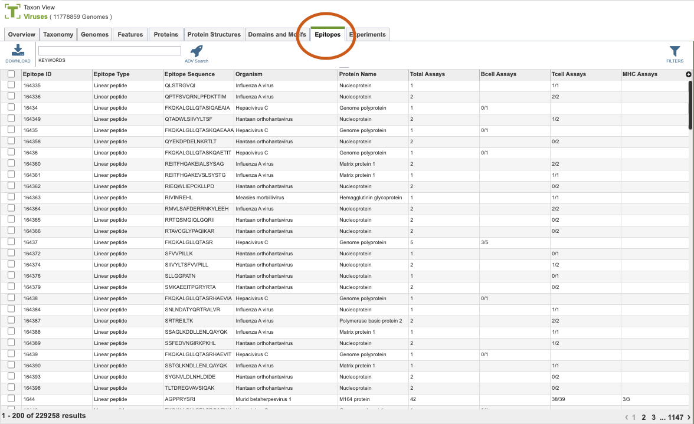
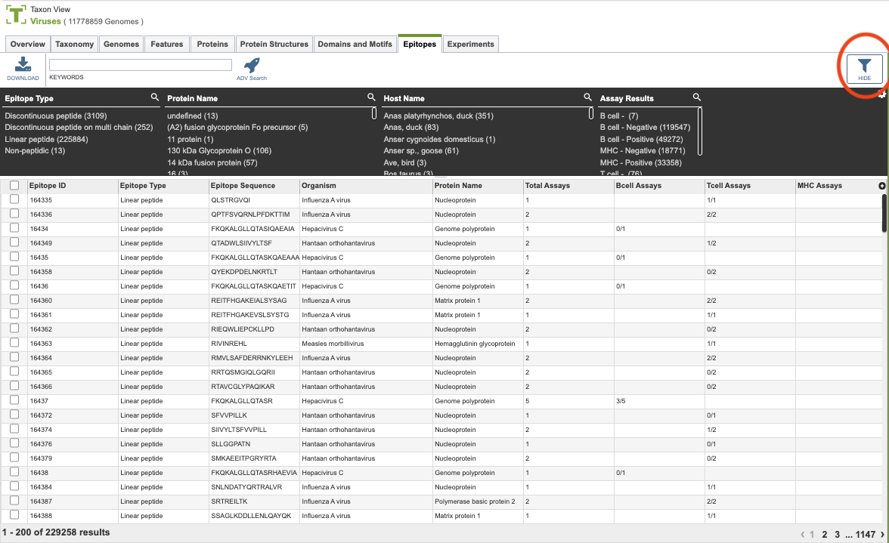

# Epitopes

## Overview
The Epitope Tab provides a comprehensive table of all annotated epitopes (linear, discontinuous, multi-chain, etc.) across selected proteins or user-defined protein groups. From this page, epitopes can be sorted, filtered, grouped, and downloaded for further analysis.

## See also
  * [Genome Annotations](/quick_references/organisms_taxon/genome_annotations)
  * [Genome Page Overview](/quick_references/organisms_gene/overview)
  * [Multiple Sequence Alignment Viewer](/quick_references/other/msa_viewer)

## Accessing the Epitope Table
Clicking the Epitopes Tab in a Taxon View displays the Epitopes Table (shown below), listing all the epitope data corresponding to the set of genomes in the selected taxon level.

The list in the Features table includes annotations created by the BV-BRC annotation service, which includes protein-coding genes and other genomic features, as well as the original annotations (typically from RefSeq), if available. 

### Epitope Table Tools
Within this table you may do the following:

* **Download** the entire contents of the table in text, CSV, or Excel format by clicking the Download button above the table on the left side.

* **Rearrange and narrow** the list of sequences in the table via sorting (using column headers), keywords (using the Keyword box), and filtering (using the Filters tool).

### Filter Tool

As with all tables, the Filters tool is available to narrow the display of the items in the table, shown below:
  

Clicking on the Filters button at the top right of the table opens the Filter Panel above the table, displaying column names from the table and values for those columns with counts of occurrence.  Clicking on the filter values narrows the list displayed in the table to those matching the chosen filter values.  Clicking the Hide button closes the Filter Panel. More details are available in the [Filter Tool](../other/filter_tool.html) Quick Reference Guide.

### Action buttons

After selecting one or more of the features by clicking the checkbox beside the Genome Name in the table, a set of options becomes available in the vertical green Action Bar on the right side of the table.  These include

* **Hide/Show:** Toggles (hides) the right-hand side Details Pane.
* **Download:**  Downloads the selected items (rows).
* **Copy:** Copies the selected items to the clipboard.
More details are available in the [Action Buttons](/quick_references/action_bar) Quick Reference Guide.
