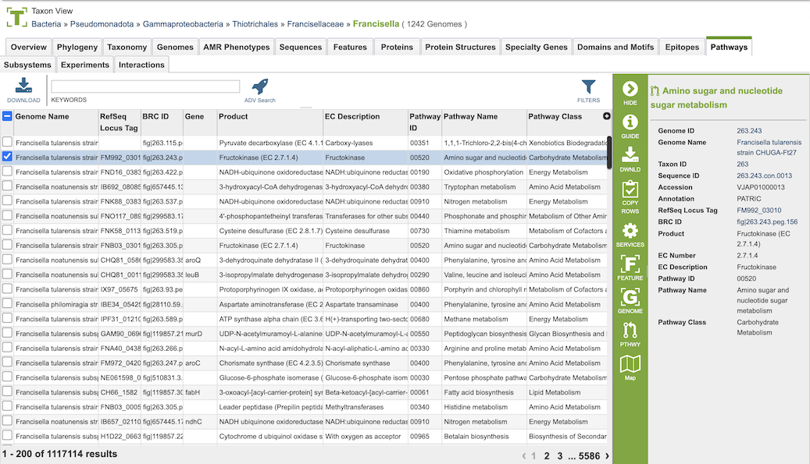

# Pathways

## Overview
The Pathways Tab displays the pathways associated with the selected set of genomes. which displays table that includes the Genome Name, RefSeq Locus Tag, BRC ID, Gene, Product, EC Description, Pathway ID, and Pathway Name. From this table, you can access additional information such as other genomes that contain the pathway and the KEGG map associated with the pathway.

## See also
  * [Comparative Systems Service](https://www.bv-brc.org/app/ComparativeSystems)
  * [Comparative Systems Service Tutorial](/tutorial/comparative_systems/comparative_systems)
  * [Pathway Comparison Tool Quick Reference Guide](/quick_references/other/pathway_comparison_tool)

## Pathway Table
Clicking on the Pathways Tab displays the Pathway table, shown below.

Pathways come from the Kyoto Encyclopedia of Genes and Genomes, commonly known as [KEGG](http://www.genome.jp/kegg/). The data in this table provides summary information regarding the pathways:

* **Genome Name:** Genome name(s) from selected set of genomes or taxonomy level

* **RefSeq Locus Tag:** Unique identifier assigned specific gene in the genome associated with the pathway within the NCBI Reference Sequence (RefSeq) database 

* **BRC ID:** BV-BRC identifier associated with the gene/feature

* **Gene:** Gene name, if available

* **Product:** the molecule or substance that is created as a result of a chemical reaction catalyzed by the enzyme 

* **EC Description** Type of enzyme

* **Pathway ID:** 5-digit identifier defined by KEGG

* **Pathway Name:** Name of the pathway provided by KEGG

* **Pathway Class:** Higher level grouping of pathways provided by KEGG

### Action buttons

After selecting one or more of the genomes by clicking the checkbox beside the Genomes Name in the table, a set of options becomes available in the vertical green Action Bar on the right side of the table.  These include

* **Hide:** Toggles (hides) the right-hand side Details Pane.
* **Download:**  Downloads the selected items (rows).
* **Copy:** Copies the selected items to the clipboard.
* **Genome:** Loads the Genome View Overview page for the selected genome (if only one genome selected).
* **Feature:** Displays the Feature Page for the selected feature. Available only if a single feature is selected.
* **Pathway:** Displays the Pathway Summary Table containing a list of all the pathways in which the selected features are found.
* **Map:** Displays the KEGG map in which the selected feature is found.

More details are available in the [Action Buttons](/quick_references/action_bar) Quick Reference Guide.
