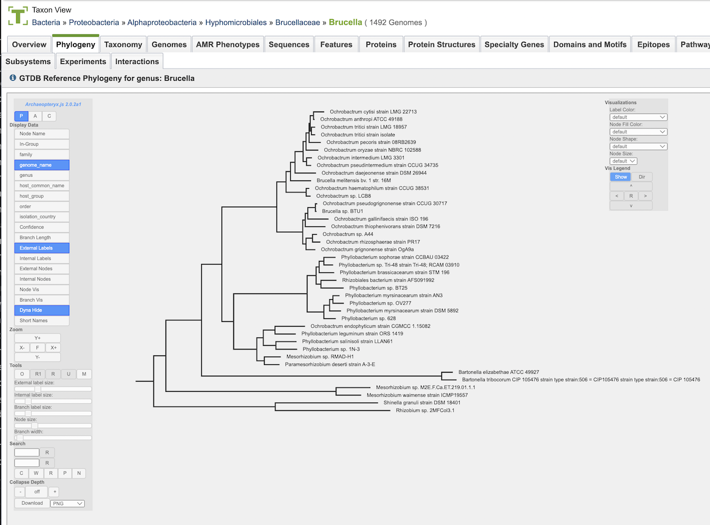

# Phylogeny

## Overview
The Phylogeny Tab and Phylogenetic Tree Viewer allow you to visualize and interact with genome trees. This tab is currently only displayed for bacterial genomes.

## See also
* [Phylogenetic Tree Service](https://bv-brc.org/app/PhylogeneticTree)
* [Phylogenetic Tree Service Tutorial](../../tutorial/phylogenetic_tree/phylogenetic_tree.html)
* [Phylogenetic Tree Service Quick Reference Guide](../services/phylogenetic_tree_building_service.md)

## Accessing Phylogenetic Trees 
Phylogenetic trees can be viewed by either 

* **Clicking the Phylogeny Tab in a Taxon View:** Displays an interactive tree corresponding to the *order* in which the taxon or genome exists.

* **Launching the Phylogenetic Tree Building Service:** Returns, among other files, a Newick file for the tree.  Clicking on the (tree) View button opens the tree in the Phylogenetic Tree Viewer.

### Phylogenetic Tree Viewer

### Phylogenetic Tree Viewer Features and Functionality

**Color Scheme:** The phylogenetic tree branch color scheme is based on genus. Any genera that occur more than once in the tree are assigned a color and every taxon label within that genus is drawn in the genus color. There are a total of 28 colors that may be used. If more than 28 genera are represented multiple times in the tree, then the most common genera will be assigned colors first. Colors are not re-used therefore any additional taxa will be labeled in black.

**Phylogram/Cladogram View:** Trees can be displayed in either phylogram or cladogram view. In the phylogram view, the tree branches are drawn with lengths based upon the branch lengths in the tree. In the cladogram view, the tree branch lengths are disregarded and branches are drawn so that all branch labels line up on the right side of the display. The phylogram view conveys additional information about the evolutionary divergence, while the cladogram view allows better visual resolution of the branching pattern for very closely related taxa (where the branch lengths are too small to allow the branching pattern to be distinguished in the phylogram view).

**Support Values:** Branch support values below 100% are shown. Support values of 100% are not shown.

**Taxon Labels:** The taxon labels in the trees (leaf nodes) are the names of genomes. Clicking the ID Type Button in the vertical green Action Bar enables toggling the labels from genome name to genome ID.

**Accessing Genomes in the Tree:** Clicking on the genome name will add the Genome button to the vertical green Action Bar on the right side of the tree.  Clicking the Genome Button will open the corresponding Genome Page.  If multiple genomes are selected (using ctrl-click), clicking the Genome Button will open a Genome List page. The selected genome(s) can also be added to a group by clicking the Group Button in the Action Bar.

**Downloading Trees:** Clicking the Download Button in the Action Bar will allow downloading the tree as either an SVG (Scalable Vector Graphics) file or a Newick file.

### Phylogenetic Tree Construction
The trees are obtained by extracting subtrees from the global phylogenetic tree of bacteria provided by the Genome Taxonomy Database project (GTDB, https://gtdb.ecogenomic.org).
Version 214 of this tree (available at https://data.gtdb.ecogenomic.org/releases/) contains 80,789 genomes. The tree is built on a concatenated alignment of 120 conserved proteins using maximum likelihood described by (Parks et al., 2018) and here with additional methods described here: https://gtdb.ecogenomic.org/methods.

The python module DendroPy (https://dendropy.org/) was used to write to extract subtrees of the overall GTDB bacterial tree as described below. Of the 80789 genomes on the GTDB tree, 60746 could be matched to bacterial genomes in BVBRC by joining on the assembly accession field. This subset was drawn on for taxon trees. 

To extract a representative tree for a given NCBI taxon, we identified all BVBRC genomes classified as that taxon (using the NCBI taxonomy fields of the GTDB metadata table). Then we followed the path toward the root for all such genomes on the BVBRC subset of the GTDB tree to find where they converge, yielding the most recent common ancestor (mrca). We then extract all genomes descended from this mrca, which can include genomes not classified within the target taxon (due to the NCBI taxonomy being imperfectly phylogenetic). We consider displaying such deviations between taxonomy and phylogeny, however rare, to be useful. 

Because the number of genomes identified by this approach for a given taxon is frequently too large for convenient display, we impose an upper limit and filter out genomes to reach it, typically limiting to 40 genomes. For the filtering process, we eliminate tips in approximately the order of their branch lengths to the immediate ancestral node. This results in trees with fewer nearly identical tips and better representation of diversity.

To provide phylogenetic context for the taxon being illustrated, outgroups are selected from deeper nodes in the tree. For a selected number of nodes (typically 3) immediately ancestral to the mrca, a given number of descendant tips are selected (typically 2). This provides a reasonable chance of obtaining context to appreciate the ingroup taxon. The ingroup/outgroup identities are stored in the phyloxml format (Han and Zmasek, 2009) to allow them to be visualized in the Archaeopteryx tree viewer (Zmasek and Eddy, 2001).

1.	Parks, DH; Chuvochina, M; Waite, DW; Rinke, C; Skarshewski, A; Chaumeil, PA; Hugenholtz, P (November 2018). "A standardized bacterial taxonomy based on genome phylogeny substantially revises the tree of life". Nature Biotechnology. 36 (10): 996–1004. bioRxiv 10.1101/256800. doi:10.1038/nbt.4229. PMID 30148503. S2CID 52093100.

2.	Han, Mira V.; Zmasek, Christian M. (2009). "phyloXML: XML for evolutionary biology and comparative genomics". BMC Bioinformatics. United Kingdom: BioMed Central. 10: 356. doi:10.1186/1471-2105-10-356. PMC 2774328. PMID 19860910.
