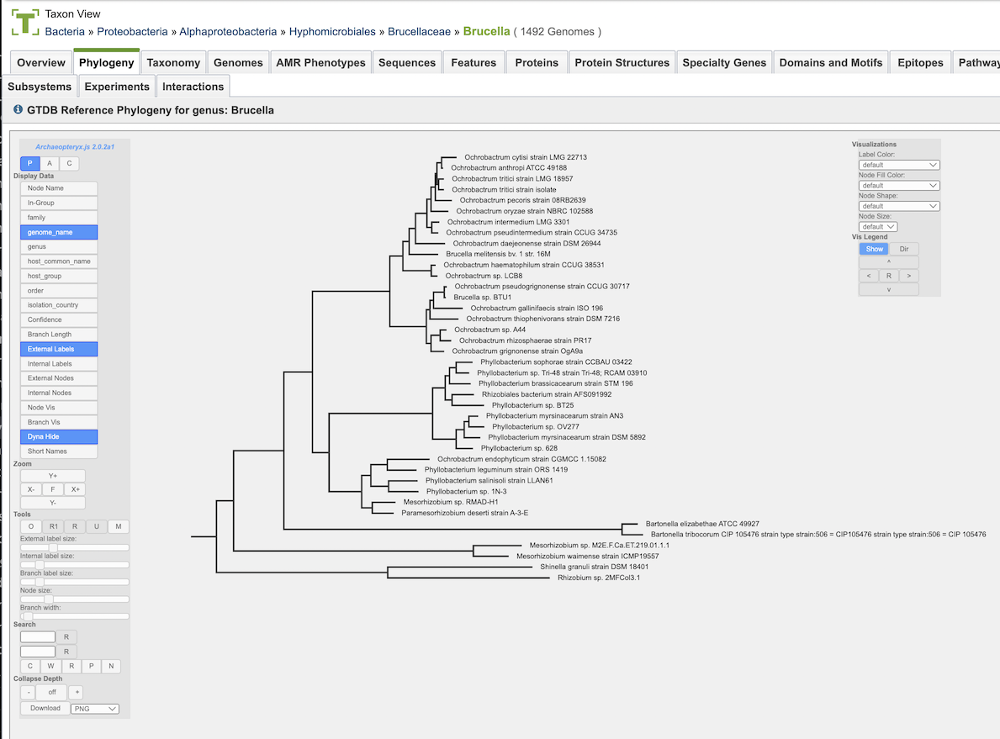

# Phylogeny

## Overview
The Phylogeny tab provides an interactive tree viewer for visualizing and exploring genome-based phylogenetic relationships. Users can examine tree structure, metadata, and branch support directly within the interface. This feature is available for both bacterial and viral genomes.

## See also
* [Phylogenetic Tree Service](https://bv-brc.org/app/PhylogeneticTree)
* [Phylogenetic Tree Service Tutorial](/tutorial/phylogenetic_tree/phylogenetic_tree)
* [Phylogenetic Tree Service Quick Reference Guide](/quick_references/services/phylogenetic_tree_building_service)
* [Archaeopteryx.js Phylogenetic Tree Viewer Quick Reference Guide](/quick_references/services/archaeopteryx)


## Accessing Phylogenetic Trees 
Phylogenetic trees can be viewed by either of the following methods:

* **Clicking the Phylogeny Tab in a Taxon View:** Displays an interactive tree corresponding to the *order* in which the taxon or genome exists.

* **Launching the Phylogenetic Tree Building Service:** Returns, among other files, a Newick file for the tree.  Clicking on the (tree) View button opens the tree in the Phylogenetic Tree Viewer.

### Phylogenetic Tree Viewer


Phylogenetic trees in BV-BRC are rendered using Archaeopteryx.js (Zmasek and Eddy, 2001). By default, the trees are presented in a Phylogram view with genome names as node labels. Archaeopteryx provides controls for changing node labels, node appearance, alternate views, zooming, and others. A detailed description of all features and functionality is provided in the [Archaeopteryx.js Phylogenetic Tree Viewer Quick Reference Guide](/quick_references/services/archaeopteryx).  

## Bacterial Phylogenetic Tree Construction
The trees are obtained by extracting subtrees from the global phylogenetic tree of bacteria provided by the Genome Taxonomy Database project (GTDB, https://gtdb.ecogenomic.org).
Version 214 of this tree (available at https://data.gtdb.ecogenomic.org/releases/) contains 80,789 genomes. The tree is built on a concatenated alignment of 120 conserved proteins using maximum likelihood described by (Parks et al., 2018) and here with additional methods described here: https://gtdb.ecogenomic.org/methods.

The python module DendroPy (https://dendropy.org/) was used to write to extract subtrees of the overall GTDB bacterial tree as described below. Of the 80789 genomes on the GTDB tree, 60746 could be matched to bacterial genomes in BVBRC by joining on the assembly accession field. This subset was drawn on for taxon trees. 

To extract a representative tree for a given NCBI taxon, we identified all BVBRC genomes classified as that taxon (using the NCBI taxonomy fields of the GTDB metadata table). Then we followed the path toward the root for all such genomes on the BVBRC subset of the GTDB tree to find where they converge, yielding the most recent common ancestor (mrca). We then extract all genomes descended from this mrca, which can include genomes not classified within the target taxon (due to the NCBI taxonomy being imperfectly phylogenetic). We consider displaying such deviations between taxonomy and phylogeny, however rare, to be useful. 

Because the number of genomes identified by this approach for a given taxon is frequently too large for convenient display, we impose an upper limit and filter out genomes to reach it, typically limiting to 40 genomes. For the filtering process, we eliminate tips in approximately the order of their branch lengths to the immediate ancestral node. This results in trees with fewer nearly identical tips and better representation of diversity.

To provide phylogenetic context for the taxon being illustrated, outgroups are selected from deeper nodes in the tree. For a selected number of nodes (typically 3) immediately ancestral to the mrca, a given number of descendant tips are selected (typically 2). This provides a reasonable chance of obtaining context to appreciate the ingroup taxon. The ingroup/outgroup identities are stored in the phyloxml format (Han and Zmasek, 2009) to allow them to be visualized in the Archaeopteryx.js tree viewer (Zmasek and Eddy, 2001).


1.	Parks, DH; Chuvochina, M; Waite, DW; Rinke, C; Skarshewski, A; Chaumeil, PA; Hugenholtz, P (November 2018). "A standardized bacterial taxonomy based on genome phylogeny substantially revises the tree of life". Nature Biotechnology. 36 (10): 996–1004. bioRxiv 10.1101/256800. doi:10.1038/nbt.4229. PMID 30148503. S2CID 52093100.

2.	Han, Mira V.; Zmasek, Christian M. (2009). "phyloXML: XML for evolutionary biology and comparative genomics". BMC Bioinformatics. United Kingdom: BioMed Central. 10: 356. doi:10.1186/1471-2105-10-356. PMC 2774328. PMID 19860910.


## Viral Phylogenetic Tree Construction
For each viral family, vfam_trees (v1.1.6) was used for the construction of two maximum-likelihood phylogenies, a broad tree of up to 500 sequences and a representative tree of up to 100 sequences. The pipeline is implemented in Python with Snakemake orchestrating per-family jobs and is available at https://github.com/cmzmasek/vfam_trees.
### 1. Species discovery and sequence acquisition
For each viral family, the family-level NCBI Taxonomy ID is resolved by exact-match query against the Taxonomy database. Candidate species are filtered against an exclusion list (synthetic constructs, environmental metagenomes including "MAG:", uncultured isolates, unverified records, vectors, recombinant constructs, and patent sequences) before sequence retrieval.

### 2. Sequence quality control
Each record is subjected to a four-stage filter:
Organism exclusion: case-insensitive substring matching of the configured exclusion terms against the ORGANISM, SOURCE, and DEFINITION text (joined by a newline to prevent cross-field false matches).
Length filtering: sequences shorter than a minimum length are discarded. By default the minimum is set adaptively, beginning at 50% of the family-wide median sequence length and relaxing to 40% and then 30% if the strict threshold yields no surviving sequences. A hard floor of 200 nt (nucleotide) or 100 aa (protein) is always enforced.
Ambiguity filtering: sequences with more than 1% ambiguous characters (default; configurable) are discarded. Ambiguous characters are defined as IUPAC ambiguity codes for nucleotide sequences (R, Y, S, W, K, M, B, D, H, V, N) and the standard set for protein sequences (X, B, Z, J, O, U).
Deduplication: exact duplicate sequences (within a species) are collapsed to a single representative.
Per-family counts of records excluded at each stage are recorded in summary.tsv for transparency.
### 3. Within-species clustering
Quality-controlled sequences belonging to the same species are clustered to reduce within-species redundancy and to ensure that downstream cross-species subsampling samples biological diversity rather than sequencing depth. Clustering is performed with MMseqs2 easy-linclust (Steinegger & Söding, 2017) using sequence identity as the clustering criterion.
For each species, the most permissive clustering identity that yields a representative count at or below a target maximum is selected via binary search over a configurable identity range (default: 0.70 to 0.99). When a species' sequence count is already at or below the target at the upper bound (0.99), no clustering is performed and all sequences are retained. When the lower bound (0.70) still produces more representatives than the target, the lower-bound representatives are retained as a best effort. The target maximum representatives per species is 20 for the broad tree and 5 for the representative tree.
### 4. Cross-species proportional subsampling
The per-species representative sets are then merged into a single pool of size N, where N is 500 for the broad tree and 100 for the representative tree. When the total number of representatives across species is at most N, all are retained. Otherwise, a per-species quota is assigned proportional to the cluster count of that species, with the constraint that every represented species receives at least one slot whenever feasible. When the number of species exceeds the target N, species are ranked by cluster count and the top N species are each given a single representative. RefSeq records are prioritized within each species' quota: when a species' allocation is smaller than its representative count, RefSeq sequences are taken first and the remainder is filled by uniform random sampling (with a fixed seed for reproducibility). The fraction of RefSeqs retained through this step is recorded.
### 5. Pre-alignment length-outlier removal
Following subsampling, a two-sided length-outlier filter is applied to guard against alignment-distorting fragments and concatenated mis-annotations that survive earlier QC. The median length L of the selected set is computed, and sequences shorter than (1/3) × L or longer than 3 × L are removed. RefSeq records (NCBI accessions matching the XX_ prefix convention, e.g. NC_, NZ_, YP_) are exempt from this filter: a flagged RefSeq is retained and a warning is logged. Counts of long and short outliers removed are recorded in summary.tsv.
### 6. Multiple sequence alignment and trimming
Sequences are aligned with MAFFT (Katoh & Standley, 2013). To balance accuracy and tractable run-time at family scale, separate options are used per tree size and sequence type. By default the broad tree is aligned with --6merpair --retree 1 (a fast progressive strategy), while the representative tree uses --retree 2 for nucleotide data and --auto for amino-acid data. Alignment integrity is validated by parsing the FASTA output and confirming that all aligned sequences have identical column counts.
Alignment columns are then trimmed with trimAl (Capella-Gutiérrez et al., 2009) using the -automated1 heuristic, which selects an optimal gap and conservation threshold tailored to each alignment. Column trimming is applied uniformly to nucleotide and protein alignments and is on by default; it can be disabled per family. Pre-trim alignment length, post-trim length, gap percentage, and trimming options are recorded in summary.tsv.
### 7. Phylogenetic inference
Two phylogenies are inferred per family from independent alignments and sequence sets:
Broad tree (≤500 sequences): FastTree. Maximum-likelihood inference with FastTree 2 (Price et al., 2010), using the GTR model with discrete gamma rate variation (GTR+G) for nucleotide alignments and the LG model with gamma (LG+G) for protein alignments. Branch support is assessed via FastTree's local Shimodaira–Hasegawa-like test (SH-like values, range 0–100 after pipeline normalization).
Representative tree (≤100 sequences): IQ-TREE. Maximum-likelihood inference with IQ-TREE 2 (Minh et al., 2020). Nucleotide alignments are run with --fast (a heuristic search optimized for speed on moderate-size data sets) and the GTR+G substitution model, with branch support assessed by the SH-aLRT test (-alrt 1000, automatically injected by the pipeline when no other support flag is specified). Protein alignments are run with -B 1000 (ultrafast bootstrap; Hoang et al., 2018) and the substitution model selected by ModelFinder (-m TEST; Kalyaanamoorthy et al., 2017) according to the Bayesian Information Criterion. The selected model (e.g. LG+I+G4, Q.yeast+F+I+G4) is parsed from the IQ-TREE log file and recorded in summary.tsv and the PhyloXML provenance string.
Output Newick files are validated by re-parsing with Biopython prior to downstream processing.
### 8. Iterative branch-length outlier removal
Long terminal branches in the resulting tree are identified using a robust median-based criterion. For each tree, the terminal branch lengths b of all leaves are collected, and leaves with b > median(b) + 20 × MAD(b) are flagged as outliers, where MAD is the median absolute deviation. RefSeq leaves are exempt from removal: a flagged RefSeq is retained in the data set and a warning is logged with its branch length and standard score. Non-RefSeq outliers are removed and the alignment + tree are rebuilt; this procedure iterates up to a maximum of three times per tree. Removal is suppressed when (i) it would reduce the data set below a minimum of 40 sequences, (ii) only RefSeq outliers remain, or (iii) no leaf exceeds the threshold. The number of branch-length outliers removed across all iterations is recorded per tree.
### 9. Tree rooting
Trees are rooted by a three-tier strategy:
Taxonomy-guided rooting. Every branch in the tree is tested as a candidate root position. For each placement, the mean LCA specificity is computed across all internal nodes, where the specificity of an internal node is defined as the depth (number of ranked-lineage entries) of the LCA of its leaves' NCBI lineages. The branch maximizing mean specificity is selected as the root; ties are broken in favor of the shorter branch. This approach exploits the principle that the correct root maximizes the agreement between tree topology and external taxonomy.
MAD rooting. When taxonomic lineage information is unavailable for too many leaves to support taxonomy-guided rooting, the Minimum Ancestor Deviation (MAD; Tria et al., 2017) algorithm is applied. MAD selects the root that minimizes deviation from a strict molecular clock, and is well-suited to viral families where taxonomy is sparse or contested.
Midpoint rooting. As a final fallback, the tree is rooted at the midpoint of the longest leaf-to-leaf path.
The strategy actually used is logged per family.
## 10. Internal-node taxonomic annotation
After rooting, internal nodes are annotated with their LCA taxon. For each internal node, the intersection of the ranked NCBI lineages of its descendant leaves is computed, and the deepest shared taxon is attached as the node label, together with its taxonomic rank (family, subfamily, genus, subgenus, species). Redundant labels — internal nodes whose two leaf children belong to the same species — are suppressed to keep visualizations uncluttered.
## 11. Output and provenance

For each family, both trees are exported in Newick and PhyloXML 1.20 format. PhyloXML files preserve taxonomy IDs, GenBank accession numbers, host, isolate/strain, collection date, geographic location, and resolved taxonomic ranks (genus, subgenus, subfamily) as structured vipr:-namespaced properties on each leaf, allowing downstream viewers (e.g. Archaeopteryx; Han & Zmasek, 2009) to color or filter leaves by any field. A style:font_color property carries the genus-based leaf color used in the rendered figures. Internal-node taxa are exported within <taxonomy> elements with controlled-vocabulary <rank> values. Each PhyloXML file's <description> element records pipeline version, exact MSA tool and options, exact tree-inference tool, model, and options, and the clustering identity range actually used, providing a self-contained provenance record for downstream re-analysis. A detailed description of every output file is provided in OUTPUT_FILES.md.
For cross-family comparison, a summary.tsv containing per-family species and sequence counts, QC exclusion breakdowns, post-QC sequence-length statistics, alignment statistics, support-value distributions, branch-length outlier counts, genus and subfamily diversity counts, and (optionally) Baltimore classification is written; a companion status.tsv records a one-row outcome (OK or skip reason) for every family attempted.
### Software versions
Versions reported in this Methods section are the defaults shipped with vfam_trees v1.1.6. The actual versions used in any given run are recorded automatically in the <description> element of each PhyloXML output and in summary.tsv. Required external tools are: NCBI Entrez (via Biopython ≥ 1.81; Cock et al., 2009), MMseqs2 (Steinegger & Söding, 2017), MAFFT (Katoh & Standley, 2013), trimAl (Capella-Gutiérrez et al., 2009), FastTree 2 (Price et al., 2010), and IQ-TREE 2 (Minh et al., 2020).

## References
Capella-Gutiérrez S., Silla-Martínez J.M., Gabaldón T. (2009) trimAl: a tool for automated alignment trimming in large-scale phylogenetic analyses. Bioinformatics 25:1972–1973. \
Cock P.J.A. et al. (2009) Biopython: freely available Python tools for computational molecular biology and bioinformatics. Bioinformatics 25:1422–1423. \
Han M.V., Zmasek C.M. (2009) phyloXML: XML for evolutionary biology and comparative genomics. BMC Bioinformatics 10:356. \
Hoang D.T., Chernomor O., von Haeseler A., Minh B.Q., Vinh L.S. (2018) UFBoot2: Improving the ultrafast bootstrap approximation. Molecular Biology and Evolution 35:518–522. \
Kalyaanamoorthy S., Minh B.Q., Wong T.K.F., von Haeseler A., Jermiin L.S. (2017) ModelFinder: fast model selection for accurate phylogenetic estimates. Nature Methods 14:587–589. \
Katoh K., Standley D.M. (2013) MAFFT multiple sequence alignment software version 7: improvements in performance and usability. Molecular Biology and Evolution 30:772–780. \
Minh B.Q. et al. (2020) IQ-TREE 2: New models and efficient methods for phylogenetic inference in the genomic era. Molecular Biology and Evolution 37:1530–1534. \
Price M.N., Dehal P.S., Arkin A.P. (2010) FastTree 2 — approximately maximum-likelihood trees for large alignments. PLoS ONE 5:e9490. \
Steinegger M., Söding J. (2017) MMseqs2 enables sensitive protein sequence searching for the analysis of massive data sets. Nature Biotechnology 35:1026–1028. \
Tria F.D.K., Landan G., Dagan T. (2017) Phylogenetic rooting using minimal ancestor deviation. Nature Ecology & Evolution 1:0193. 

## Viral Tree Download
### 1. Tree files

**Newick (<Family>_tree_500.nwk, <Family>_tree_100.nwk)**
Plain text trees in standard Newick format. Internal nodes are annotated with the last common ancestor (LCA) taxon name (e.g. genus, subfamily) wherever the taxonomy of the descendant leaves agrees. Branch lengths are in expected substitutions per site. Support values are attached to internal nodes (range and meaning depend on the tree tool — see PhyloXML section). These are intended for downstream programmatic use (Bio.Phylo, ETE, dendropy, R ape, etc.).

**PhyloXML (<Family>_tree_500.xml, <Family>_tree_100.xml)**
Richly-annotated phylogenetic XML. This is the canonical output format — it carries the tree topology plus per-leaf metadata, taxonomy, and visual styling that a Newick file cannot. Detailed structure is given in 6. below.

**Tree images: rooted rectangular (<Family>_tree_500.pdf / .png, <Family>_tree_100.pdf / .png)**
Conventional left-to-right rectangular cladograms, rooted by the pipeline's taxonomy-guided algorithm (with MAD and midpoint fallbacks). Support values below 50% are suppressed for visual clarity. Leaf labels are colored by genus (one hue band per subfamily; lightness varies across genera within a subfamily). A structured legend grouped by subfamily appears alongside the tree.

**Tree images: unrooted radial (<Family>_tree_500_ur.pdf / .png, <Family>_tree_100_ur.pdf / .png)**
Radial (fan) layout with no root and no internal-node or support labels, useful for inspecting overall topology and divergence without any one root hypothesis.

**Tree icon (<Family>_tree_icon.png)**
Square topology-only thumbnail of tree_100.


### 2. Sequence and alignment files

**Raw QC'd sequences (<Family>_sequences_raw_500.fasta, <Family>_sequences_raw_100.fasta)**
Sequences that entered the MSA, after: organism-name exclusion (e.g. synthetic constructs, patents), length filtering, ambiguity filtering, deduplication, per-species clustering with MMseqs2, and proportional cross-species subsampling. RefSeq records are preferred during subsampling and never removed by the length-outlier or branch-length-outlier filters. Headers carry pipe-delimited display names: <species>|<strain>|<accession>|<host>.

**Final alignment (<Family>_alignment_500.fasta, <Family>_alignment_100.fasta)**
The MSA actually fed to the tree-building step — MAFFT alignment, optionally column-trimmed by trimAl (-automated1 by default). Reflects the final iteration after any post-tree branch-length outlier removal. Length and gap percentage are reported in summary.tsv.


### 3. Metadata files

**Sequence metadata TSV (<Family>_metadata_500.tsv, <Family>_metadata_100.tsv)**
One row per sequence in the corresponding tree. Columns include short_id, display_name, accession, species, strain, host, collection_date, location, taxon_id, length. This is a flat, spreadsheet-friendly view of what's encoded richly in the PhyloXML.

**ID map (<Family>_id_map.tsv)**
Three columns: short_id (used internally during MSA/tree inference because phylogenetics tools choke on long names), accession, display_name. Restores the human-readable label after tree inference.

**Color map (<Family>_colors_500.json, <Family>_colors_100.json)**
JSON mapping each leaf's display_name to a hex color. The same colors are reused in the PDF/PNG figures and the PhyloXML style:font_color property.


### 4. Configuration & log

**Resolved per-family config (<Family>.yaml)**
The fully merged configuration actually used for this family — global config + family overrides + defaults. Useful for reproducibility and for re-running a single family with the same settings.

**Per-family log (<Family>.log)**
Verbose, time-stamped log of every pipeline step for this family: NCBI fetches, QC counts, clustering thresholds tried, MSA + tree commands, outlier removal decisions, RefSeq-protection warnings, rooting choice, and timing.


### 5. Reports

**Per-family report (<Family>_report.pdf)**
Multi-page PDF with:

Stats table — species discovered, sequences kept after each QC stage, clustering identity, tree leaf counts, support distribution.
Post-QC sequence length histogram — pre-MSA distribution.
Per-tree sequence-length histograms for tree_500 and tree_100.
SH support histograms for tree_500 and tree_100.
tree_100 visualization with the genus/subfamily color legend.
Sequence-length plot (<Family>_seqlen_plot.pdf)
Standalone histogram of post-QC sequence lengths.


### 6. PhyloXML files: detailed description

PhyloXML is an XML schema for phylogenetic trees. Standard viewers include Archaeopteryx, Forester, and Dendroscope. Below is a description of every element the pipeline emits, what biological information it carries, and how a viewer renders it.

| Field / Element                              | Description                                                                                                                                         |
| -------------------------------------------- | --------------------------------------------------------------------------------------------------------------------------------------------------- |
| `<phyloxml xmlns="http://www.phyloxml.org">` | Root container element defining the document as PhyloXML and declaring the PhyloXML namespace                                                       |
| `<phylogeny>`                                | Container for a single phylogenetic tree                                                                                                            |
| `rooted="true"`                              | Indicates the tree is explicitly rooted                                                                                                             |
| `rerootable="false"`                         | Instructs compatible viewers not to reroot the tree                                                                                                 |
| Rooting method                               | The root is determined by a taxonomy-guided LCA specificity algorithm, with MAD (Minimum Ancestor Deviation) and midpoint rooting used as fallbacks |
| Viewer behavior note                         | The `rerootable="false"` attribute helps prevent tree viewers from automatically overriding the pipeline-defined root                               |

**Phylogeny header**
| Field / Element | Description                                                                                                                                                                                                                                                                             |
| --------------- | --------------------------------------------------------------------------------------------------------------------------------------------------------------------------------------------------------------------------------------------------------------------------------------- |
| `<name>`        | Short tree title encoding key parameters in pipe-delimited format (`family\|molecule\|segment/region\|MSA tool\|tree method/model`); designed for quick readability in tree viewers                                                                                                     |
| `<description>` | Full provenance record including pipeline version, target family, UTC timestamp, molecule/segment, target tree size, clustering identity range, multiple sequence alignment (MSA) tool with version and parameters, and phylogenetic inference tool with version and substitution model |


**Clade element: the tree itself**
The tree topology is a recursive nesting of <clade> elements. Each <clade> represents either a leaf (terminal taxon) or an internal node (LCA of its descendants). The PhyloXML schema fixes child-element order: name, branch_length, confidence, taxonomy, sequence, property, then nested <clade> children.

**Common to leaves and internals**
| Field / Element   | Description                                                                                                                                                                 |
| ----------------- | --------------------------------------------------------------------------------------------------------------------------------------------------------------------------- |
| `<branch_length>` | Length of the branch leading to the node, measured in expected substitutions per site (maximum likelihood units); represented as horizontal distance in tree visualizations |
| `<confidence>`    | Branch support value (0–100) indicating statistical confidence in the split                                                                                                 |
| `type="SH_aLRT"`  | Shimodaira–Hasegawa-like approximate likelihood ratio test (IQ-TREE); ≥80 indicates strong support                                                                          |
| `type="SH_like"`  | FastTree local Shimodaira–Hasegawa support; ≥80 strong support, 50–80 moderate/uncertain, <50 typically suppressed in visualizations                                        |
| `type="UFBoot"`   | Ultrafast bootstrap support (IQ-TREE with `-bb`); ≥95 indicates strong support                                                                                              |

**Leaves** 
```xml
<clade>
  <name>Orthohantavirus_andesense|CHI-7913|PV808472.1|Homo_sapiens</name>
  <branch_length>0.013183853</branch_length>
  <taxonomy>
    <id provider="ncbi">1980456</id>
    <scientific_name>Orthohantavirus andesense</scientific_name>
  </taxonomy>
  <sequence>
    <accession source="ncbi">PV808472.1</accession>
    <name>Orthohantavirus andesense isolate CHI-7913 segment L, complete sequence</name>
  </sequence>
  <property ref="vipr:Host" datatype="xsd:string" applies_to="node">Homo sapiens</property>
  <property ref="vipr:Collection_Date" datatype="xsd:string" applies_to="node">1999</property>
  <property ref="vipr:Strain" datatype="xsd:string" applies_to="node">CHI-7913</property>
  <property ref="vipr:Year" datatype="xsd:string" applies_to="node">1999</property>
  <property ref="vipr:Species" datatype="xsd:string" applies_to="node">Orthohantavirus andesense</property>
  <property ref="vipr:Genus" datatype="xsd:string" applies_to="node">Orthohantavirus</property>
  <property ref="vipr:Subgenus" datatype="xsd:string" applies_to="node">...</property>
  <property ref="vipr:Subfamily" datatype="xsd:string" applies_to="node">...</property>
  <property ref="style:font_color" datatype="xsd:token" applies_to="node">#21e6e6</property>
</clade>
```

| Field / Element             | Description                                                                                                        |
| --------------------------- | ------------------------------------------------------------------------------------------------------------------ |
| `<name>`                    | Pipe-delimited display name (`species\|strain\|accession\|host`); appears as the leaf label in tree viewers        |
| `<taxonomy>`                | Container for taxonomy metadata                                                                                    |
| `<id provider="ncbi">`      | NCBI Taxonomy ID (useful for linking or joining to external datasets)                                              |
| `<scientific_name>`         | Official species name (binomial)                                                                                   |
| `<sequence>`                | Container for sequence metadata                                                                                    |
| `<accession source="ncbi">` | GenBank accession with version (e.g., PV808472.1)                                                                  |
| `<sequence><name>`          | Full GenBank record title (DEFINITION line; useful for identifying complete vs partial sequences)                  |
| `<property>`                | Generic metadata element storing key-value annotations for each node                                               |
| `ref`                       | Namespace-qualified key (e.g., `vipr:` or `style:`) recognized by viewers                                          |
| `datatype="xsd:string"`     | Indicates the value is stored as a string                                                                          |
| `applies_to="node"`         | Specifies metadata applies to the leaf node (not the branch)                                                       |
| `vipr:Host`                 | Host organism                                                                                                      |
| `vipr:Collection_Date`      | Full collection date                                                                                               |
| `vipr:Year`                 | 4-digit collection year (parsed for filtering/visualization)                                                       |
| `vipr:Location`             | Geographic collection location                                                                                     |
| `vipr:Strain`               | Isolate/strain designation                                                                                         |
| `vipr:Species`              | Species classification                                                                                             |
| `vipr:Genus`                | Genus classification                                                                                               |
| `vipr:Subgenus`             | Subgenus classification (if available)                                                                             |
| `vipr:Subfamily`            | Subfamily classification (if available)                                                                            |
| `style:font_color`          | Hex color applied to leaf labels in compatible viewers (e.g., Archaeopteryx); consistent with figure color schemes |
| Missing values              | Fields not present in output were not available in the source GenBank record                                       |
| `"unknown"` handling        | Values labeled as `"unknown"` internally are omitted in the final PhyloXML output                                  |


**Internal nodes (LCA-annotated)**

```xml
<clade>
  <name>Orthohantavirus</name>
  <branch_length>0.114886822</branch_length>
  <confidence type="SH_like">50</confidence>
  <taxonomy>
    <scientific_name>Orthohantavirus</scientific_name>
    <rank>genus</rank>
  </taxonomy>
  <clade>...</clade>
  <clade>...</clade>
</clade>
```

| Field / Element     | Description                                                                                                                                                                                                                                                                   |
| ------------------- | ----------------------------------------------------------------------------------------------------------------------------------------------------------------------------------------------------------------------------------------------------------------------------- |
| `<name>`            | Taxon name assigned where the lowest common ancestor (LCA) of all descendants agrees on a named rank (e.g., genus *Orthohantavirus*, family *Hantaviridae*, subfamily *Mammantavirinae*). Enables visual placement of clades within standard taxonomy without external lookup |
| `<taxonomy>`        | Container for structured taxonomy annotation at the node level                                                                                                                                                                                                                |
| `<scientific_name>` | Taxonomic name corresponding to the inferred LCA                                                                                                                                                                                                                              |
| `<rank>`            | Taxonomic rank associated with the LCA (e.g., family, subfamily, genus, subgenus, species); values follow the PhyloXML schema vocabulary, with unsupported ranks collapsed to `other`                                                                                         |
| Label suppression   | If an internal node has exactly two descendant leaves of the same species, the LCA label is considered redundant and omitted (no `<name>` element), reducing visual clutter                                                                                                   |


