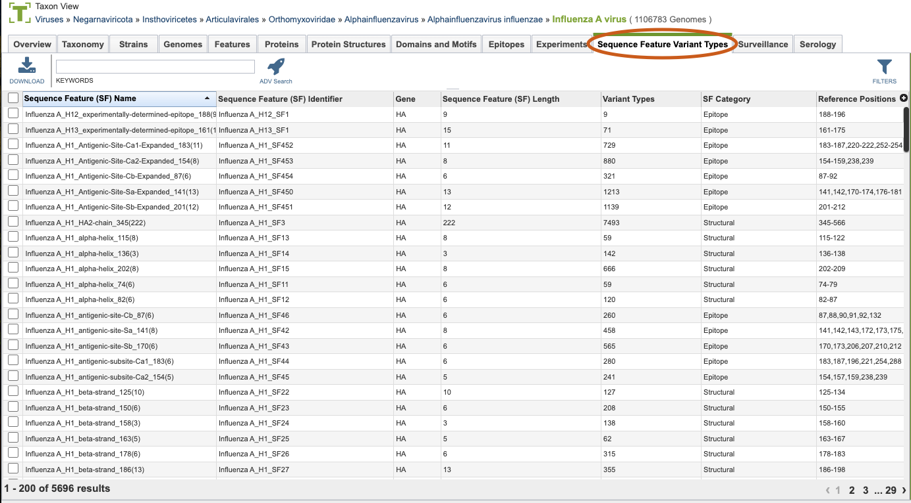
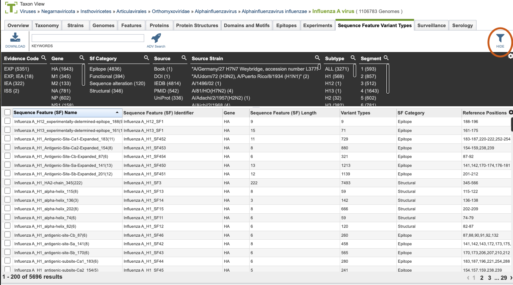
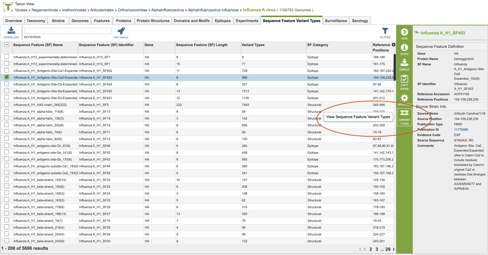
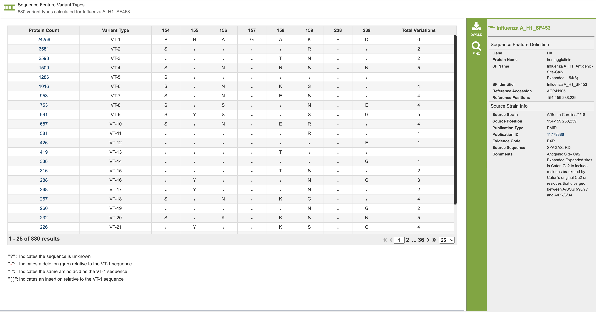

# Sequence Feature Variant Types

## Overview
The Sequence Feature Variant Types Tab provides a comprehensive understanding of a pathogen is essential for analyzing genotype-phenotype associations. Understanding how changes in a pathogen’s genomic sequence may be reflected in its functional characteristics is crucial for understanding pathogenesis. Traditionally, the relationship between genotype and phenotype is assessed by phylogenetic analysis of whole genome sequences or statistical tests of association between single residue variations and specific phenotypic characteristics. However, these approaches have limitations, such as not providing direct information about the specific region contributing to the phenotypic effect.
The Sequence Feature Variant Types (SFVT) approach addresses these limitations. SFVT defines distinct sequence features (SFs) of constellations of amino acid positions based on functional and structural characteristics. SFVTs capture the extent of sequence variations observed within these combinations and are used for statistically analyzing genotype-phenotype associations.

## Sequence Feature Description
A Sequence Feature (SF) is a specific region of a protein with some characteristic of interest, such as:
* Structural properties (e.g., alpha helix, beta sheet)
* Functional properties (e.g., nuclear localization signal, enzyme active sites)
* Positions where sequence alterations have functional effects (e.g., changes in virulence)
* Immune epitopes

SFs can be continuous or discontinuous stretches of amino acids and can overlap. They are annotated with additional information, including a descriptive name, the protein in which it occurs, start and end positions, total length, category (structural, functional, sequence alteration, or immune epitope), virus strain, known associated phenotypes, evidence codes, and the publication or resource where it was described.

## Workflow for Defining a Sequence Feature

* Identify reference sequence
* Develop coordinate system
* Map positions
* Obtain metadata including:
* Virus Information (type, subtype, strain, segment-protein)
* SF Information (name, strain-specific position, sequence in the source strain, category, comments)
* Reference (public domain databases like PubMed, UniProt, PDB)

## See also
  * [Genome Annotations](/quick_references/organisms_taxon/genome_annotations)
  * [Genome Page Overview](/quick_references/organisms_gene/overview)
  * [Multiple Sequence Alignment Viewer](/quick_references/other/msa_viewer)
  * [Advanced Searches](/quick_references/searches_menu)

## Accessing the SFVT Table
Clicking the Sequence Feature Variant Types (SFVT) Tab in a Taxon View displays the SFVT Table (shown below), listing all the SFVT data corresponding to the set of genomes in the selected taxon level.

### Sequence Feature Variant Types (SFVT) Table Tools
Within this table you may do the following:

* **Download** the entire contents of the table in text, CSV, or Excel format by clicking the Download button above the table on the left side.

* **Rearrange and narrow** the list of sequences in the table via sorting (using column headers), keywords (using the Keyword box), and filtering (using the Filters tool).

### Filter Tool

As with all tables, the Filters tool is available to narrow the display of the items in the table, shown below:
  

Clicking on the Filters button at the top right of the table opens the Filter Panel above the table, displaying column names from the table and values for those columns with counts of occurrence.  Clicking on the filter values narrows the list displayed in the table to those matching the chosen filter values.  Clicking the Hide button closes the Filter Panel. More details are available in the [Filter Tool](../other/filter_tool.html) Quick Reference Guide.

One filter specific to the Sequence Feature Variant Types is the evidence code. The options for evidence code include EXP for experimental evidence, IEA for inferred electronic annotation and ISS for inferred from sequence or structural similarity.

### Action buttons

After selecting one or more of the features by clicking the checkbox beside the Genome Name in the table, a set of options becomes available in the vertical green Action Bar on the right side of the table.  These include

* **Hide/Show:** Toggles (hides) the right-hand side Details Pane.
* **Download:**  Downloads the selected items (rows).
* **Guide:**  The way to come back to this guide.
* **Copy:** Copies the selected items to the clipboard.
* **Variant Types** takes you to the variant type when you click on one specific row.

### Accessing the Variant Type Table
From the Sequence Feature Variant Type Tab, you can click on a specific variant type to view the amino acid changes for that specific sequence feature. You can see where to click in the below image. Any single variant type tab can be viewed and further analyzed.

This leads to the variant type table, which shows the amino acid changes within each variant type, as seen below. This table shows all of the variant types in descending order and is unique for each variant type. The specific amino acids are shown, including differences for each row. The number of specific amino acid shifts from the most common variant are listed in the last column- labeled total variation. Clicking on the value in the protein count table will take you to the feature group, which includes all of the sequences with that specific variant.

  
### Additional Information 
Sequence Feature Variant Types can be accessed and searched for using the [Advanced Searches](/quick_references/searches_menu). One of the advanced searches is [Sequence Feature Variant Types Advanced Search](www.bv-brc.org/searches/SFVTSearch) which you can utilize to find sequence features or sequence feature variant types based on amino acids, and their variant expression.  
More details are available in the [Action Buttons](/quick_references/action_bar) Quick Reference Guide.
