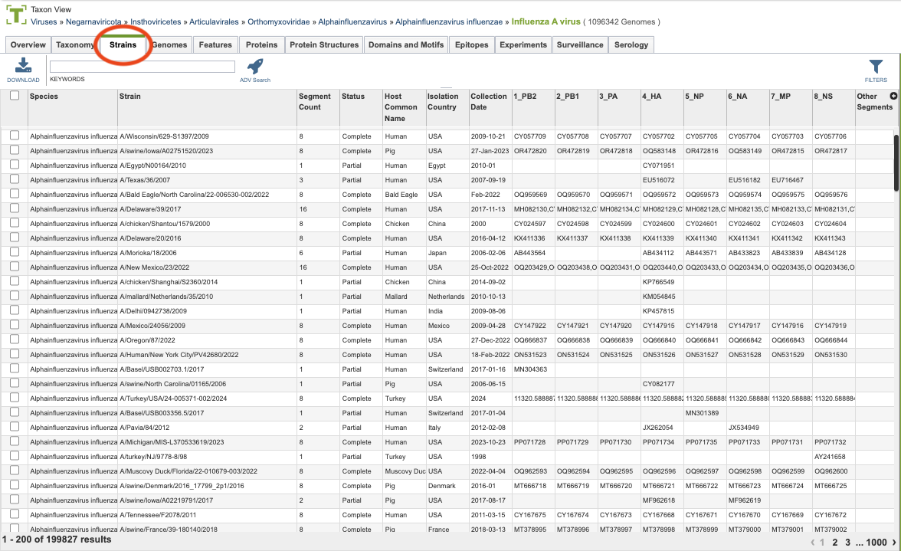
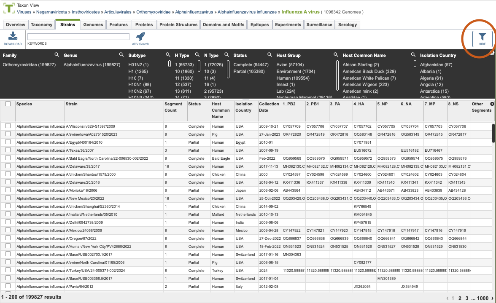

# Strains

# Features

## Overview
The Strains tab presents grouped genomic data for influenza strains. This includes curated strain information including genomic sequences, for each strain. Users can access and explore this grouped genomic data, which is organized to facilitate analysis and comparison across different influenza strains. 

## Accessing the Strains Table
Clicking the Features Tab in a Taxon View displays the Features Table (shown below), listing all the annotated genomics features corresponding to the set of genomes in the selected taxon level.

The list in the Strains table includes some of the search and filter functionality seen on the genomes tab. 

### Strains Table Tools
Within this table you may do the following:

* **Download** the entire contents of the table in text, CSV, or Excel format by clicking the Download button above the table on the left side.

* **Rearrange and narrow** the list of sequences in the table via sorting (using column headers), keywords (using the Keyword box), and filtering (using the Filters tool).

### Filter Tool

As with all tables, the Filters tool is available to narrow the display of the items in the table, show below:
  

Clicking on the Filters button at the top right of the table opens the Filter Panel above the table, displaying column names from the table and values for those columns with counts of occurence.  Clicking on the filter values narrows the list displayed in the table to those matching the chosen filter values.  Clicking the Hide button closes the Filter Panel. More details are available in the [Filter Tool](../other/filter_tool.html) Quick Reference Guide.

### Action buttons

After selecting one or more of the features by clicking the checkbox beside the Genome Name in the table, a set of options becomes available in the vertical green Action Bar on the right side of the table.  These include

* **Hide/Show:** Toggles (hides) the right-hand side Details Pane.
* **Copy:** Copies the selected items to the clipboard.
* **Genomes:** Loads the Genomes Table, listing the genomes that correspond to the selected featuress. *Available only if multiple featuress are selected.*
* **Group:** Opens a pop-up window to enable adding the selected sequences to an existing or new group in the private workspace.

More details are available in the [Action Buttons](/quick_references/action_bar) Quick Reference Guide.
