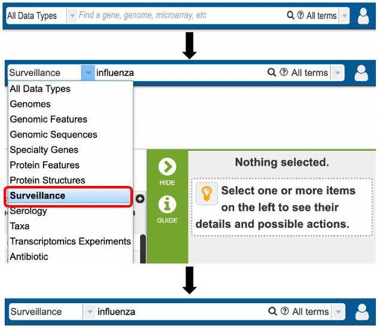
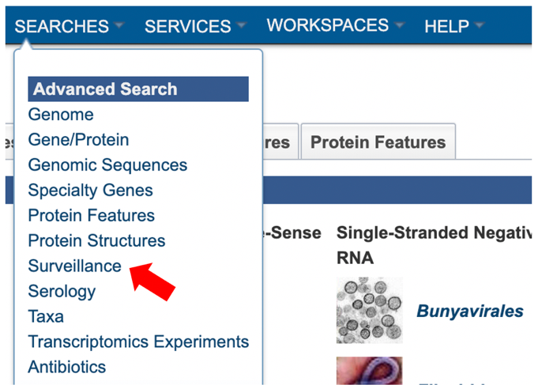
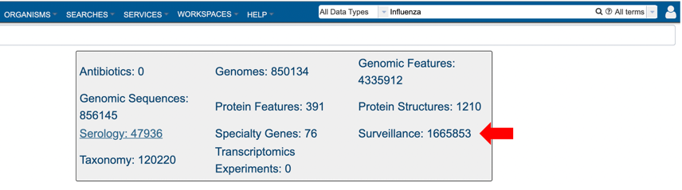
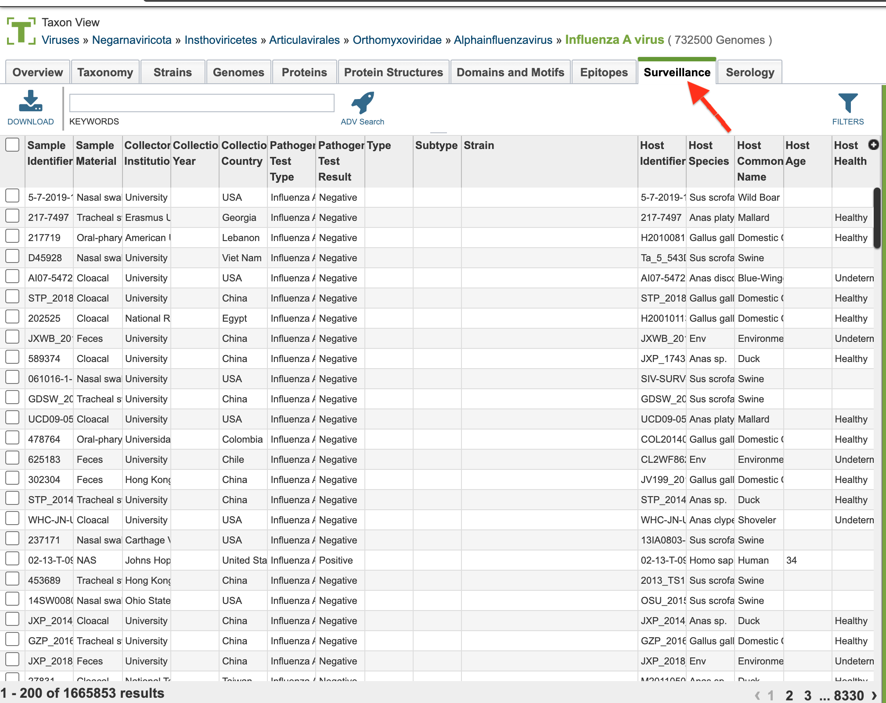
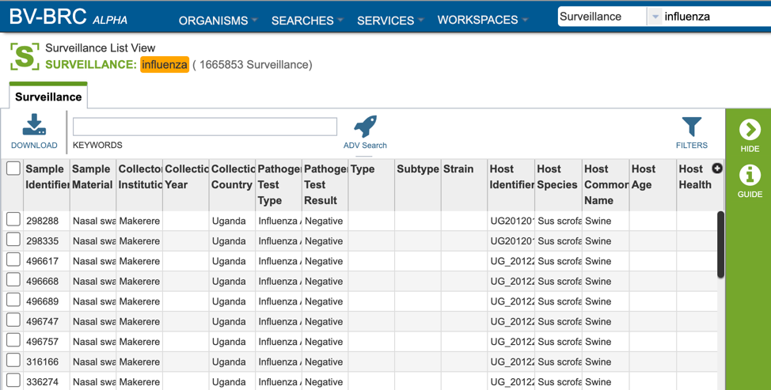
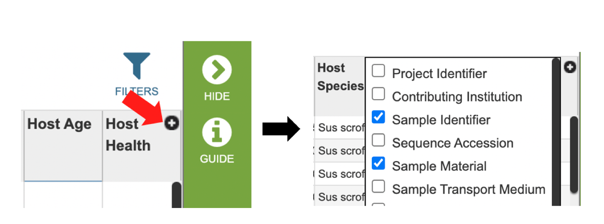
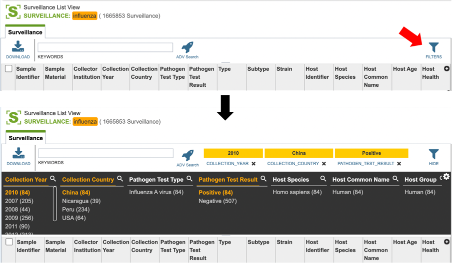
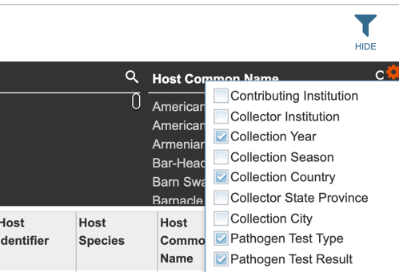

# Surveillance Data

## Overview
Data from worldwide influenza surveillance studies, including both avian and non-human mammalian samples, have been collected by the NIAID-funded Centers of Excellence for Influenza Research and Surveillance ([CEIRS](https://www.niaidceirs.org/)) program and deposited into the IRD and the BV-BRC.  Surveillance records can be queried using various criteria including: whether the sample was positive or negative for influenza, geographic location, and/or avian taxonomy classification. BV-BRC uses [Avibase](https://avibase.bsc-eoc.org/avibase.jsp?lang=EN) as the standard for taxonomy, and scientific and common names of avian host species. 

Human samples were collected from patients presenting at a physician with influenza symptoms. Samples were collected from all patients and virus was isolated and sequenced from flu positive samples. Associated clinical data may also be available as part of the search results.

### See also
* Surveillance Data Tutorial

## Accessing Surveillance data

Surveillance data can be accessed through multiple routes in BV-BRC: 

1\. Specifically searching for protein structure data by selecting "Surveillance" as the data type from the Global Search bar.

2\. Using the advanced search for Surveillance (red arrow) under the “SEARCHES” menu. 

3\. Selecting “Surveillance” as the data type (red arrow) after performing a quick search for all data types. 

4\. Selecting the “Surveillance” tab when browsing data for a specific virus.  

## Surveillance List View and Column Definitions

Surveillance data is listed in tabular format in the BV-BRC as shown below. 

Several metadata fields are available for surveillance results including those associated with animal surveillance or human clinical data associated with human samples. Visible metadata columns can be customized by clicking on the “+” sign at the top right corner of the table, as shown below. 

Visible columns can be customized. Below is a list of available metadata fields and their definitions. 

* **Project Identifier:** The identification assigned to the project contributing Surveillance information. 
* **Contributing Institution:** The institution where the Surveillance test took place. 
* **Sample Identifier:** The identification number assigned to the Surveillance sample. 
* **Sequence Accession:** The public database accession numbers for the relevant genomic sequence/s. 
* **Sample Material:** The source material for the sample; eg: BAL (Bronchio-alveolar lavage), blood, cloacal swabs, feces, lungs, nasal swab, environment etc. 
Sample Transport Medium:** The fluid used to preserve and/or transport sample. 
* **Sample Receipt Date:** The date the sample was received
* **Submission Date:** The date the genomic information was received. 
* **Last Update Date:** The date genomic information was last updated. 
* **Longitudinal Study:** Specifies whether the sample was part of a longitudinal study involving repeated sampling of subjects. 
* **Embargo End Date:** End date of the research embargo period. 
* **Collector Name:** Name of individual who collected the sample. 
* **Collector Institution:** Name of institution collecting the sample.
* **Contact Email Address:** The email address associated with the sample collectors. 
* **Collection Date:** The date the sample was collected. 
* **Collection Year:** The year the sample was collected.
* **Collection Season:** The season the sample was collected; eg: flu season 1998-1999.
* **Days Elapsed to Sample Collection:** The days elapsed between sample testing and sample collection. 
* **Collection Country:** The country where the sample was collected
* **Collection State Province:** The state or province where the sample was collected
* **Collection City:** The city where the sample was collected
* **Collection POI:** The collection point of interest. 
* **Collection Latitude and Longitude:** The geographic coordinates that specify where the sample was collected. 
* **Pathogen Test Type:** The type of test that was used to ascertain presence/absence of the infectious agent. 
* **Pathogen Test Result:** The results of the test. 
* **Pathogen Test Interpretation:** The test interpretation notes. 
* **Species:** Species sample was collected from.
* **Type:** The infectious agent type ascertained. 
* **Subtype:** The infectious agent subtype ascertained.
* **Strain:** The strain name. 
* **Host Identifier:** The identification number assigned to the host the sample was taken from. 
* **Host ID Type:** Can include avian, human or non-human mammalian. 
* **Host Species:** The scientific name for the host the sample was taken from. 
* **Host Common Name:** The common name for the host the sample was taken from.
* **Host Group:** Animal, avian, or human. 
* **Host Sex:** The sex of the host: male, female.
* **Host Age:** The age of the host at the time the sample was taken. 
* **Host Height:** information on host height.  
* **Host Weight:** information on host weight. 
* **Host Habitat:** host environment.  
* **Host Natural State:** Wild or captive. 
* **Host Capture Status:** How the animal was captured for sample acquisition. Eg: active surveillance, trap etc. 
* **Host Health:** The disease status of the host at the time the sample was taken.
* **Exposure:** Whether the host was known to be exposed to the infectious agent. 
* **Duration of Exposure:** How long the host was exposed to the infectious agent. 
* **Exposure Type:** how the host was exposed to the infectious agent. 
* **Use of Personal Protective Equipment (PPE):** whether the host was using PPE. 
* **Primary Living Situation:** primary environment of the patient. 
* **Nursing Home Residence:** nursing home the patient attends (if applicable).
* **Daycare Attendance:** whether patient attends daycare (if juvenile).
* **Travel History:** Any travel history associated with the patient. 
* **Profession:** Patient’s occupation. 
* **Education:** highest education level attained. 
* **Pregnancy:** pregnancy status of patient (if applicable).
Trimester of Pregnancy: 1st, 2nd, or 3rd pregnancy trimester (if applicable).
* **Breastfeeding:** whether the patient is breastfeeding (if applicable). 
* **Hospitalized:** hospitalization status of the patient. 
* **Hospitalization Duration:** the length of hospital stay (if applicable). 
* **Intensive Care Unit (ICU):** whether the patient was admitted to the ICU. 
* **Chest Imaging Interpretation:** results of chest imaging (if applicable). 
* **Ventilation:** whether a mechanical ventilator was used to help patient breathe.
* **Oxygen Saturation:** blood oxygen saturation percentage. 
* **ECMO:** Extracorporeal membrane oxygenation status of patient. 
* **Dialysis:** whether the patient was undergoing kidney dialysis.
* **Disease Status:** disease status of the patient (if known). 
* **Days Elapsed to Disease Status:** the number of days before arriving at recorded disease status. 
* **Disease Severity:** measurements of disease severity. 
* **Alcohol Or Other Drug Dependence:** patient alcohol or drug dependent status. 
* **Tobacco Use:** whether to patient uses tobacco products. 
* **Packs Per Day For How Many Years:** amount of tobacco use (if a tobacco user)
* **Chronic Conditions:** Any known patient chronic conditions. 
* **Maintenance Medication:** Any medication the patient regularly takes. 
* **Types of Allergies:** known patient allergies. 
* **Influenza Like Illness Over The Past Year:** known incidence of influenza like illness in the past year. 
* **Infections Within Five Years:** known infections within the 5 years preceding sample collection. 
* **Human Leukocyte Antigens (HLA):** patient HLA type (if known).
* **Symptoms:** patient associated symptoms. 
* **Onset Hours:** Hours of disease (onset if known).
* **Sudden Onset:** whether disease onset was acute.
* **Diagnosis:** medical diagnosis.
* **Pre Visit Medication:** any medication taken prior to sample being taken.
* **Post Visit Medication:** any medication taken post sample being taken.
* **Treatment:** any treatment prescribed.
* **Initiation of Treatment:** the date of treatment initiation.
* **Duration of Treatment:** the duration of treatment initiation.
* **Treatment Dosage:** the dosage of treatment prescribed.
* **Vaccination Type:** the type of vaccine used (if any).
* **Days Elapsed To Vaccination:** the days elapsed between vaccination and sample collection. 
* **Source of Vaccine Information:** source where vaccine information was obtained. 
* **Vaccine Lot Number:** the lot number associated with the vaccine the patient received. 
* **Vaccine Manufacturer:** the manufacturer of vaccine the patient received.
* **Vaccine Dosage:** the dosage of vaccine the patient received.
* **Other Vaccinations:** any other vaccinations the patient received.
* **Additional Metadata:** additional metadata may be available here. 
* **Comments:** Any additional comments provided by the submitters.

Users who wish to further filter results can do so by clicking the “filters” icon (red arrow) and selecting the desired criteria as shown below.   

Users may also customize the fields displayed in the table by clicking on the gear icon at the top right corner of the page. 

## Action buttons

After selecting one of the output files by clicking it, a set of options becomes available in the vertical green Action Bar on the right side of the table. These include:

* **Hide/Show:** Toggles (hides) the right-hand side Details Pane.
* **Guide:** Link to the corresponding User Guide
* **Download:** Downloads the selected item.
* **Copy:** Copies the selected items to the clipboard.
* **Surveillance:** Allows user to switch to the surveillance view, summarizing the surveillance test results.

More details are available in the [Selection Action Bar](../action_bar.html) Quick Reference.
