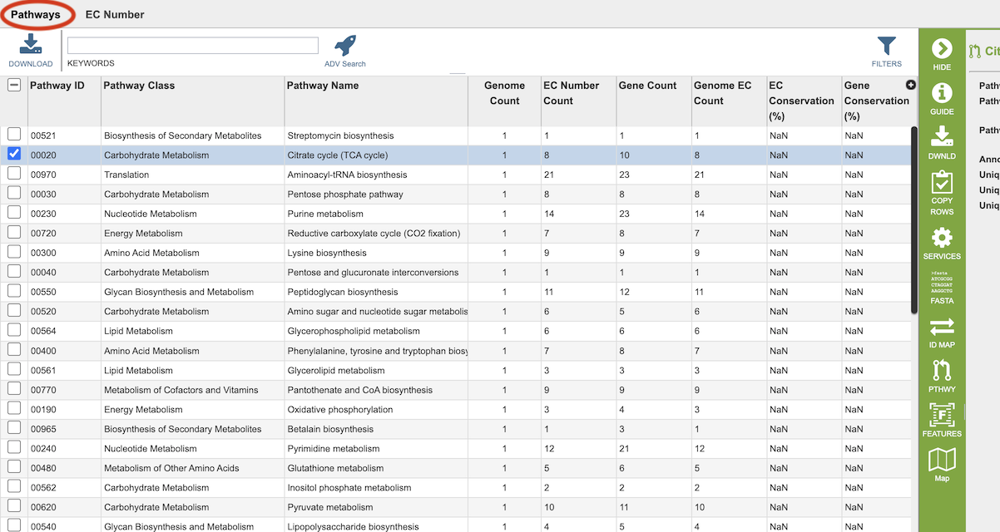

# Pathway Comparison Tool

## Overview
The Pathway Comparison Tool is based on the RASTtk (1) annotations. It allows researchers to identify a set of metabolic pathways based on taxonomy, EC number, pathway ID, pathway name and/or specific annotation type. The data are mapped to and summarized on pathway maps from the Kyoto Encyclopedia of Genes and Genomes, commonly known as KEGG (2). This tool also provides a table of unique pathways that match the search criteria (i.e., the genomes or proteins chosen by the researcher, or at any taxonomic level) from which researchers can select specific pathways of interest and view a KEGG Map, or on a heatmap view that summarizes the data, including presence/absence of individual EC numbers within the selected genomes.

### See also
  * [Comparative Systems Service](https://www.bv-brc.org/app/ComparativeSystems)
  * [Comparative Systems Service Tutorial](../../tutorial/comparative_systems/comparative_systems.html)

## Accessing the Pathway Comparison Tool
The Pathway Comparison Tool can be accessed by clickging the **Pathways** icon at the top right of the results page from a [Comparative Systems Service](https://www.bv-brc.org/app/ComparativeSystems) analysis job.

Results are presented in tabular and pathway map views, as described below.

## Pathway and EC Tables
Results will be shown in a Pathway table, shown below.

Pathways come from the Kyoto Encyclopedia of Genes and Genomes, commonly known as [KEGG](http://www.genome.jp/kegg/). The column data in this table provides summary information regarding the pathways:

* **Pathway ID:** 5-digit identifier defined by KEGG.
* **Pathway Class:** Higher level grouping of pathways provided by KEGG.
* **Pathway Name:** Name of the pathway provided by KEGG
* **Genome Count:** Total number of genomes that have some genes present in this pathway from the set of genomes chosen.
* **EC Number Count:** The Enzyme Commission number (EC number) is a numerical classification scheme for enzymes, based on the chemical reactions they catalyze and in a given KEGG metabolic pathway, each step has an EC number assigned to it. In a given genome there may be several genes that have been assigned the same EC number, meaning that several different genes have the possibility of doing the same job. The unique EC count tells how many steps within the pathway have at least one gene behind them.
* **Gene Count:** Total of number of unique genes that belong to this pathway from the set of genomes chosen. 
* **Genome EC Count:** Sum of the EC numbers found across all the genomes that have genes in this pathway.
* **EC Conservation %:** For a single pathway (row), this number gives the percent of unique EC numbers present in all selected genomes. 100% describes a situation in which all unique EC numbers are present in all selected genomes. Smaller numbers indicate that there is one or more genomes are missing some EC numbers.
* **Gene Conservation:** A genome can have several genes that have been assigned the same EC number. Gene conservation provides an estimate of pathways where there might be redundancies, or where EC numbers are missing. Numbers greater than one mean that in at least one genome, there is more than one gene that has been assigned a particular EC number. Numbers less than one mean indicate that in at least one genome, a particular EC number is missing. This provides a quick way to see which pathways have perfect conservation across all genomes (Gene Conservation = 1) to those pathways where there are differences among the genomes. Users can then explore these differences by drilling down on either the Unique Gene Count, or the Unique EC Count.
  
Clicking on **EC Number** at the top left of the table shows the details of the EC numbers that are found across the selection of genomes for the individual pathway. Each EC Number has its own row, and the Description column provides the function of the genes in that pathway.

### Action buttons

After selecting one or more of the rows in the table by clicking the checkbox on the left side, a set of options becomes available in the vertical green Action Bar on the right side of the table.  These include

* **Hide:** Toggles (hides) the right-hand side Details Pane.
* **Guide:** Opens the Quick Reference Guide for the page.
* **Download:**  Downloads the selected items (rows).
* **Copy Rows:** Copies the contents of the selected rows as text to the clipboard. Options include *All Columns (with headers), All Columns (without headers), Selected Columns (with headers),* and *Selected Columns (without headers)*. 
* **Services:** Provides links to tools and services in BV-BRC that can accept the selected items as input.
* **FASTA:** Provides the FASTA DNA or protein sequence for the selected item(s).
* * **ID Map:** Provides the option to map the selected feature(s) to multiple other idenfiers, such as RefSeq and UniProt.
* **Pathway:** Displays the Pathway Summary Table containing a list of all the pathways in which the selected features are found.
* **Feature:** Displays the Feature Page for the selected feature. *Available only if a single feature is selected.*
* **Features:** Displays the Features Table for the selected features. *Available only if multiple features are selected.*
* **Map:** Opens the Pathway View, which includes an EC table and the corresponding KEGG pathway map.

More details are available in the [Action Buttons](../other/action_buttons.html) Quick Reference Guide.

## Pathway Viewers
Selecting a pathway in the table and then clicking the **Map** button in the vertical green Action Bar on the right side of the table opens the Pathway View for that pathway. From this page there are two view options - **KEGG Map** and **Heatmap**.

### KEGG Map

In the KEGG Map view option, there are two regions, the EC Number table and the KEGG Map itself.

**EC Table:** This table, located to the left of the KEGG Map, lists the Enzyme Commission (EC) Numbers of the genes that are found across all the genomes and are present in that particular pathway. The columns include

* **EC Number:** The Enzyme Commission number.
* **Genome Count:** The number of genomes that are summarized in the pathway.
* **Feature Count:** The number of genes in the selection of genomes, or individual genome, that have the same EC number.
* **Genome Count Not Present** The number of genomes in the current selection that *do not* have a gene with this particular EC number.
* **Occurrence:** The number of times this EC number appears in this pathway.
* **Description:** (Hidden by default) The description (name) associated with the EC Number. To show this column, click the plus sign (+) in the top right corner of the table and check the box beside "Description."

Selecting a row in the the table causes the associated EC number to be highlighted in red within the KEGG Map.

**KEGG Map:** This is the KEGG map associated with the selected pathway.

* **Map Numbers:** The numbers in the boxes are EC numbers. These numbers are part of a numerical classification schema that has been developed for enzymes and the chemical reactions they catalyze.

* **Color Coding:** The box containing the EC number will be one of three colors: 
  * **Bright green:** A protein with this EC number has been annotated in all the genomes chosen.
  * **Muted green:** A protein with this EC number has been annotated in at least one, but not all, genomes chosen.
  * **White (no color):** The annotation did not identify a protein with that EC number.
  * **Red:** Selected EC number(s).

* **Names Associated with EC numbers:** Scrolling over the box that contains the EC number will give the name of the EC number. 

* **Related Pathways:** Generally, an individual KEGG pathway will show different associated pathways that specific enzymes play a part in. These pathways are named and are found on the KEGG Map in boxes with rounded corners. Clicking the link that appears when scrolling over one of these boxes will take you to that pathway. Alternatively, you could begin a new Comparative Pathway Tool search using the pathway name as a keyword in the initial search criteria.

### Heatmap

The Heatmap is an interactive visualization tool, which provides an overview of the distribution of genomes across the set of EC numbers within a selected pathway. Patterns visible in a Heatmap can allow for many types of analysis such as, a bird’s-eye view of the conservation (or lack thereof) of particular genes of interest, discerning how many
proteins have the same function within a single genome, and identifying proteins with multiple homologs or paralogs across a set of genomes.

**Color Coding:**  Each cell is colored according to how many proteins (features) from a
specific genome are assigned a particular EC number. 
* **Black:** No representative proteins from the genome assigned that EC number 
* **Bright yellow:** One representative protein
* **Dark yellow:** Two representative proteins
* **Dark orange:** Three or more representative genomes

**Features and Functionality**

EC Numbers and Descriptions are listed along the Y (vertical) axis and corresponding Genomes are listed along the X (horizontal) axis. The scale of these rows and columns may be controlled by sliding the x and/or y slidebars located at the axis intersection in the upper left corner of the Heatmap. The "Flip Axis" button at the top left of the heatmap will swap the positions (horizontal or vertical) of the Genomes and EC Numbers. Each individual column or row within the Heatmap may be clicked and dragged to any specified position.

The following options may be accessed from a pop-up widow by clicking on any individual colored cell, any EC label, or any Genome label within the Heatmap. The same information can be collected for a whole region of interest within the Heatmap by clicking and dragging to select a group of cells.

  * **Download Heatmap Data:** Shows the count of representative features from each genome assigned to each EC Number in either a text or excel file. Note: Clicking this button from an EC label will produce a file with the count for each genome assigned to that EC number, while clicking on this button from a Genome label will produce a file with the count for that particular genome in every EC number associated for this selected pathway.

  * **Download Proteins:** Downloads the set of features associated with the chosen proteins.  Download available as csv, txt, or Excel file.  
  
  * **Show Proteins:** Opens a feature list table containing the features associated with the chosen proteins. This view contains the same information as any feature list: Genome Name, Genome ID, RefSeq Locus Tab, Gene Symbol, protein family information, Product, length, start/stop, etc. This view also allows access to sequences, enables building of multiple sequence alignments, map IDs, etc.

  * **Add Proteins to Group:** button will save selected items to new, or existing, groups within the Workspace.     
     
  * **Cancel:** Closes the pop-up window.

## References

1. Brettin, T. et al. RASTtk: a modular and extensible implementation of the RAST algorithm for building custom annotation pipelines and annotating batches of genomes. Scientific reports 5, 8365 (2015).
2. Kanehisa, M., Furumichi, M., Sato, Y., Kawashima, M. & Ishiguro-Watanabe, M. KEGG for taxonomy-based analysis of pathways and genomes. Nucleic Acids Research (2022).