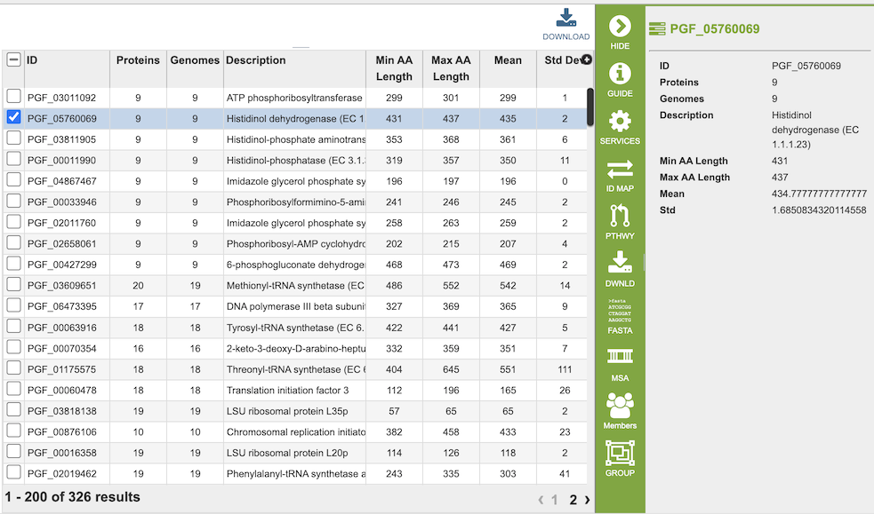
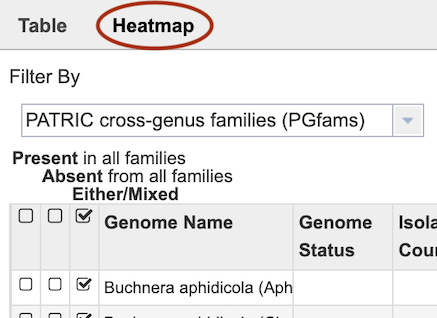
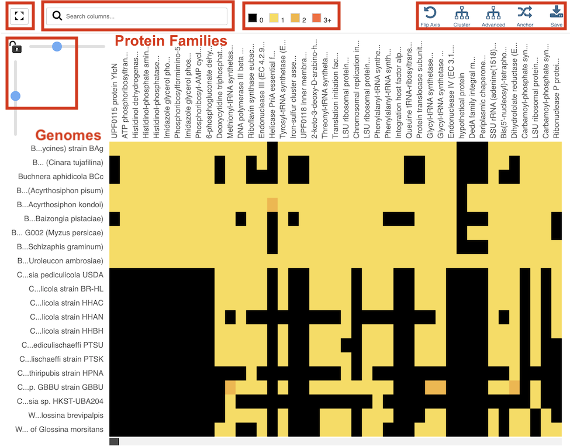
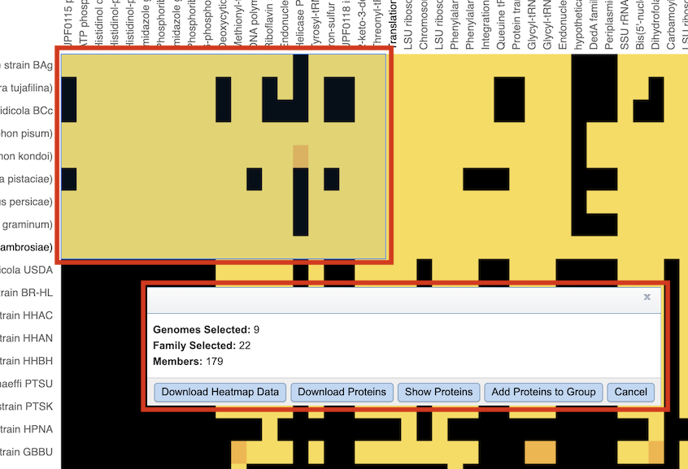

# Protein Family Sorter

## Overview
The Protein Family Sorter (PFS) allows users to select a set of genomes of interest and examine distribution of the superset of protein families across the genomes, commonly referred to as the “pan genome." The PFS provides various filtering options to quickly locate protein families that are conserved across all the genomes (“core genome”), conserved only in asubset of the selected genomes (“accessory genome”) or that match a specified function. A tabular view shows protein families matching filtering criteria and an interactive heatmap viewer provides a bird’s-eye (“pan genome”) view of the distribution of the protein families across multiple genomes, with clustering andanchoring functions to show relative conservation of synteny and identify areas of possible horizontal transfer. 

## See also
  * [Comparative Systems Service](https://www.bv-brc.org/app/ComparativeSystems)
  * [Comparative Systems Service Tutorial](../../tutorial/comparative_systems/comparative_systems.html)
  * [Protein Families]

## Accessing the Protein Family Sorter
The PFS can be accessed by clickging the **Families** icon at the top right of the results page from a [Comparative Systems Service](https://www.bv-brc.org/app/ComparativeSystems) analysis job.

Results are presented in tabular and heatmap views, as described below.

### Tabular View

**Dynamic Filter Panel**

The dynamic filter on the left side panel allows inclusion or exclusion of genomes based on their presence or absence in the pan genome protein families. 

The first option selects between **genus-specific families (PLFams)** and **cross-genus families (PGFams)**.

Next, options are provided for limiting families to those with the following critieria:

* *Present* in all families
* *Absent* in all families
* *Either/mixed*

All of the options result in immediate updates the table of Protein Families in the right-hand panel.

Filter options are also provided for filtering by keyword, Protein Family membership (*Perfect*, *Non-perfect*, *All*) and specification of a numeric range of *Proteins per Family* and *Genomes per Family*.

For these options, clicking the **Filter** button applies these filter options to the table of protein families in the right-hand panel. The **Reset** button clears all of the keyword, Family Membership, and numeric range filters.  

**Protein Family Table**

In the Tabular View, the right panel displays a list of the protein families based on the criteria specified in the left-hand filter panel. Fields (columns) in the table include the following:

* **ID**: BV-BRC identifier for the protein family
* **Proteins**: Number of proteins in the protein family   
* **Genomes**: Number of genomes containing proteins in the protein family  
* **Description**: Functional description of the proteins in the family  
* **Min AA Length**: Length (number of amino acids) of shortest protein in the family  
* **Max AA Length**: Length (number of amino acids) of longest protein in the family
* **Mean**: Average length of proteins in the family
* **Std Dev**: Standard deviation of lengths of proteins in the family. 

The entire table can be downloaded as text or CSV file by clicking the Download button at the top right of the table.

### Action buttons

After selecting one or more of the protein families by clicking the checkbox beside the ID column in the table, a set of options becomes available in the vertical green Action Bar on the right side of the table.  These include

* **Hide:** Toggles (hides) the right-hand side Details Pane.
* **Guide:** Opens the Quick Reference Guide for the page.
* **Services:** Provides links to tools and services in BV-BRC that can accept the selected items as input.
* **ID Map:** Provides the option to map the selected feature(s) to multiple other idenfiers, such as RefSeq and UniProt.
* **Pathway:** Displays the Pathway Summary Table containing a list of all the pathways in which the selected features are found.
* **Download:**  Downloads the selected items (rows).
* **FASTA:** Provides the FASTA DNA or protein sequence for the selected item(s).
* **MSA:** Launches the Multiple Sequence Alignment (MSA) tool and aligns the selected features by DNA or protein sequence in an interactive viewer.
* **Members:** Displays a list of all of the features in the selected protein family within the current genome or taxonomic level.
* **Group:** Opens a pop-up window to enable adding the selected genomes or features to an existing or new group in the private workspace.

More details are available in the [Action Buttons](../other/action_buttons.html) Quick Reference Guide.

### Heatmap View

The presence and/or absence of protein families can also be seen in a heatmap view. To see the heatmap, click on the Heatmap icon above the filter. This will reload the page to show the heatmap.
 

The Heatmap is an interactive visualization tool that provides an overview of the distribution of genomes across the set of protein families that comprise them, subject to the applied filter criteria set by the Protein Family Filter Tool to the left of the heatmap. Patterns visible in a Heatmap can allow for many types of analysis such as a providing a bird's-eye view of the conservation (or lack thereof) of particular genes of interest, discerning how many proteins have the same function within a single genome, and identifying proteins with multiple homologs or paralogs across a set of genomes.

**Color Coding**  

Each cell is colored according to how many proteins from a
specific genome are assigned a particular protein family. 
* **Black:** No proteins from the genome assigned that protein family 
* **Bright yellow:** One protein assigned
* **Dark yellow:** Two proteins assigned
* **Dark orange:** Three or more proteins assigned

**Features and Functionality**

***Display Options***

Genomes are listed along the vertical axis and corresponding Protein Families are listed along the horizontal axis. The scale of these rows and columns may be controlled by sliding the x and/or y slider located at the axis intersection in the upper left corner of the Heatmap. Tools across the top of the heatmap provide additional functionality:

* **Full Window:** Toggles between the heatmap in regular or full-window view
* **Search:** Highlights genomes or protein families with matching text to the search criteria.
* **Legend:** Allows changing of the color scheme of the heatmap.
* **Flip Axis:** Swaps the positions (horizontal or vertical) of the Genomes and Protein Families.
* **Cluster:** Reorders the Genomes and Protein Families in their respective axes to group individual cells in the heatmap together by value (color), using Pearson Correlation.
* **Advanced:** Provides advanced clustering options including clustering by Protein Families or Genomes separately, or both; choosing alternate clustering algorithms; and choosing alternate clustering types. 
* **Anchor:** Reorders the heatmap display such that all Genomes and Protein Families are baselined ("anchored") against the chosen genome.

In addition to the display options described above, each individual column or row within the Heatmap may be clicked and dragged to any specified position.

***Accessing Heatmap Data***

The following options may be accessed from a pop-up widow by clicking on any individual colored cell, any Protein Family label, or any Genome label within the Heatmap. The same information can be collected for a whole region of interest within the Heatmap by clicking and dragging to select a group of cells.

* **Download Heatmap Data:** Shows the count of proteins from each Genome assigned to each Protein Family in either a text or excel file. Note: Clicking this button from a Protein Family label will produce a file with the count for each genome assigned to that Protein Family, while clicking on this button from a Genome label will produce a file with the count for that particular genome in every Protein Family.
* **Download Proteins:** Downloads the set of features associated with the chosen proteins.  Download available as csv, txt, or Excel file.
* **Show Proteins:** Open a feature list table containing the features associated with the chosen proteins. This view contains the same information as any feature list: Genome Name, Genome ID, RefSeq Locus Tab, Gene Symbol, protein family information, Product, length, start/stop, etc. This view also allows access to sequences, enables building of multiple sequence alignments, map IDs, etc.
* **Add Proteins to Group:** button will save selected items to new, or existing, groups within the Workspace. 
* **Cancel:** Closes the pop-up window.

The [Comparative Systems Service Tutorial](../../tutorial/comparative_systems/comparative_systems.html) provides additional information and guidance in using the Protein Family Sorter.
