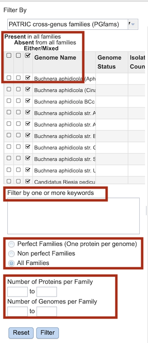

# Protein Family Sorter

## Overview
The Protein Family Sorter (PFS) allows users to select a set of genomes of interest and examine distribution of the superset of protein families across the genomes, commonly referred to as the “pan genome." The PFS provides various filtering options to quickly locate protein families that are conserved across all the genomes (“core genome”), conserved only in asubset of the selected genomes (“accessory genome”) or that match a specified function. A tabular view shows protein families matching filtering criteria and an interactive heatmap viewer provides a bird’s-eye (“pan genome”) view of the distribution of the protein families across multiple genomes, with clustering andanchoring functions to show relative conservation of synteny and identify areas of possible horizontal transfer. 

### See also
  * [Comparative Systems Service]([../organisms_taxon/features.html](https://www.bv-brc.org/app/ComparativeSystems))
  * [Comparative Systems Service Tutorial](../../tutorial/comparative_systems/comparative_systems.html)

## Accessing the Protein Family Sorter
The PFS can be accessed by clickging the **Families** icon at the top right of the results page from a Comparative Systems Service analysis job.

Results are presented in tabular and heatmap views, as described below.

**Tabular View**

The dynamic filter on the left side panel allows inclusion or exclusion of genomes based on their presence or absence in the pan genome protein families. Clicking the checkboxes immediately updates the table of Protein Families in the right-hand panel:

* *Present* in all families
* *Absent* in all families
* *Either/mixed*

Filter options are also provided for filtering by keyword, Protein Family membership (*Perfect*, *Non-perfect*, *All*) and specification of a numeric range of *Proteins per Family* and *Genomes per Family*.

Clicking the **Filter** button applies these filter options to the table of protein families in the right-hand panel. 

The **Reset** button clears all of the keyword, Family Membership, and numeric range filters.  

**Heatmap View**

## Features and Functionality

The visualization has 3 main components:
  1. 
  2. 
  3. 