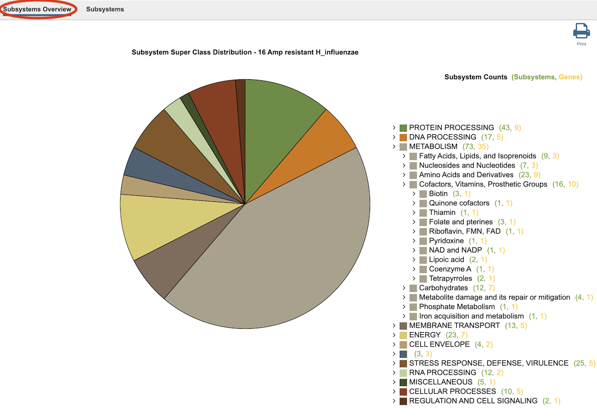
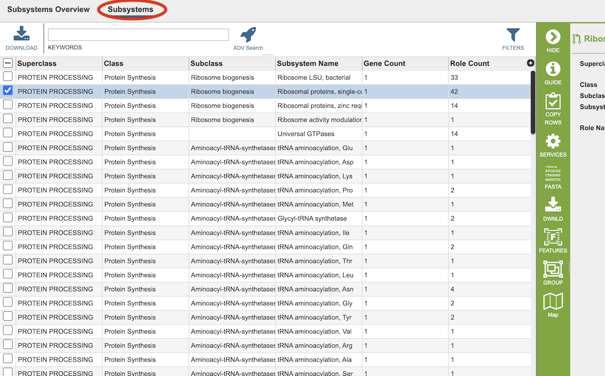
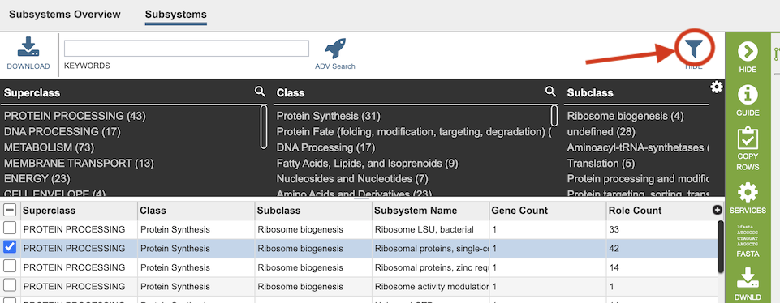
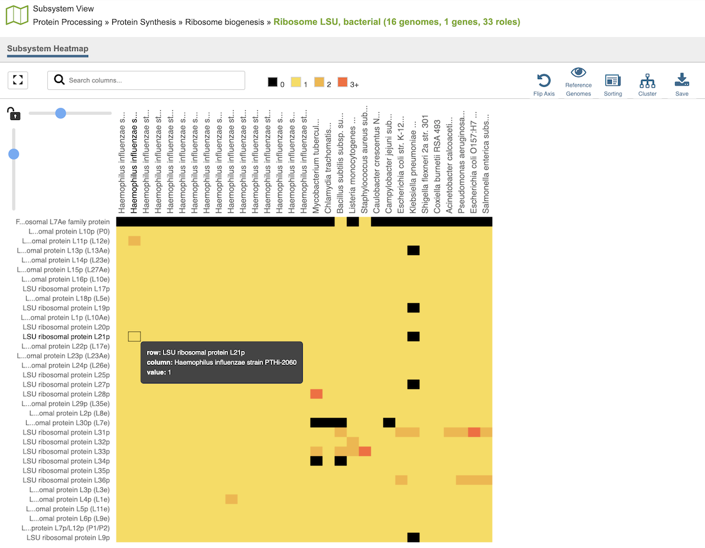

# Subsystems Data

## Overview
The Subsystems Data page includes a distribution pie chart that summarizes the functionality and genes across all genomes selected. It also includes a table showing the individual subsystems available. When a subsystem is selected, a heatmap can be displayed showing the genes that are included in it and the presence and absence of those genes across all the genomes in the selection.

### See also
  * [Comparative Systems Service](https://www.bv-brc.org/app/ComparativeSystems)
  * [Comparative Systems Service Tutorial](../../tutorial/comparative_systems/comparative_systems.html)
  * [Subsystems](../organisms_taxon/subsystems.html)

## Accessing the Subsystems Data
The Subsystems Data can be accessed by clickging the **Subsystems** icon at the top right of the results page from a [Comparative Systems Service](https://www.bv-brc.org/app/ComparativeSystems) analysis job.

Results are presented in pie chart,  and pathway map views, as described below.

## Subsystems Overview

On the left side, a pie chart displays the subsystem superclasses asserted to the selected set of genomes. On the right side an interactive hierarchical display of the 11 superclasses of subsystems (Metabolism, Energy, Protein Processing etc.), with matching colors the corresponding slice in the pie chart. The subsystem superclasses and nested subclasses can be expanded to progressively lower levels by clicking the arrow (>) on the left side of the subsystem name. On the right side of the subsystem name, two numbers are provided in parentheses.  The first is the count of subsystems (green) and the second is the count of genes (yellow) associated with the subsystem name.

## Subsystems Table
Clicking the Subsystems menu option displays a table of all the subsystems associated within the taxon or selected subsystem, as shown below.  

The columns in this table provide additional information about each of the subsystems:

* **Superclass:** One of the 11 highest level groupings of subsystems
* **Class:** Second-level grouping of subsystems
* **Subclass:** Third-level grouping of subsystems
* **Subsystem Name:** Name of the subsystem 
* **Gene Count:** Total of number of unique genes that belong to this subsystem from the set of genomes chosen.
* **Role Count:** Total of number of unique functional roles asserted for an active variant of the subsystem.

Two additional columns (hidden by default) are available by clicking the (+) at the top right of the table.  They are 
* **Variant (formerly named Active):** A subsystem can be asserted to be active or likely if one or more functional roles are missing.
* **Subsystem ID:** Unique identifier for the subsystem (usually the same as Subsystem Name by default).	

### Filter Tool

As with all tables, the Filters tool is available to narrow the display of the items in the table, show below:
  

Clicking on the Filters button at the top right of the table opens the Filter Panel above the table, displaying column names from the table and values for those columns with counts of occurence.  Clicking on the filter values narrows the genomes *displayed* in the table to those matching the chosen filter values.  Clicking the Hide button closes the Filter Panel.  Clicking the Apply button removes the non-matching genomes and *resets the scope* in the Taxonomic View to only the genomes matching the filter criteria. More details are available in the [Filter Tool](../other/filter_tool.html) Quick Reference Guide.

### Action buttons

After selecting one or more of the genomes by clicking the checkbox beside the Genomes Name in the table, a set of options becomes available in the vertical green Action Bar on the right side of the table. These include the following:

* **Hide:** Toggles (hides) the right-hand side Details Pane.
* **Guide:** Opens the Quick Reference Guide for the page.
* **Copy Rows:** Copies the contents of the selected rows as text to the clipboard. Options include *All Columns (with headers), All Columns (without headers), Selected Columns (with headers),* and *Selected Columns (without headers)*. 
* **Services:** Provides links to tools and services in BV-BRC that can accept the selected items as input.
* **FASTA:** Provides the FASTA DNA or protein sequence for the selected item(s).
* **Download:**  Downloads the selected items (rows).
* **Feature:** Displays the Feature Page for the selected feature. *Available only if a single feature is selected.*
* **Features:** Displays the Features Table for the selected features. *Available only if multiple features are selected.*
* **Map:** Opens the Subsystems heatmap, described below.

More details are available in the [Action Buttons](../other/action_buttons.html) Quick Reference Guide.

## Heatmap
The Heatmap is an interactive visualization tool, which provides an overview of the distribution of genomes across the set of functional roles defined by a subsystem. Patterns visible in a Heatmap can allow for many types of analysis such as, a bird’s-eye view of the conservation (or lack thereof) of particular functional roles of interest, discerning how many proteins have the same function within a single genome, and identifying proteins with multiple homologs or paralogs across a set of genomes. The Heatmap is accessible by selecting a Subsystem or Gene in the corresponding tables (described in this Quick Reference Guide) and then clicking the Map icon in the green action bar.

### Color Coding: 
Each cell is colored according to how many genes are annotated to perform the specific functional role within a specific genome. Note that fragments of a gene can be presented as separate entities.

* **Black:** No genes from the genome have the specific functional role assigned.
* **Bright yellow:** One gene with the specific functional role
* **Dark yellow:** Two genes with the specific functional role
* **Dark orange:** Three or more genes with the specific functional role

### Features and Functionality
Functional roles needed for an “active” subsystem are listed along the vertical axis. Note that not all functional roles are always needed for a functional variant of a subsystem. Depending on a given genome one specific functional role or another can be present (non orthologous gene displacement). Also some subsystems are collections of similar functional roles for the purpose of disambiguation of paralogous genes.

The corresponding Genomes are listed along the horizontal axis. The scale of these rows and columns may be controlled by sliding the x and/or y slidebars located at the axis intersection in the upper left corner of the Heatmap. 

Buttons across the top right of the heatmap provide additional functions: 
* **Flip Axis:** Swap the horizontal and vertical axes of the Genomes and EC Numbers.
* **Reference Genomes:** Filters the heatmap to show only reference genomes. Can be toggled on and off. 
* **Sorting:** Allows sorting of the genome alphabetically or taxonomically. 
* **Cluster:** Clusters genomes based on values in the heatmap data.
* **Save:** Saves the heatmap as an SVG image, or the underlying heatmap data as tab-separated value (TSV) or Javascript Object Notation (JSON) format. 

Each individual column or row within the Heatmap may be clicked and dragged to any specified position. The following options may be accessed from a pop-up widow by clicking on any individual colored cell, any EC label, or any Genome label within the Heatmap. The same information can be collected for a whole region of interest within the Heatmap by clicking and dragging to select a group of cells.

* Download Heatmap Data: Shows the count of representative features from each genome assigned to each EC Number in either a text or excel file. Note: Clicking this button from an EC label will produce a file with the count for each genome assigned to that EC number, while clicking on this button from a Genome label will produce a file with the count for that particular genome in every EC number associated for this selected pathway.

* Download Proteins: Downloads the set of features associated with the chosen proteins. Download available as csv, txt, or Excel file.

* Show Proteins: Open a feature list table containing the features associated with the chosen proteins. This view contains the same information as any feature list: Genome Name, Genome ID, RefSeq Locus Tab, Gene Symbol, protein family information, Product, length, start/stop, etc. This view also allows access to sequences, enables building of multiple sequence alignments, map IDs, etc.

* Add Proteins to Group: button will save selected items to new, or existing, groups within the Workspace.
  
* Cancel: Closes the pop-up window.

## References

1. Overbeek, R. et al. The subsystems approach to genome annotation and its use in the project to annotate 1000 genomes. Nucleic acids research 33, 5691-5702 (2005).

