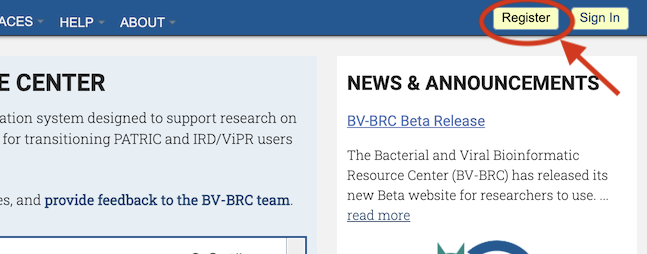
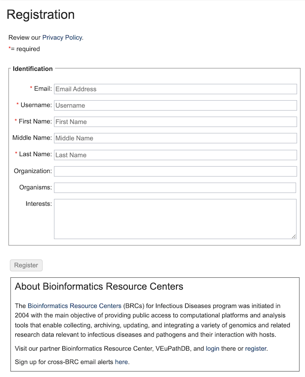
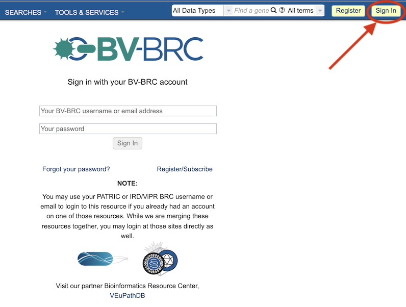
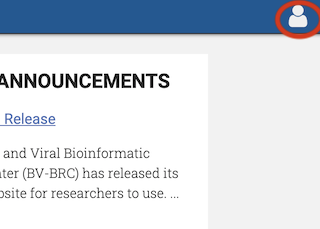

Registration
============

Overview
--------
Registration and login as a BV-BRC user provides additional capabilities not available through just navigating through the website alone. These include uploading data into a private workspace, access to analysis services, ability to save data in custom groups, and sharing data with other users.

See Also
--------

- `Workspace <./workspaces/workspace.html>`__
- `Services and Tools <./services_tab.html>`__
- `Groups <./workspaces/groups.html>`__
- `Data Upload <./workspaces/data_upload.html>`__

Registration and Login Process
------------------------------

Clicking the "Register" button located at the top right corner of the website will open the User Registration dialog box. The username will be the name you log in with, and a link will be sent to the email address so that you can set your password. *Note: The registration information will remain completely private. Under no circumstances will BV-BRC sell, distribute, or lease this information to third parties.*

In the box at the bottom of the registration form, a link to the other BRC, VEuPathDB (Vectors and Eukaryotic Pathogens), is provided for convenience. You may also sign up for a cross-BRC email listserv.
 

Clicking the "Sign In" button located at the top right corner of the website beside the "Register" button will open the Sign In dialog box, where a username and password are required to complete the login.

**Forgotten Password:** Clicking the "Forgot your password?" link at the bottom of the Sign In dialog box will display another dialog box where you can enter your email address and a email will be sent with instrutions on resetting your password.

Once signed in, the top right corner of the webiste will display an icon of a person.  Clicking on this icon will allow you to see the account settings (username, email, etc.) and logout.

Benefits of Registration
------------------------

Registration and login provide additional capabilities in BV-BRC not avaialable otherwise.  These include the following:

- **Access to a private workspace** wherein you can store, manage, and share private data. See `Workspace <./workspaces/workspace.html>`__.
- **Access to analysis services** including a variety of tools for Genomics, Transcriptomics, Metabolomics, and other analyses. See `Tools & Services <./services_menu.html>`__.
- **Capability to create groups** for storing and analyzing custom sets of data including genomes and features. See `Groups <./workspaces/groups.html>`__.
- **Capability to upload data**, including batch file uploads, into the Workspace for analysis. See `Data Upload <./workspaces/data_upload.html>`__.
