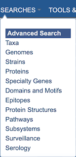
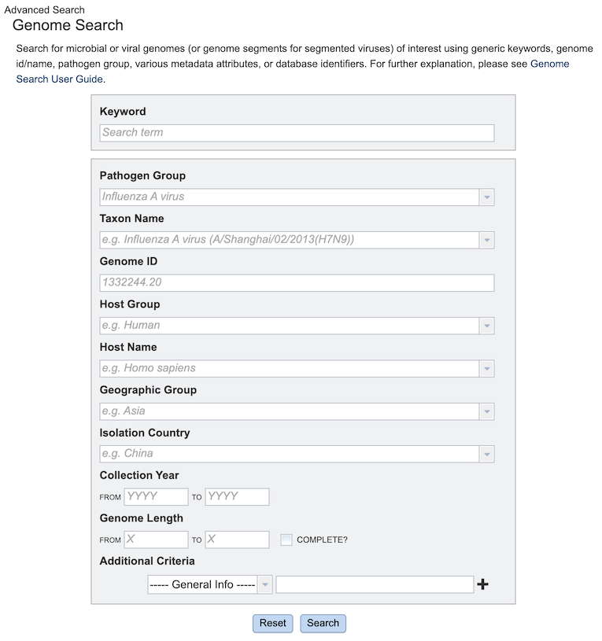
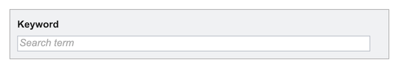
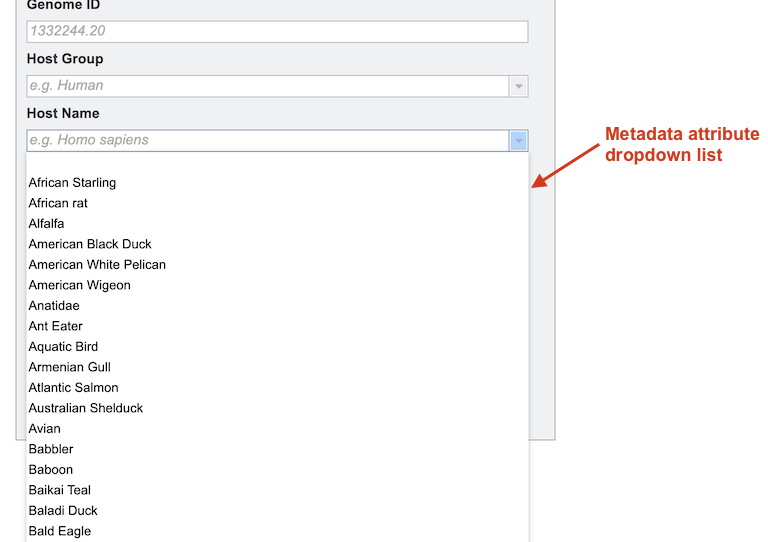
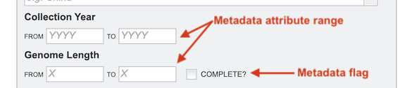
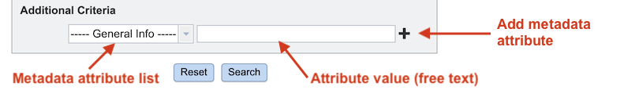
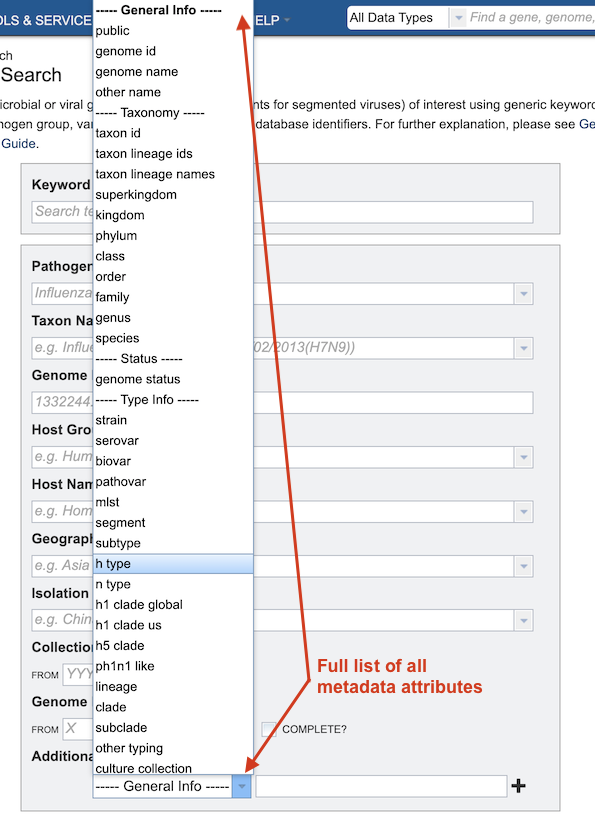

# Advanced Searches

## Overview

BV-BRC provides Advanced Searches for each major data type in the database, to enable location of specific data of interest. Advanced Searches are available for the following data types:

* Taxa
* Genomes
* Strains
* Features
* Proteins
* Specialty Genes
* Domains and Motifs
* Epitopes
* Protein Structures
* Pathways
* Subsystems
* Surveillance
* Serology

## Accessing Advanced Searches

The Searches menu is available from the top menu on each page. 

Clicking on one of the searches opens the corresponding search input form, as shown in the Genome Search example below.

## Using the Advanced Search

Each Advanced Search input form is tailored specifically to its corresponding data type, providing input options based on the primary metadata fields for that type. It returns results of that type in the database matching the input criteria.  

### Keyword

The first option in each form is **Keyword**. This searches *all* metadata fields for that keyword. 

### Primary Metadata Attributes
The next set of options is derived from the primary metadata fields fro that data type. Many metadata fields are curated to conform to consistent, and in some cases, controlled, vocabularies, which helps ensure that searches return all appropriate matching results. In the search form, these fields have a dropdown option that allows the user to select the correct desired value.  

### Metadata Attribute Ranges and Flags

Other fields allow entry of numeric values to specify a range of results, e.g., Collection Year, Genome Length. Some fields also facilitate selection of certain flags on the data, e.g., "Complete" genomes.

### Additional Criteria 

The last option in each Advanced Search form is **Additional Criteria** which allows refinement of additional metadata attributes not specified elsewhere in the form. 

Clicking on the dropdown list on the left displays a list of *all* the metadata fields in the database for the data type. After selecting one of the metadata fields, entering a search term in the box on the right will limit the matching results appropriately. 

Clicking the **plus sign (+)** opens another metadata attribute criterion option. This can be done multiple times to include additional criteria for the search. Boolean operators (AND, OR, NOT) are available to allow very fine-grained specificity in the search results. Clicking the **minus sign (-)** removes the corresponding criterion.

## Running the Search

The **Search** button runs the search the database for the data type and returns all matching results based on metadata attribute selections in the form.

The **Reset** button clears and resets the input form.