# Archaeopteryx.js Phylogenetic Tree Viewer

## Overview
Archaeopteryx.js provides an interactive display of phylogenetic trees, with the ability to adjust many parameters of the display, download images in multiple formats, and search within the tree.

### See also
  * [Gene Tree Service](https://www.bv-brc.org/app/GeneTree)
  * [Gene Tree Quick Reference Guide](./genetree.html)
  * [Gene Tree Tutorial](../../tutorial/genetree/genetree.html)
  * [Phylogenetic Tree Service](https://www.bv-brc.org/app/PhylogeneticTree)
  * [Phylogenetic Tree Quick Reference Guide](./phylogenetic_tree.html)
  * [Phylogenetic Tree Tutorial](../../tutorial/phylogenetic_tree/phylogenetic_tree.html)

## Accessing Archaeopteryx.js 

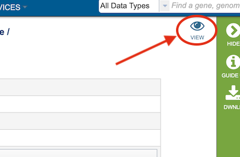

Clicking the **"VIEW"** icon at the top right of the result page of a Gene Tree Service analysis job result will open the Archaeopteryx display. 

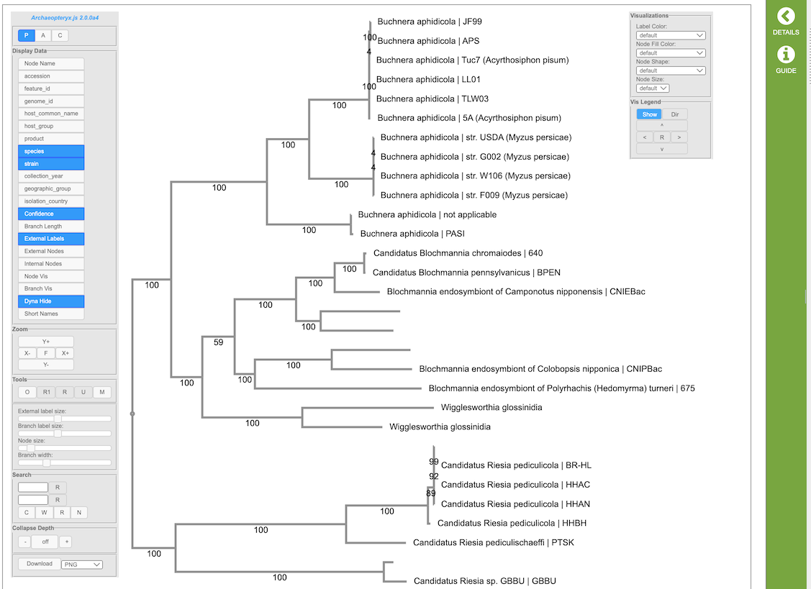

Archaeopteryx provides an interactive graphical representation of phylogenetic trees control panels on the left and right side of the tree display. The controls are described below.

## Controls
The following describes the standard controls (found in the left control box). Depending on the tree displayed, some buttons might not be present. For example, if the tree being shown lacks confidence values ("bootstrap values"), the button to show confidence values does not appear.

### Tree Display Types
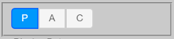
  - **P** for phylogram display (uses branch length values)
  - **A** for phylogram display (uses branch length values) with left-aligned labels
  - **C** for cladogram display (ignores branch length values)

Alternatively, use *Alt+P*  ("Option" on Macintosh) to cycle between these display types.

### Display Data
These settings control which data is being shown. In general, only relevant buttons are shown (for example, for a tree which has no internal labels, the "Internal Labels" button is not shown). Depending on the tree being displayed additional buttons might also be present.

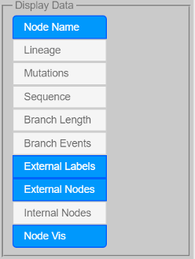

  - **Node Name** to show/hide node names (node names usually are the untyped labels found in, for example, New Hampshire/Newick formatted trees)
  - **Taxonomy** to show/hide node taxonomic information
  - **Sequence**  to show/hide node sequence information
  - **Confidence** to show/hide confidence values
  - **Branch Length** to show/hide branch length values
  - **Node Events** to show speciations and duplications as colored nodes (e.g. speciations green duplications red)
  - **Branch Events** to show/hide branch events (e.g. mutations)
  - **External Labels** to show/hide external node labels (e.g. node labels, sequence and taxonomic information -- if present)
  - **Internal Labels** to show/hide internal node labels
  - **External Nodes** to show external nodes as shapes (usually circles)
  - **Internal Nodes** to show internal nodes as shapes (usually circles)
  - **Node Vis** to show/hide node visualizations (node colors, shapes, sizes)
  - **Dyna Hide** to hide labels depending on expected visibility
  - **Short Names** to shorten long node labels

### Zoom

These settings control zoom in horizontal and vertical directions.
General zoom (where everything changes size) can also be achieved with the **mouse-wheel**.

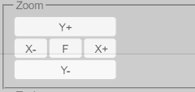

  - **Y+** to zoom in vertically (*Alt+Up* or *Shift+mousewheel*)
  - **Y-** to zoom out vertically (*Alt+Down* or *Shift+mousewheel*)
  - **X+** to zoom in horizontally (*Alt+Right* or *Shift+Alt+mousewheel*)
  - **X**- to zoom out horizontally (*Alt+Left* or *Shift+Alt+mousewheel*)
  - **F** to fit the tree to the display size (*Alt+C*, *Alt+Delete*, *Home*, or *Esc* to re-position controls as well)
  - *Alt+plus* and Alt+minus to zoom while keeping all font sizes constant
  - *Shift+Alt+plus* and *Shift+Alt+minus* or *Page Up* and *Page Down* or *Shift+Ctrl+mousewheel* to change all font sizes

### Tools
These settings control the tree being displayed.

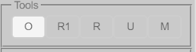

  - **O** to "order" the entire tree (*Alt+O*)
  - **R1** to return to super-tree, one branch at the time, if in sub-tree (*Alt+R*)
  - **R** to return to complete tree, if in sub-tree 
  - **U** to uncollapse all, if collapse sub-trees present (*Alt+U*)
  - **M** to midpoint re-root the tree, if tree is re-rootable (uncollapses as well) (*Alt+M*)

### Node Actions
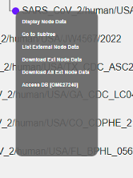

(Left-) clicking on nodes allows to (not all actions are available at all times):
  - Display Node Data
  - Collapse
  - Uncollapse
  - Uncollapse All 
  - Go to Subtree
  - Return to Supertree
  - Swap Descendants
  - Order Subtree
  - Reroot 
  - Select/Deselect Node
  - Select/Deselect All Ext Nodes
  - List External Node Data
  - Download Ext Node Data (to download data from external nodes which is currently displayed)
  - Download All Ext Node Data (to download all data from external nodes)
  - List Sequences in Fasta
  - Delete Subtree/External Node

### Size Control
These sliders control the size of various elements.

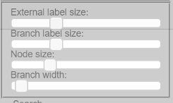

  - **External label size** to control the size of the external label fonts
  - **Internal label size** to control the size of the internal label fonts
  - **Branch label size** to control the size of the fonts for confidence and branch lengths
  - **Node size** to control the size of the external and internal node shapes (if turned on with **"External Nodes"** and **"Internal Nodes"**)
  - **Branch width** to control the branch widths (if not set in the tree itself)

### Collapse
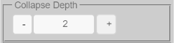

  - **Collapse Depth** 
  - **Collapse Feature** to collapse nodes based on shared metadata values

### Download
The following formats are available for download.

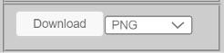

  - PNG image
  - SVG vector image
  - phyloXML tree file
  - Newick tree file

### Visualizations
Example: Node fill color representing PANGO lineages:

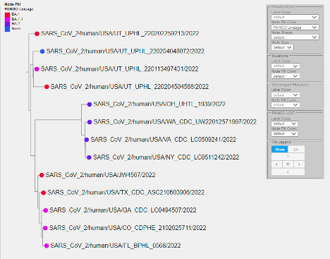

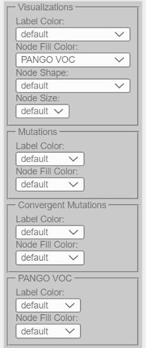

The following visualizations are possible (depending on the data present):
  - **Label Color** to control label colors based on a selected metadata field
  - **Node Fill Color** to control node colors based on a selected metadata field
  - **Node Border Color** to control node border colors based on a selected metadata field
  - **Node Shape** to control node shapes based on a selected metadata field
  - **Node Size** to adjust node sizes based on the numerical values of a selected metadata field

### Vis Legend
  - **Show** to show/hide legends
  - **Dir** to toggle between vertical and horizontal alignment of multiple legends
  - Arrows to move the position of legends
  - **R** to return legends to the default position

### Search
Archaeopteryx.js provides a wide variety of powerful search functions.

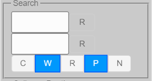

#### Search Fields
By default, all available data fields (such as sequence names, gene names, taxonomic names, etc.) are searched.

#### Basic Search
Search terms can be entered into the two input boxes. Matches of the search term entered in the top box are highlighted in green, while matches of the search term entered in the bottom box are in red. Matches of both search terms are in blue.  

**"R"** buttons are used to reset (clear) search results. In addition, the **"R"** buttons change color if the corresponding search succeeds (one or more matches). The tooltip of the **"R"** buttons can be used to obtain the exact number of matches.  

If Archaeopteryx.js is set up to load with preset initial search terms, pressing the Escape (Esc) key will restore these terms.

#### Search Modes
Search mode options are as follows:
  - **C** - to search in a case-sensitive manner
  - **W** - to match complete words (separated by spaces) only (does not apply to regular expression search)
  - **R** - to search with regular expressions
  - **P** - to search (hidden) properties associated with nodes
  - **N** - to negate (invert) the search results

#### Logical AND/OR Search
A comma is for logical OR search and a plus sign is used for logical AND search. AND has precedence (is evaluated first) over OR.

Examples:
  - "human + pre-mRNA" only matches nodes with both "human" and "pre-mRNA" in their name/annotation(s)
  - "human, mouse" matches all nodes with "human" or "mouse" in their name/annotation(s)
  - "human + bcl-2, caeel + ced-9" matches all nodes with "human" and "bcl-2" or "caeel" and "ced-9" in their name/annotation(s)

#### Field-specific Search
To limit queries to specific data fields, the following prefixes can be used (given that the displayed tree has typed data elements, provided by, for example, [phyloXML](http://www.phyloxml.org/) formatted trees):
  - NN: node names
  - TC: taxonomy codes (e.g. "CAEEL")
  - TS: taxonomy scientific names
  - TN: taxonomy common name
  - TI: taxonomy (database) identifiers
  - SY: taxonomy synonym
  - SN: sequence names
  - GN: gene names
  - SS: sequence symbols
  - SA: sequence accessions
  - AN: sequence annotations
  - XR: sequence cross references
  - MS: molecular sequences

Field-specific searches can be combined with logical AND/OR.

Examples:
  - "SN:Bcl-2" matches all nodes with a sequence name containing Bcl-2
  - "TC:CAEEL" matches all nodes for which the taxonomy code is "CAEEL"
  - "SN:ced-9 + TC:CAEEL" matches all nodes with a ced-9 sequence from C. elegans 
  - "TC:CAEEL , TC:DROME" matches all nodes from C. elegans or Drosophila melanogaster
  - "XR:NMR" matches all nodes with a NMR structure cross reference (for sequences from UniProt, for example)
  - "XR:X-ray" matches all nodes with a X-ray structure cross reference (for sequences from UniProt, for example)
  - "XR:X-ray + TC:MOUSE" matches all nodes from mouse with a X-ray structure cross reference
  - "MS:GPIRQIR" matches all nodes with a protein sequence containing "GPIRQIR"

#### Regular Expression Search
[Regular expression](https://en.wikipedia.org/wiki/Regular_expression) search can be enabled with the **R** button in the Search panel. Archaeopteryx.js follows the regular expression syntax of the [JavaScript language](https://www.debuggex.com/cheatsheet/regex/javascript), which in turn is very similar to widely known syntax used in Perl 5.

When using regular expressions:
  - "+" and "," assume their normal use in regular expressions and cannot be used to indicate logical AND/OR searches
  - Case-matching ("C" button) applies (i.e., when "Cas" is turned off [A-Z] and [a-z] are the same)
  - "W" does not apply

Regular Expression Search Examples:
  - \d_C – matches everything which contains a digit followed by an underscore followed by the letter C ("Cas" turned on)
  - ^A – matches everything which starts with a letter A ("Cas" turned on)
  - ^B[a-z]{5,}\d{2,}$ – matches everything starting with a B and ending with at least two digits, separated by at least 5 lowercase characters  ("Cas" turned on)
  - ^C\.\s – matches everything starting with "C." followed by at least one white-space character ("Cas" turned on)

Regular expression can be used for typed searches.

Typed Regular Expression Search Examples:
  - SN:Bcl-?2 – to search for nodes with sequences named "Bcl2" or "Bcl-2"
  - MS:GP.R..R – to search molecular sequences for a motif or pattern
  - MS:E{5,} – to search for molecular sequences with Glutamic acid repeats of at least length 5
