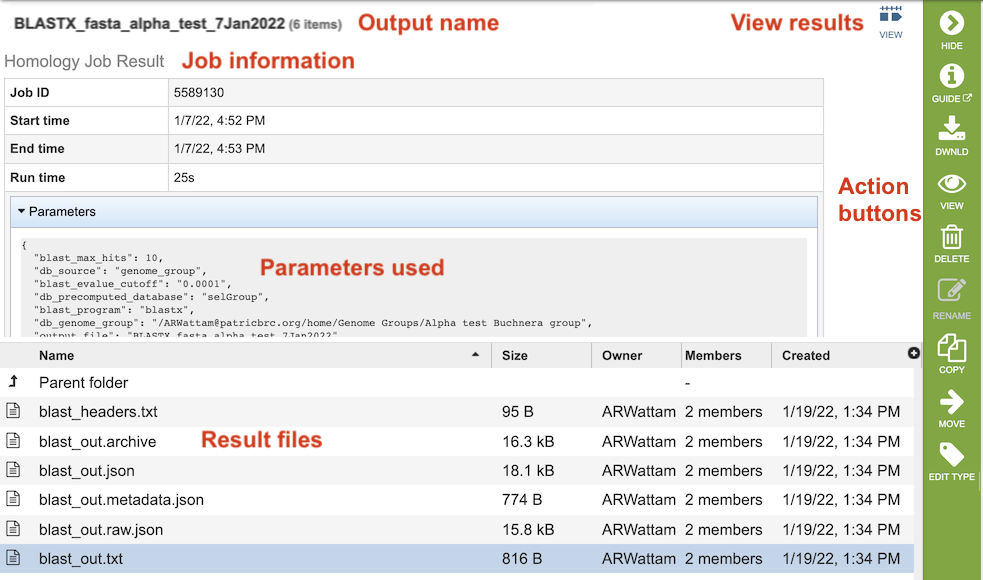
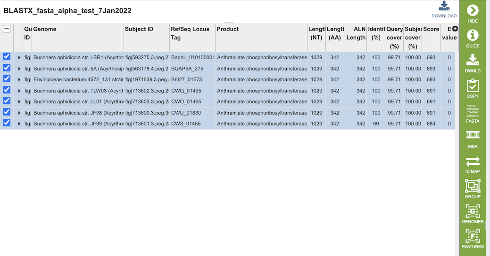

# BLAST Service

## Overview
The BLAST service integrates the BLAST (Basic Local Aligment Search Tool) algorithms to perform searches against against public or private genomes in BV-BRC or other reference databases using a DNA or protein sequence and find matching genomes, genes, RNAs, or proteins.  

### See also
* [BLAST Service](https://www.bv-brc.org/app/Homology)
* [BLAST Service Tutorial](../../tutorial/blast/blast.html)

## Using the BLAST Service
The **BLAST** submenu option under the **Services** main menu (Genomics category) opens the BLAST input form (*shown below*). *Note: You must be logged into BV-BRC to use this service.*

## Options
 

## Search Program 

There are four BLAST programs provided by BV-BRC, and each has a specific query sequence and database. Clicking on the button in front of the program name will select it and will also select the appropriate databases.

  * **BLASTN** – The query sequence is DNA (nucleotide), and when enabled the program will search against DNA databases of contig or gene sequences.
  * **BLASTX** – The query sequence is DNA (nucleotide), and when enabled the program will search against the protein sequence database.
  * **BLASTP** – The query sequence is protein (amino acid), and when enabled the program will search against the protein sequence database.
  * **tBLASTn** – The query sequence is protein (amino acid), and when enabled the program will search against DNA databases of contig or gene sequences.

 ## Query Source 

There are three types of Query sources that are provided by BV-BRC:

* **Enter sequence** - Paste the query sequence into the box.
* **Select FASTA file** - Choose FASTA file that has been uploaded to the Workspace.
* **Select feature group** - Choose a feature (gene/protein) that has been saved in the Workspace.

## Database Source

BV-BRC has different databases to choose from for the source to search wihin: 

* **Reference and representative genomes (bacteria, archaea)** - Those designated by the [NCBI](https://www.ncbi.nlm.nih.gov/refseq/about/prokaryotes/). This is the default.
* **Reference and representative genomes (virus)** - Those designated by the [NCBI](https://www.ncbi.nlm.nih.gov/refseq/about/).
* **Selected genome list** - Clicking on “Search within genome list” in the drop-down box will open a new source box where desired genomes can be added.
* **Selected genome group** - Genome group saved in the Workspace.
* **Selected feature group** - Feature (gene/protein) group saved in the workspace.
* **Taxon** - Selected taxonomic level from the database.
* **Selected fasta file** - FASTA file that has been uploaded to the Workspace.

## Output Folder
Folder in the Workspace where you want the BLAST results stored.

## Output Name
Name you provide to identify the results in the Workspace. 

## Advanced Options

* **Max hits** - Maximum number of BLAST hits to return.
* **E-Value threshold** - the number of expected hits of similar quality (score) that could be found just by chance.

**BLAST Parameters:** Allows adjustment of maximum number of hits returned and E value threshold.

## Buttons

* **Reset** above the search results reloads the input form so that the parameters can be easily adjusted and the search relaunched.
* **Submit** Launches the search which, upon completion, returns a set of results matching the sequence provided and selected criteria.  
* **View results (checkbox)** - Displays the results of the BLAST search (when completed) directly without having to go to the Jobs Landing page. 

## Output Results
 

The BLAST Service Job Results page (above) contains information about the job and all the files that are produced when the service completes. Information about the job submission can be seen in the table at the top of the results page. Clicking on "Parameters" below the job information table will display all the parameters that were selected when the job was submitted. 

Clicking on the "View" icon near the top right of the page (left of the green action bar) will display a table of the hits (below), from which you can perform more actions such as downloading, copying, accessing DNA and protein FASTA format data, constructing an MSA, creating a group of the results, and displaying the associated features and genomes in the database.

 

The table at the bottom of the page lists all of the files that were generated by the BLAST run:

* **blast_headers.txt** - 
* **blast_out.txt** - 
* **blast_out.json** - 
* **blast_out.metadata.json** - 
* **blast_out.raw.json** - 
* **blast_out.txt** - 

The BLAST Service generates a table of matching results (features) based on the options chosen.  

### Action buttons
After selecting one of the output files by clicking it, a set of options becomes available in the vertical green Action Bar on the right side of the table.  These include

* **Hide/Show:** Toggles (hides) the right-hand side Details Pane.
* **Download:**  Downloads the selected items (rows).
* **Copy:** Copies the selected items to the clipboard.
* **FASTA:** Provides the FASTA DNA or protein sequence for the selected feature(s).
* **ID Map:** Provides the option to map the selected feature(s) to multiple other idenfiers, such as RefSeq and UniProt.
* **MSA:** Launches the Multiple Sequence Alignment (MSA) tool and aligns the selected features by DNA or protein sequence in an interactive viewer.
* **Pathway:** Loads the Pathway Summary Table containing a list of all the pathways in BV-BRC in which the selected features are found.
* **Group:** Opens a pop-up window to enable adding the selected sequences to an existing or new group in the private workspace.
* **Feature:** Loads the Feature Page for the selected feature. *Available only if a single feature is selected.*
* **Features:** Loads the Features Table for the selected features. *Available only if multiple features are selected.*
* **Genome:** Loads the Genome View Overview page corresponding to the selected feature.  *Available only if a single feature is selected.*
* **Genomes:** Loads the Genomes Table, listing the genomes that correspond to the selected features. *Available only if multiple features are selected.*

More details are available in the [Action Buttons](../action_buttons.html) Quick Reference Guide.

## References
1.	Boratyn, G.M., Camacho, C., Cooper, P.S., Coulouris, G., Fong, A., Ma, N., Madden, T.L., Matten, W.T., McGinnis, S.D., Merezhuk, Y. et al. (2013) BLAST: a more efficient report with usability improvements. Nucleic acids research, 41, W29-33.

2.	O'Leary, N.A., Wright, M.W., Brister, J.R., Ciufo, S., Haddad, D., McVeigh, R., Rajput, B., Robbertse, B., Smith-White, B., Ako-Adjei, D. et al. (2016) Reference sequence (RefSeq) database at NCBI: current status, taxonomic expansion, and functional annotation. Nucleic acids research, 44, D733-745.
