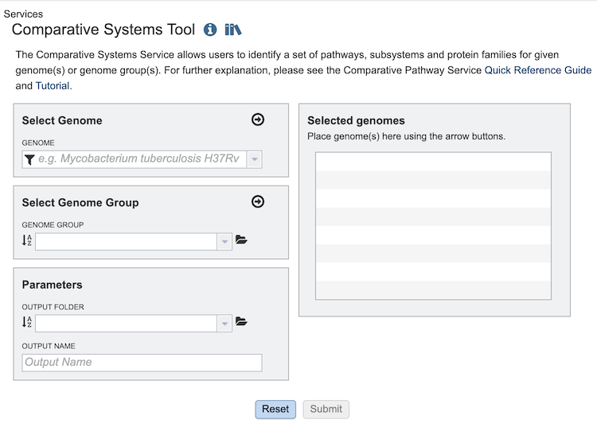
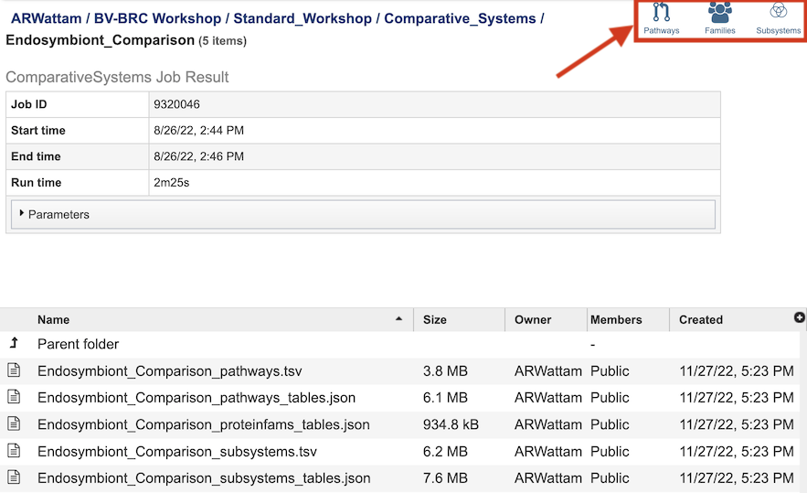

# Comparative Systems Service

## Overview
The Comparative Systems Service allows users to identify a set of pathways, subsystems, and protein families for a set of genomes or genome groups. It combines together functionality from three different tools and data from the legacy PATRIC system: the **Protein Family Sorter**, **Pathway Comparison Tool**, and **Subsystems Data**.

### See also
  * [Comparative Systems Service](https://www.bv-brc.org/app/ComparativeSystems)
  * [Comparative Systems Service Tutorial](../../tutorial/comparative_systems/comparative_systems.html)

## Using the Comparative Systems Service
The **Comparative Systems** submenu option under the **Services** main menu (Genomics category) opens the Comparative Systems input form (shown below). *Note: You must be logged into BV-BRC to use this service.*

## Options

## Select Genome
The service can accept selected genomes and genome groups. To include any genome (reference, representative, other public, or private genomes), click on the filter icon in the text box in the "Select Genome" box to narrow the selection and deselect the categories that are not of interest. Typing in the text box will display a list of matching genomes. Clicking on the genome name selects it, and clicking on the arrow icon in the top right of the box adds it to the "Selected Genomes" list. Multiple genomes can be added.

## Select Genome Group
To include a genome group in the analysis, click on the down arrow in the text box in the "Select Genome Group" box. This will display a list of all the genome groups, with the most recently created appearing at the top of the list. Selecting a group and clicking on the arrow icon in the top right of the box adds it to the "Selected Genomes" list. Multiple genome groups can be added.

## Selected Genomes
This box displays the list of all of the genomes and/or genome groups selected to be included in the analysis.

## Parameters
* **Output folder** - The workspace folder where results will be placed.
* **Output name** - A user-specified label. This name will appear in the workspace when the annotation job is complete.

## Buttons
* **Reset** - clears the form and resets all default values
* **Submit** - Submits the analysis service job. This button is only enabled after all required fields and settings in the form are completed.

## Output Results
 

The Comparative Systems Service generates several files that are deposited in the Private Workspace in the designated Output Folder. These include the following, where [output_name] is replaced with the Output Name entered on the input form:

* **[output_name]_pathways.tsv** - Tab-separated-value (TSV) format file containing all the pathways and genes found across all the genomes in the selection.
* **[output_name]_pathways_tables.json** - Javascript Object Notation (JSON) format file of the pathways and genes found across the genomes in the selection. Files of this type are used by the system for structured data handling.
* **[output_name]_proteinfams_tables.json** - JSON-format file containing all of the protein families found across all the genomes in the selection.
* **[output_name]_subsystems.tsv** - TSV-format file containing all of the subsystems found across all the genomes in the selection.
* **[output_name]_subsystems_tables.json.** - JSON-format file containing all of the subsystems found across all the genomes in the selection.

The output from the Comparative Systems Service can be accessed and analyzed from three different BV-BRC tools: the **Pathway Comparison Tool**, **Protein Family Sorter**, and **Subsystems Data**. Each of these can be accessed by clicking the corresponding icon in the upper right corner of the results page. 

 

 

## Pathway Comparison Tool

The Comparative Pathway tool allows researchers to identify a set of metabolic pathways based on taxonomy, EC number, pathway ID, pathway name and/or specific annotation type. 

 * [Pathway Comparison Tool Quick Reference Guide](../../tutorial/comparative_systems/comparative_systems.html)

 * [Pathway Comparison Tool Quick Reference Guide](../../tutorial/comparative_systems/comparative_systems.html)

## Protein Family Sorter

The Protein Family Sorter allows users to select a set of genomes of interest  and examine distribution of protein families across the genomes, commonly referred to as the "pan genome," which in this case refers to the superset of proteins found in all selected genomes. This tool provides various filtering options to quickly locate protein families that are conserved across all the genomes ("core genome"), conserved only in a subset of the selected genomes ("accessory genome") or that match a specified function. A tabular view shows protein families matching filtering criteria and an interactive heatmap viewer provides a birds-eye (pan genome) view of the distribution of the protein families across multiple genomes, with clustering and anchoring functions to show relative conservation of synteny and identify areas of possible horizontal transfer.

 * [Protein Family Sorter Quick Reference Guide](../other/protein_family_sorter/protein_family_sorter.html)

## Subsystems Data

Subsystems are also included in the Comparative Systems service.  This part of the service includes a distribution pie chart that summarizes the functionality and genes across all genomes selected.  It also includes a table showing the individual subsystems available.  When a subsystem is selected, researchers can see a heatmap showing the genes that are included in it and the presence and absence of those genes across all the genomes in the selection. 

## References
1. 

