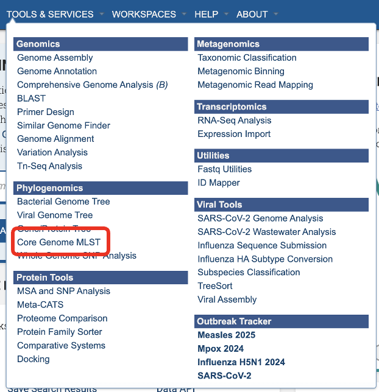
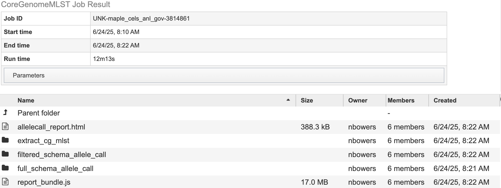

# Core Genome MLST Analysis Service

## Overview
The Core Genome Multi-Locus Sequence Typing (MLST) pipeline allows you to characterize bacterial and viruses based on the presence and absence of specific loci. These loci are defined in a schema.  This service defines a schema as a list of locus names and collection of allele sequences.  There are 32 schemas for priority pathogen species curated by species experts at [Ridom]( https://www.ridom.de/seqsphere/cgmlst/) 
Typical MLST schemas used 5-7 genes that are conserved and essential for basic cellular functions and are expected to be present in all strains of a species even as they evolve.  This service uses schemas with predefined sets of species-specific loci including both core and accessory genes.  This allows for finger resolution of bacterial strain differences and consistent tracking across labs.

This service used Chewbbaca 3.3.10.  Elements of this tutorial are based on their documentation. The full documentation is available [here]( https://chewbbaca.readthedocs.io/en/latest/index.html) The pipeline begins with the alle call step which finds alleles in the genomes that are also listed in the schema. Thus identifying known and novel alleles in the input genomes. An allele is a specific sequence variant that occurs at a given locus.  The initial allele call can be considered as cgMLST including all alleles. Later, we will rerun this step to identify the core genome. The allele call uses the following tools:
  
  * Pyrodigal predicts the coding sequences (CDSs) and generates predicted protein-coding genes which are used for allele matches.
  
  * BLAST Score Ratio (BSR) screening for each locus in the schema.  The predicted CDSs are compared to the known alleles. A match is accepted if the BSR to a known allele is les than or greater than the global threshold of 0.6. The resulting alleles are classified according to the match. Scroll down to Reading "The Allele Call Classification Counts" section for definitions of each classification type.
Then the service runs chewBBACA’s remove genes command to remove paralogous loci (if any) identified in the initial allele call. This is followed by the extract cgMLST command which determines the set of loci that constitute the core genome loci from the allele call results. The following steps take place:
  
  *  Masking: Converts less stable allele calls, INF- (inferred) allele labels and special classifications to 0 to standardize the data.
  
  * Presence-absence matrix: Builds a loci presence-absence matrix and tracks missing/special calls per sample.
  
  * Core Loci Selection: Determines which loci are “core” based on how often they appear across the genomes – providing results for default thresholds 95%, 99% and 100%. 
This service uses 95% as the threshold. A second allele call is performed with the allelic profiles meeting the 95% threshold. Followed by the allele call evaluator. This generates an interactive report, called "allelecall_report.html" that provides summary statistics to evaluate results per sample and per loci. This is available in your job results. The report includes a presence-absence matrix heatmap, a distance matrix based on the allelic differences and a Neighbor-Joining (NJ) tree based on the multiple sequence alignment (MSA) of the core genome loci.

## See also
* [Core Genome MLST Analysis Service](https://bv-brc.org/app/CoreGenomeMLST)
* [Core Genome MLST Analysis Service Tutorial](../../tutorial/core_genome_mlst/core_genome_mlst.html)

## Using the Core Genome MLST Analysis Service
The **Core Genome MLST Analysis** submenu option under the **Services** main menu (Genomics category) opens the Core Genome MLST Analysis Service input form (*shown below*). *Note: You must be logged into BV-BRC to use this service.*

## Service Menu

## Genome Input

### Select a Genome Group
This service accepts assembled genomes that are collected into one Genome Group. For more information about creating a genome group please visit our [documentation](https://www.bv-brc.org/docs/quick_references/workspaces/groups.html) or our [video tutorial](https://www.youtube.com/watch?v=BDCUyhX9brA&t=36s)

### Select Reference Schema
The schemas are species-specific.  Selecting a schema built from a different species will not allow the service to correctly match your loci to the target genome. This could lead to inaccurate allele calls. 

## Parameters
In the parameters section you will select an output folder and output name.

See the core genome MLST tutorial for a detailed guide to reviewing the job results.

### Output Folder
The workspace folder where results will be placed.

### Output Name
Name used to uniquely identify results.

## Buttons

**Reset:** Resets the input form to default values

**Submit:** Launches the Core Genome MLST Analysis job

## Output Results

* cgMLST.html details the number of loci present at 100%, 99% and 95%.

* cgMLST100.tsv, cgMLST95.tsv, cgMLST99.tsv contains a matrix of allelic profiles for the cgMLST for each threshold.

* cgMLSTschema100.txt,  cgMLSTschema95.txt,  cgMLSTschema99.txt,  contains the list of loci that constitute the cgMLST schema. The filtered schema allele call uses the cgMLSTschema95.txt file to define the loci list to perform allele calling on. Compared to full schema allele call which uses all the loci listed in the schema. For more information please visit the [Chewbbaca documentation]( https://chewbbaca.readthedocs.io/en/latest/user/modules/ExtractCgMLST.html).

Note: The “filtered_schema_allele_call” and “full_schema_allele_call” contain the same contents and only differ on if the allele call used loci present in 95% of the genomes passed or the full schema of genes available (regardless of how many genomes they are present in). 

  * allele_call_evaulator directory 

  * allelecall_report.html and report_bundle.js – The allelecall_report.html  is detailed above. The report_bundle.js must be kept in  the same directory as allelecall_report.html. 

  * cgMLST_MSA.fasta - contains the MSA of the core loci. For each locus in the core genome, the alleles found in all samples are translated and aligned with MAFFT. The alignment files are concatenated to generate the full core genome alignment.
		  
  * cgMLST_profiles.tsv  - contains the allelic profiles for the set of core loci.
		  
  * distance_matrix_symmetric.tsv contains the symmetric distance matrix. The matrix contains the pairwise allelic distances computed based on the set of core loci (shared by 100% of the samples).

  * masked_profiles.tsv - contains the masked allelic profiles (the profiles in the results_alleles.tsv file are masked to remove INF- prefixes and substitute all non-EXC and non-INF classification by 0).
		
  * presence_absence.tsv - contains the loci presence-absence matrix.

* cds_coordinates.tsv - contains the coordinates (genome unique identifier, contig identifier, start position, stop position, protein identifier attributed by chewBBACA, and coding strand chewBBACA>=3.3.0 assigns 1 and -1 to the forward and reverse strands,)) of the CDSs identified in each genome.

* invalid_cds.txt file contains the list of alleles predicted by Prodigal that were excluded based on the minimum sequence size value and presence of ambiguous bases.

* loci_summary_stats.tsv - contains the classification type counts (EXC, INF, PLOT3, PLOT5, LOTSC, NIPH, NIPHEM, ALM, ASM, PAMA, LNF) and the total number of classified CDSs (non-LNF) per locus.

* logging_info.txt - contains summary information about the allele calling process.

* missing_classes.fasta and missing_classes.tsv give insight into why the sequences were classified as non-EXC or non-INF.

* paralogous_counts.tsv - contains the list of paralogous loci and the number of times those loci matched a CDS that was also similar to other loci in the schema.

* paralogous_loci.tsv - contains the sets of paralogous loci identified per genome (genome identifier, identifiers of the paralogous loci and the coordinates of the CDS that is similar to the group of paralogous loci).

* results_alleles.tsv - contains the allelic profiles determined for the input samples. The first column has the identifiers of the genome assemblies. The remaining columns contain the allele identifiers or other classification labels for loci present in the schema, with the column headers being the locus identifiers.

* results_alleles_NoParalogs.tsv - details loci that were identified as possible paralogs. These loci should be removed from the schema due to the potential uncertainty in allele assignment. This is completed by the “RemoveGenes” command which is run prior to the filtered allele call.

* results_contigsInfo.tsv - contains the loci coordinates in the genomes analyzed. The first column contains the identifiers of the input genomes and the other columns (with loci names in the headers) the locus coordinate information or the classification attributed by chewBBACA if it was not an exact match or inferred allele.

* results_statistics.tsv  - contains the classification type counts (EXC, INF, PLOT3, PLOT5, LOTSC, NIPH, NIPHEM, ALM, ASM, PAMA, LNF), the total number of invalid CDSs, the total number of classified CDSs (non-LNF) and the total number of predicted CDSs per genome.

* unclassified_sequences.fasta – a FASTA file with the DNA sequences of the distinct CDSs that were not classified.

### Action buttons

After selecting one of the output files by clicking it, a set of options becomes available in the vertical green Action Bar on the right side of the table, listed below. To find out more about the different options for using these output files, see the [Core Genome MLST Analysis Service Tutorial](https://bv-brc.org/docs/tutorial/core_genome_mlst/core_genome_mlst.html).

* **Hide/Show:** Toggles (hides) the right-hand side Details Pane.
* **Guide:** Link to the corresponding Quick Reference Guide
* **Download:**  Downloads the selected item.
* **View:** Displays the content of the file, typically as plain text or rendered html, depending on filetype. Only available for html, txt, and tsv file types.
* **Delete:** Deletes the file.
* **Rename:** Allows renaming of the file.
* **Copy:** Copies the selected items to the clipboard.
* **Move:** Allows moving of the file to another folder.
* **Edit Type:** Allows changing of the type of the file in terms of how BV-BRC interprets the content and uses it in other services or parts of the website.  Allowable types include unspecified, contigs, nwk, reads, differential expression input data, and differential expression input metadata.

More details are available in the [Action Bar](/quick_references/action_bar) Quick Reference Guide.

## References
1. Olson RD, Assaf R, Brettin T, Conrad N, Cucinell C, Davis JJ, Dempsey DM, Dickerman A, Dietrich EM, Kenyon RW, Kuscuoglu M, Lefkowitz EJ, Lu J, Machi D, Macken C, Mao C, Niewiadomska A, Nguyen M, Olsen GJ, Overbeek JC, Parrello B, Parrello V, Porter JS, Pusch GD, Shukla M, Singh I, Stewart L, Tan G, Thomas C, VanOeffelen M, Vonstein V, Wallace ZS, Warren AS, Wattam AR, Xia F, Yoo H, Zhang Y, Zmasek CM, Scheuermann RH, Stevens RL.
2. Silva, Mickael, et al. “ChewBBACA: A Complete Suite for Gene-By-Gene Schema Creation and Strain Identification.” Microbial Genomics, vol. 4, no. 3, 1 Mar. 2018, https://doi.org/10.1099/mgen.0.000166.
