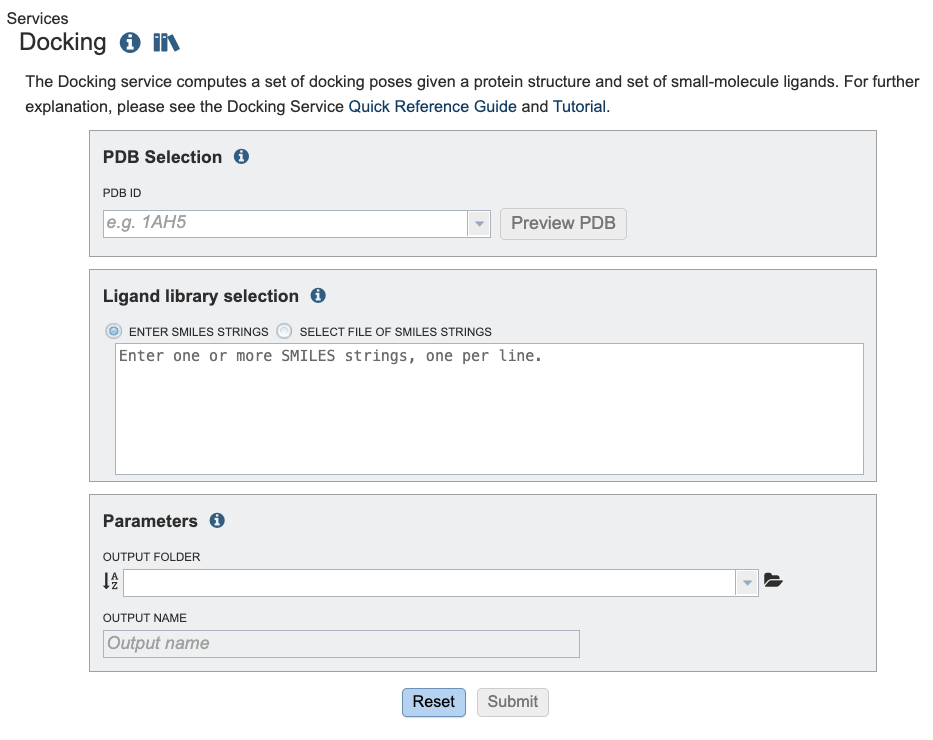
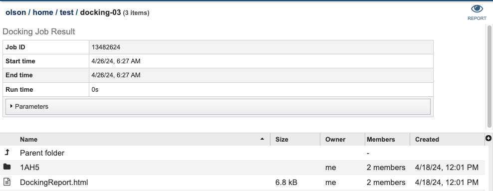

# Small-molecule Docking Service

*Revised: April 26, 2024*

## Overview
The small-molecule docking service uses the DiffDock method of molecular docking to compute a set of predicted
poses for a given protein structure and a set of small-molecule ligands.

## See also
* [Docking Application](https://bv-brc.org/app/Docking)
* [Docking Tutorial](/tutorial/docking/docking)

## Using the Docking Service
The **Docking** submenu option under the **"SERVICES"** main menu (Protein Tools category) opens the Docking Service input form. *Note: You must be logged into BV-BRC to use this service.*


Below is a screenshot of the Docking Service landing page, as well as a summary of customizable parameters.



## PDB Selection

**PDB ID:** The PDB identifier of the target protein. The PDB identifiers here come from
the collection loaded into the BV-BRC resource. The **Preview PDB** button may be used
to preview the given PDB structure using the BV-BRC struture viewer.


## Ligand library selection

Choose a set of ligands to bind. These may be specified using one of the following mechanisms:

 * By using the **Enter SMILES Strings** option, one or more SMILES strings may be pasted into the text
box, one per line. If you wish to specify identifiers for the SMILES strings these may be provided before the SMILES string.
For example:
```
    coffee CN1C=NC2=C1C(=O)N(C(=O)N2C)C
    sugar  C(C1C(C(C(C(O1)OC2(C(C(C(O2)CO)O)O)CO)O)O)O)O
```

 *  By using the **Select File of SMILES Strings** option. Here you may choose an existing
file of SMILES strings from the workspace, or upload a new file from your computer. The format
is the same as the format used in the SMILES text box described above.

## Parameters

**Output Folder:** The workspace folder where results will be placed.

**Output Name:** A user-specified label. This name will appear in the workspace when the analysis job is complete.

## Buttons

**Reset:** Resets the input form to default values

**Submit:** Launches the Docking job. A message will appear below the box to indicate that the job is now in the queue.

## Output Results



The Docking Service generates several files that are deposited in the Private Workspace in the designated Output Folder. T
The top level folder includes a file named **DockingRreport.html**.
This contains a report summarizing the results of the docking against each ligand
including scores for each match and a link to the structure viewer with the protein structure
with the ligand placed in it.

Each protein that was docked has more detailed output in a folder named with the PDB identifier for the protein.
In this folder is a set of additional folders, one per ligand. In these folders you will find the details
for the docking of the protein with the given ligand:

* **result.csv** contains a table summarizing the results. The columns are as follows:
  * **ident** Ligand identifier
  * **rank** Rank of the pose as determined by DiffDock
  * **score** Confidence score of the pose as determined by DiffDock
  * **lig_sdf** The name of a SDF file containing the posed ligand
  * **comb_pdb** The name of a PDB file containing the ligand and PDB structure composed together
  * **CNNscore** The CNN score of the pose as determined by GNINA
  * **CNNAffinity** The CNN affinity of the pose as determined by GNINA
  * **CNNscVinardoore** The Vinardo score of the pose as determined by GNINA

* **<PDB_ID>_rank\<N>_confidence-\<CONF>.pdb** - The composed PDB file for rank N with confidence CONF
* **rank\<N>.sdf** - A SDF file containing the top-ranked ligand pose
* **rank\<N>_confidence-\<CONF>.sdf** - A SDF file for the pose with rank N
* **rank\<N>_confidence-\<CONF>.pdb** - A PDB file for the pose with rank N


## Action buttons
After selecting one of the output files by clicking it, a set of options becomes available in the vertical green Action Bar on the right side of the table. These include:

* **Hide/Show:** Toggles (hides) the right-hand side Details Pane.
* **Guide Link:** to the corresponding Quick Reference.
* **Download:** Downloads the selected item.
* **View:** Displays the content of the file, typically as plain text or rendered html, depending on filetype.
* **Delete:** Deletes the file.
* **Rename:** Allows renaming of the file.
* **Copy:** Copies the selected items to the clipboard.
* **Move:** Allows moving of the file to another folder.

More details are available in the [Action Bar](/quick_references/action_bar) Quick Reference Guide.
