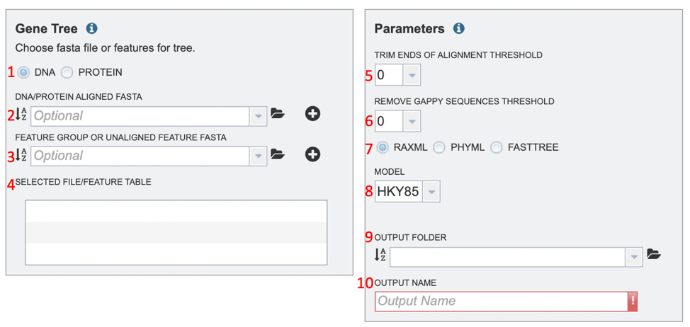
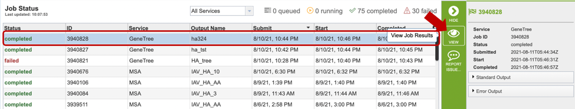

# Gene Tree Service

## Overview
The BV-BRC Phylogenetic Tree Building Service enables construction of custom phylogenetic trees built from user-selected genomes, genes, or proteins. Trees can be built based on either nucleotide or protein input sequences. The "FastTree" option computes large minimum evolution trees with profiles instead of a distance matrix. [1,2]. We also offer two maximum likelihood tree building algorithms: PhyML [3] and RaxML [4]. User-defined settings are required for either. PhyML and RaxML infer a more evolutionarily accurate phylogenetic topology by applying a substitution model to the nucleotide sequences. This algorithm is best applied to datasets containing: 
1) fewer than 100 very long sequences, and
2) between 100 and 1,000 small or medium length sequences.

The service returns a Newick file which can be rendered in the interactive Archaeopteryx Tree Viewer in the BV-BRC or downloaded and viewed in other software.   

### See also
* [Gene Tree Service](https://bv-brc.org/app/GeneTree)
* [Gene Tree Tutorial](../../tutorial/genetree/genetree.html)

## Using the Service
The **Gene Tree** submenu option under the **"SERVICES"** main menu (Viral Services category) opens the phylogenetic tree input form. *Note: You must be logged into BV-BRC to use this service.* 

 

## Input Options and Parameters

Several options exist for tree building. Below is a description of input, output, and parameter options. 

1. **DNA/PROTEIN:** Allows the user to select whether their phylogenetic tree is nucleotide or protein based. 
2. **DNA/protein aligned fasta:** allows the users to upload their aligned sequences input file or select it from their workbench.
3. **Feature group or unaligned feature fasta:** allows the users to upload their pre-selected feature group, or unaligned feature table input file or select it from their workbench.
4. **Selected file/feature table:** this box lists all input files that will be analyzed. 
5. **Trim ends of alignment threshold:** allows the user to trim ends of the alignment.
6. **Remove gappy sequences threshold:** allows the user to remove gappy positions from alignment extremities. 
7. **Tree algorithm:** Allows the user to choose from one of the following tree-building algorithms: RaxML, PhyML, or FastTree.
8. **Model:** Allows the user to choose the appropriate evolutionary model. Options will change based on whether user is aligning nucleotide or protein sequences (see options below). 
Nucleotide: HKY85, JC69, K80, F81, F84, TN93, GTR
Protein: LG, WAG, JTT, Blosum62, Dayhoff, HIVw, HIVb
9. **Output folder:** The workspace folder where results will be placed.
10: **Output name:** A user-specified label. This name will appear in the workspace when the annotation job is complete.

## Buttons

**Reset:** Resets the input form to default values

**Submit:** Launches the job. A message will appear below the box to indicate that the job is now in the queue. 

## Output Results

Clicking on the Jobs indicator at the bottom of the BV-BRC page open the Jobs Status page that displays all current and previous service jobs and their status. 

Once the job has completed, selecting the job by clicking on it and clicking the “View” button on the green vertical Action Bar (red arrow) on the right-hand side of the page displays the results files (red box). 

The results page will consist of a header describing the job and a list of output files, as shown below. 

The service generates several files that are deposited in the Private Workspace in the designated Output Folder. These include:
* **.afa** – the alignment file in fasta format.
* **.xml** – PhyloXML tree format file with genome IDs as leaf nodes
* **.nwk** – Newick tree format file with genome IDs as leaf nodes.
* **stats.txt** – Text file containing the statistics on the tree. May include the number of genomes in the tree, the number of proteins aligned, the number of amino acids included in the alignment, the number of genes (CDS) in the alignment, and/or the number of nucleotides.
* **Tree_report.html** – Web viewable file displaying the rendered tree and tree statistics, including the number of genomes, proteins, and genes used in building the tree. This file will be created even if the tree cannot be built and will provide information to understand what went wrong. 

## Action buttons

After selecting one of the output files by clicking it, a set of options becomes available in the vertical green Action Bar on the right side of the table. These include
* **Hide/Show:** Toggles (hides) the right-hand side Details Pane.
* **Guide:** Links to the corresponding Quick Reference
* **Download:** Downloads the selected item.
* **MSA:** View aligned FASTA directly on the BV-BRC site with the [MSA Viewer](../other/msa_viewer.html).  
* **View:** Displays the content of the file, typically as plain text or rendered html, depending on filetype.
* **Delete:** Deletes the file.
* **Rename:** Allows renaming of the file.
* **Copy:** Copies the selected items to the clipboard.
* **Move:** Allows moving of the file to another folder.

More details are available in the [Selection Action Bar](../action_bar.html) Quick Reference Guide.

## References
1.	Price MN, Dehal PS, Arkin AP. FastTree: computing large minimum evolution trees with profiles instead of a distance matrix. Mol Biol Evol. 2009 Jul;26(7):1641-50. doi: 10.1093/molbev/msp077. Epub 2009 Apr 17. PMID: 19377059; PMCID: PMC2693737. 
2.	Price MN, Dehal PS, Arkin AP. FastTree 2--approximately maximum-likelihood trees for large alignments. PLoS One. 2010 Mar 10;5(3):e9490. doi: 10.1371/journal.pone.0009490. PMID: 20224823; PMCID: PMC2835736.
3.	Guindon, S. and Gascuel, O., (2003) Syst Biol. 52: 696-704  
4.	Stamatakis, A. et al. (2005) Bioinformatics 21: 456-463

