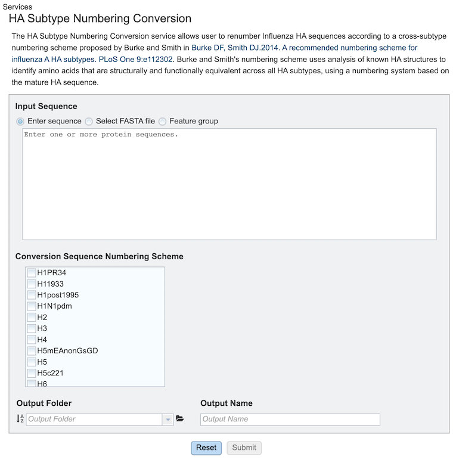

# HA Subtype Numbering Conversion Service

## Overview

The HA Subtype Numbering Conversion tool takes influenza HA protein sequence(s) and converts their existing HA position numbering to a different HA numbering scheme using David Burke and Derek Smith’s method that uses both sequence and structure information to propose positions of functional equivalence across different HA subtypes. The analysis starts with the user inputting protein sequence(s). The sequence(s) are BLASTed against the Burke Reference sequences, which will determine the best reference subtype to use in the HA numbering pipeline. The HA numbering pipeline will generate a pairwise multiple sequence alignment using the reference protein sequence selected and the user inputted protein sequence(s). This alignment will generate a mapping between the user input sequence(s) and the BLAST reference sequence. Then this mapping is used to align the input sequence(s) to the selected HA subtype positions.

### Burke Reference Sequences

| Subtype Common Name | Strain Name        |
| ------------------- | ------------------ |
| H1_PR34             | A/Puerto/Rico/8/34 |
| H1_1993             | A/United/Kingdom/1/1933 |
| H1post1995          | A/NewCaledonia/20/1999 |
| H1pdm | A/California/04/2009 |
| H2	| A/Singapore/1/1957 |
| H5mEA-nonGsGD	| A/mallard/Italy/3401/2005 (LPAI) |
| H5	| A/Vietnam/1203/04 (HPAI) |
| H5c221	| A/chicken/Egypt/0915-NLQP/2009 (HPAI) |
| H6	| A/chicken/Taiwan/0705/99 |
| H8	| A/turkey/Ontario/6118/1968 |
| H9	| A/Swine/HK/9/98 |
| H11	| A/duck/England/1/1956 |
| H12	| A/Duck/Alberta/60/1976 |
| H13	| A/gull/Maryland/704/1977 |
| H16	| A/black-headedgull/Turkmenistan/13/76 |
| B/Hong Kong/8/73	| B/HONGKONG/8/73 |
| B/Florida/4/2006	| B/FLORIDA/4/2006 |
| B/Human/Brisbane/60/2008	| B/HUMAN/BRISBANE/60/2008 |
| H3	| A/AICHI/2/68 |
| H14	| A/mallard/Astrakhan/263/1982 |
| H15	| A/duck/Australia/341/1983 |
| H10	| A/mallard/bavaria/3/2006 |
| H4	| A/swine/Ontario/01911-1/99 |
| H7N3	| A/Turkey/Italy/220158/02/H7N3 |
| H7N7	| A/Netherlands/219/03/H7N7 |
| H17	| A/little-yellowshoulderedbat/Guatemala/060/2010 |
| H18	| A/flat-faced/bat/Peru/033/2010 |

### See Also
  * [HA Subtype Numbering Conversion Service](https://www.bv-brc.org/app/HASubtypeNumberingConversion)
  * [HA Subtype Numbering Conversion Tutorial](../../tutorial/ha_numbering/ha_numbering.html)

## Using the HA Subtype Numbering Conversion Service
The **“HA Subtype Numbering Conversion”** submenu under the **“TOOLS & SERVICES”** main menu (Protein Tools category) opens the input form.
*Note: You must be logged into BV-BRC to use this service.*

## Options

Below is a screenshot of the job landing page, as well as a summary of customizable parameters.

**Input sequence:** Input sequences can be either a feature group, selected fasta sequence(s), or user-supplied sequence in fasta format.
* **Feature Groups:** Allows selection of previously identified groups of sequences saved in the workspace.
* **Select FASTA File:** Allows selection of custom sequence(s) saved in the workspace.
* **Enter Sequence:** Allows pasting of a custom sequence in fasta format.

**Conversion Sequence Numbering Scheme:** Selects the subtype(s) (one or more) to which numbering scheme conversion is desired.

**Output Folder:** The workspace folder where results will be placed.

**Output Name:** A user-specified label. This name will appear in the workspace when the analysis job is complete.

### Buttons

Reset: Resets the input form to default values
Submit: Launches the job. A message will appear below the box to indicate that the job is now in the queue.

### Output Results
 
Clicking on the Jobs indicator at the bottom of the BV-BRC page open the Jobs Status page that displays all current and previous service jobs and their status.

Once the job has completed, selecting the job by clicking on it and clicking the “View” button on the green vertical Action Bar on the right-hand side of the page displays the results files (red box).

## Results Page
 
The results page will consist of a header describing the job and a list of output files, as shown below.

The HA Subtype Numbering Conversion Service generates several files that are deposited in the Private Workspace in the designated Output Folder. These include:
 
·      blast.fasta contains the query sequences where the fasta headers are replaced with ‘queryN’.
·      blast.out is the output from blast to identify the closest Burke reference sequence.
·      input.fasta is the input sequences from the users or selected by users.
·      ‘queryN’.muscle.in input file for MUSCLE to align Nth query to its closest Burke reference sequence.
·      ‘queryN’.muscle.out output file from MUSCLE for Nth Query
·      ‘queryN’_result.fasta alignment of the query, its closest Burke reference and the selected subtypes for Numbering conversion.
·      Sequence_annotation.tsv tabular summary of blast results for all the query sequences to determine the best reference subtype to use in the HA numbering pipeline.
 
### Action buttons
 
After selecting one of the output files by clicking it, a set of options becomes available in the vertical green Action Bar on the right side of the table. These include:
·      Hide/Show: Toggles (hides) the right-hand side Details Pane.
·      Guide Link: to the corresponding Quick Reference.
·      Download: Downloads the selected item.
·      View: Displays the content of the file, typically as plain text or rendered html, depending on filetype.
·      Delete: Deletes the file.
·      Rename: Allows renaming of the file.
·      Copy: Copies the selected items to the clipboard.
·      Move: Allows moving of the file to another folder.
 
### Report 
 
On the right-hand side of header in the results page there is a “View report” option which opens a consolidated report for the job.

For each Query, the result of the analysis is reported in two forms: 
• A simple multiple sequence alignment format that includes the query sequence on top and then the reference sequence of the same subtype as the query sequence, and then reference sequences for all other chosen subtypes.  It will be displayed using the alignment viewer.
• A table with the mapping coordinating positions in one group of columns and the residue per subtype in the second group of columns

### Action Buttons 
 
·      ID TYPE - The user can change the sequence ID in the displayed alignment by selecting query and using the “ID TYPE” option. The user can view the alignment with simplified common name or strain name.

·      Download- Users can select a query sequence to download–
·      MSA in text format
·      MSA in aligned fasta format
·      Numbering Conversion Table in excel format.
·      MSA Image

