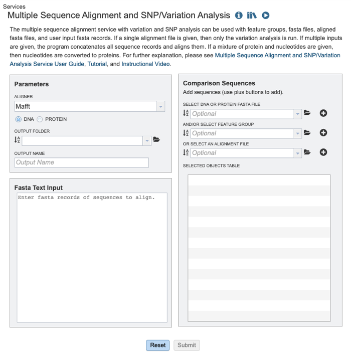
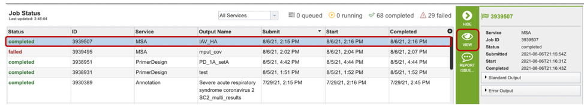
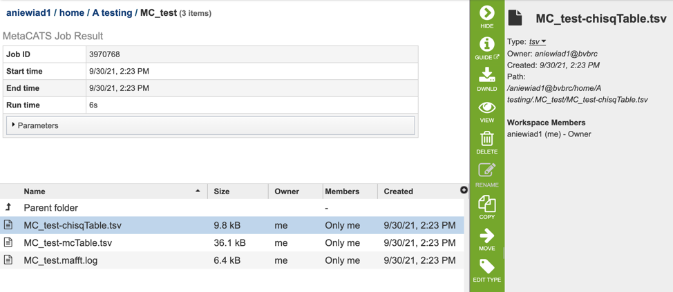

# Metadata-driven Comparative Analysis Tool (meta-CATS)

## Overview
The meta-CATS metadata genome comparison tool takes sequence data and determines the aligned positions that significantly differ between two (or more) user-specified groups. Once an analysis is started, a multiple sequence alignment is performed if the input was unaligned (such as from a database query). A chi-square test of independence is then performed on each non-conserved column of the alignment, to identify those that have a non-random distribution of bases. A quantitative statistical value of variation is computed for all positions. Columns that are perfectly conserved will not be identified as statistically significant. All other non-conserved columns will be evaluated to determine whether the p-value is lower than the specified threshold value. Terminal gaps flanking the aligned sequences will not be taken into account for the analysis.  

### See also
* [Metadata-driven Comparative Analysis Tool (meta-CATS)](https://beta.bv-brc.org/app/MetaCATS)
* [Metadata-driven Comparative Analysis Tool (meta-CATS) Tutorial](../../tutorial/metacats/metacats.html)

## Using the Meta-CATS Service
The **Meta-CATS** submenu option under the **"SERVICES"** main menu (Viral Services category) opens the Meta-CATS Service input form. *Note: You must be logged into BV-BRC to use this service.*

 

## Parameters

Below is a screenshot of the Meta-CATS landing page, as well as a summary of customizable parameters.  

 

**Aligner:** The alignment algorithm that the user wishes to use. Options include Mafft [1,2], MUSCLE [3,4], and progressiveMauve [5]. 

**DNA/Protein:** This option allows the user to specify whether they are aligning nucleic acid or protein (amino acid) sequences). 

**Output Folder:** The workspace folder where results will be placed.

**Output Name:** A user-specified label. This name will appear in the workspace when the annotation job is complete.

**Fasta Text Input:** Users may enter custom sequences here by pasting in FASTA formatted sequences. 

### *Optional Comparison Sequences*

**Select DNA or Protein Fasta File:** Users may input a nucleic acid or protein FASTA file from their workspace or upload their own data here, either in addition to the FASTA text input, or as an alternative. 

**And/or Select Feature Group:** Users may input a nucleic acid or protein FASTA file containing a previously selected “Feature Group” (eg. CDS, tRNA etc.) from their workspace here, either in addition to the FASTA text input, or as an alternative.

**Or Select and Alignment File:** If users have previously aligned dataset, they may input their nucleic acid or protein MSA file in FASTA format from their workspace here, either in addition to the FASTA text input, or as an alternative.

**Selected Objects Table:** The user specified files and/or datasets designated for analysis by the MSA and variation/SNP analysis tool. 

## Buttons

**Reset:** Resets the input form to default values 

**Submit:** Launches the MSA job. A message will appear below the box to indicate that the job is now in the queue. 

## Output Results

Clicking on the Jobs indicator at the bottom of the BV-BRC page open the Jobs Status page that displays all current and previous service jobs and their status. 

Once the job has completed, selecting the job by clicking on it and clicking the “View” button on the green vertical Action Bar on the right-hand side of the page displays the results files (red box). 

The results page will consist of a header describing the job and a list of output files, as shown below. 

The Meta-CATS Service generates several files that are deposited in the Private Workspace in the designated Output Folder. These include:

* **chisqTable.tsv** - a tab separated value file with results for a “Chi-square Goodness” of fit test result: ie: positions that have significant non-random distribution between the specified groups
* **mcTable.tsv** - a tab separated value file with results for adjusted  p-values for multiple comparisons.
* **Mafft.log** - an output log file produced by the Mafft aligner. 

## Action buttons
After selecting one of the output files by clicking it, a set of options becomes available in the vertical green Action Bar on the right side of the table. These include:

* **Hide/Show:** Toggles (hides) the right-hand side Details Pane.
* **Guide Link:** to the corresponding Quick Reference.
* **Download:** Downloads the selected item.
* **View:** Displays the content of the file, typically as plain text or rendered html, depending on filetype.
* **Delete:** Deletes the file.
* **Rename:** Allows renaming of the file.
* **Copy:** Copies the selected items to the clipboard.
* **Move:** Allows moving of the file to another folder.

More details are available in the [Action Bar](../action_bar.html) quick reference.
