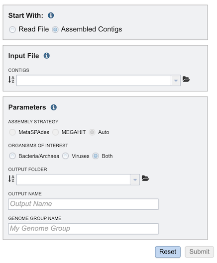

# Metagenomic Binning Service

## Overview
The Metagenomic Binning Service accepts either reads or contigs, and attempts to "bin" the data into a set of genomes. This service can be used to reconstruct bacterial and archael genomes from environmental samples [1].

## See also
* [Metagenomic Binning Service](https://bv-brc.org/app/MetagenomicBinning)
* [Metagenomic Binning Service Tutorial](/tutorial/metagenomic_binning/metagenomic_binning)

## Using the Metagenomic Binning Service
The **Metagenomic Binning** submenu option under the **Services** main menu (Metagenomics category) opens the Metagenomic Binning Service input form (*shown below*). *Note: You must be logged into BV-BRC to use this service.*

## Options

## Start With
The service supports input of read files or assembled contigs. This selection changes the options in the Input File box on the form. 

## Read File Option
 

## Assembled Contigs Option
 

## Input File
The Input File box options depend on whether Read File or Assembled Contigs is chosen in the Start With box. 

### Read File Option
Multiple read types can be uploaded and submitted to the service. Clicking the arrow beside each one after uploading the file moves it to the Selected Libraries box, which will all be included when the service is run.

#### Paired Read Library - Read File 1 & 2
Many paired read libraries are given as file pairs, with each file containing half of each read pair. Paired read files are expected to be sorted such that each read in a pair occurs in the same Nth position as its mate in their respective files. These files are specified as READ FILE 1 and READ FILE 2. For a given file pair, the selection of which file is READ 1 and which is READ 2 does not matter.

#### Single Read Library
This option allows upload of a fastq file that contains single reads.

#### SRR Run Accession
This option allows upload of existing read data at the NCBI Sequence Read Archive (SRA) by entering the SRR Run Accession number. 

### Assembled Contigs Option

#### Contigs
Alternatively, contigs can be uploaded and used with the service instead of read files.

## Parameters

### Assembly Strategy
3 options are available for read assembly:

* **MetaSpades [2]** - part of the SPAdes toolkit, developed to address the various challenges of metagenomic assembly.
* **MEGAHIT [3]** - a de novo assembler for assembling large and complex metagenomics data. MEGAHIT assembles the data as a whole (i.e., no preprocessing like partitioning and normalization).
* **Auto** - the service uses the most appropriate strategy for the input data.

### Organisms of Interest
This option allows selection of bacterial or viral annotation, or both.

* **Bacteria/Archaea** - Uses the RASTtk [4] annotation pipeline.
* **Viruses** - Uses use one of two annotation pipelines. It uses the VIGOR4 [5,6] pipeline if a reference annotation is available for that virus or viral family. If not, the Mat Peptide [7] pipeline is used.
* **Both** - Uses both the bacterial and viral annotation pipelines.

### Output Folder
The workspace folder where analysis job results will be placed.

### Output Name
User-defined name used to uniquely identify results.

### Genome Group Name
Name used to create genome group with identified genomes.

## Selected libraries
Read files placed here will be submitted to the service.

## Buttons
* **Reset** - clears the form and resets all default values
* **Submit** - Submits the analysis service job. This button is only enabled after all required fields and settings in the form are completed.

## Output Results
 

The Metagenomic Binning Service generates several files that are deposited in the Private Workspace in the designated Output Folder. These include

* **BinningReport.html** - Document containing the list of bins and other summary information. Double-clicking on this file to display it.
 
* **bin.#.####** - Annotation job result of bin number #.
* **bin.#.####.fa** - a FASTA file containing the bin’s contigs for bin number #.

## References
1. Parrello, B., Butler, R., Chlenski, P., Pusch, G. D. & Overbeek, R. Supervised extraction of near-complete genomes from metagenomic samples: A new service in PATRIC. Plos one 16, e0250092 (2021).
2. Nurk, S., Meleshko, D., Korobeynikov, A. & Pevzner, P. A. metaSPAdes: a new versatile metagenomic assembler. Genome research 27, 824-834 (2017)
3. Li, D. et al. MEGAHIT v1. 0: a fast and scalable metagenome assembler driven by advanced methodologies and community practices. Methods 102, 3-11 (2016).
4. Brettin, T. et al. RASTtk: a modular and extensible implementation of the RAST algorithm for building custom annotation pipelines and annotating batches of genomes. Scientific reports 5, 8365 (2015).
5. Wang, S., Sundaram, J. P. & Spiro, D. VIGOR, an annotation program for small viral genomes. BMC bioinformatics 11, 1-10 (2010).
6. Wang, S., Sundaram, J. P. & Stockwell, T. B. VIGOR extended to annotate genomes for additional 12 different viruses. Nucleic acids research 40, W186-W192 (2012).
7. Larsen, C. N. et al. Mat_peptide: comprehensive annotation of mature peptides from polyproteins in five virus families. Bioinformatics 36, 1627-1628 (2020).

