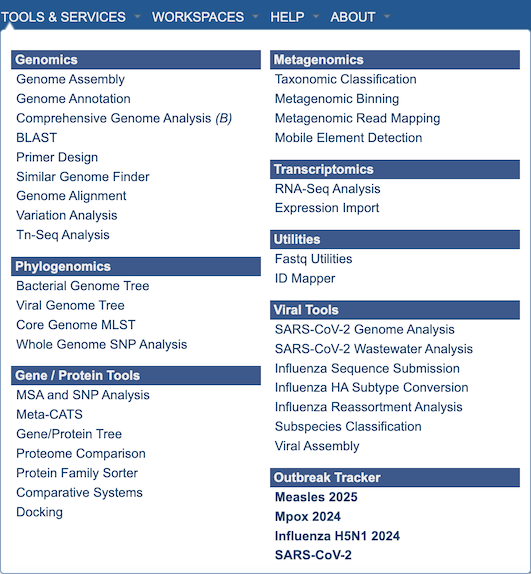

BV-BRC Quick Reference Guide

# Mobile Element Detection Service 

*Revised: April 9, 2026*

## Overview
The Mobile Element Detection service allows you to identify viruses and plasmids in nucleic acid datasets. The use cases for this pipeline are broad – from detecting novel viruses in complex wastewater samples, to identifying plasmids in isolate genomes. The core of the Mobile Element Detection service is [geNomad](https://portal.nersc.gov/genomad/index.html) which detects viruses and plasmids in assembled contigs. This pipeline can accept short reads or assembled contigs. If raw reads are provided, assembly can be carried out using any of the assembly methods in the [Genome Assembly Service](https://www.bv-brc.org/docs/tutorial/genome_assembly/assembly.html). The output of this pipeline is an assembled contigs file (if short reads are provided) and a tailored geNomad output which links identified viral and plasmid resources to BV-BRC databases. 

A detailed description of the geNomad workflow is provided in the [Mobile Element Detection Service Tutorial](../../../tutorial/mobile_element/mobile_element.html).

## See also
* [Mobile Element Detection Service](https://www.bv-brc.org/app/MobileElementDetection)
* [Mobile Element Detection Service Tutorial](../../../tutorial/mobile_element/mobile_element.html)

## Using the Mobile Element Detection Service
The **Mobile Element Detection** submenu option under the **Services** main menu (Metagenomics category) opens the service input form (*shown below*). *Note: You must be logged into BV-BRC to use this tool.*

## Options

## Input Configuration 
The service can accept either contigs (FASTA) or reads as input. If 'contigs' is selected, the input form appears as shown below. Select the file from the dropdown menu or navigate to find the file in your workspace using the folder icon.

 

If 'reads' is selected, the input form expands to appear as shown below, which adds the options for Genome Assembly (see [Genome Assembly Service Tutorial](https://www.bv-brc.org/docs/tutorial/genome_assembly/assembly.html)) for details on configuring the assembly.

 

## Output 
Select an output folder for the results of the service and provide a name for the job output results. 

## Buttons
**Reset:** Resets the input form to default settings. 
**Reset:** Launches the service , which, upon completion, displays a table below it 

## Output Results
 

The service produces several files and folders:

* **Analysis_Summary.html:** - Report summarizing the results of the service job. It has 2 overall sections, – displaying first contigs identified as viral, and then contigs identified as plasmids, describe below;

Contigs identified as viral are displayed as shown above, along with a number of details and links to annotations performed by other BV-BRC tools on those contigs. Details taken from geNomad – such as contigs length, GC%, status (virus, provirus) as well as geNomad assignment probability score and taxonomy, are displayed here. Also displayed are additional details of analysis carried out by BV-BRC. Phannotate annotations are carried out on identified viral sequences, and this links these identified viral contigs to BV-BRC databases – which can be accessed through the Genome ID column for each viral contig.

 
Contigs identified as plasmids are displayed as shown above, along with a number of details and links to annotations performed by other BV-BRC tools on those contigs Details are taken from geNomad such as contig length, GC%, topology and geNomad assignment probability score. Also displayed are additional details of analysis carried out by BV-BRC. RAST annotations are carried out on identified plasmid sequences, and this links these identified plasmid contigs to BV-BRC databases – which can be accessed through the Genome ID column for each plasmid contig.

* **[report name]-contigs_virus_summary.tsv:** - Tab-separated-value (TSV) file which cointains a sample-wide summary of all viral contigs identified.
* **[report name]-contigs_plasmid_summary.tsv:** - Tab-separated-value (TSV) file which cointains a sample-wide summary of all plasmid contigs identified.
* **Viral Annotation (folder)** - For each virus contig, provides a folder containing a single .fasta file, allowing direct download or manipulation for further analysis.
* **Plasmid Annotation (folder)** - For each plasmid contig, provides a folder containing a single .fasta file, allowing direct download or manipulation for further analysis.
