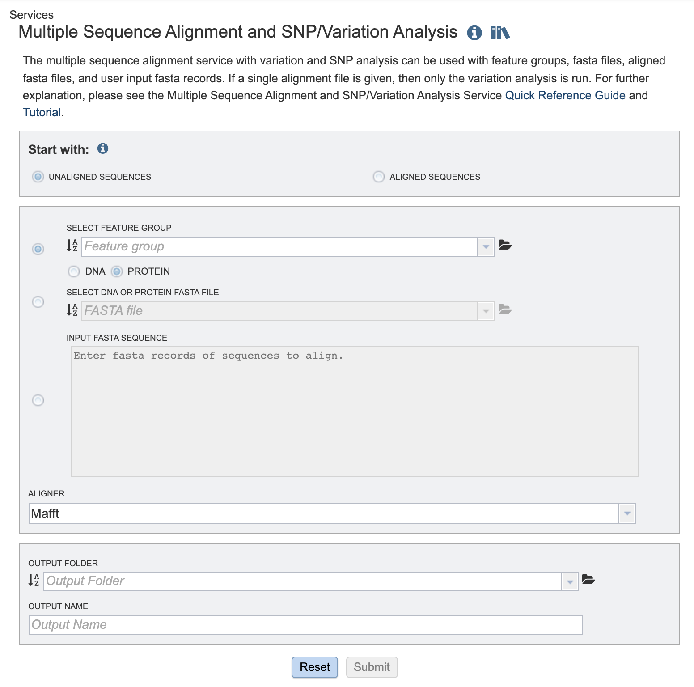

# Multiple Sequence Alignment and SNP/Variation Analysis Service

## Overview
The Multiple Sequence Alignment (MSA) and Single Nucleotide Polymorphism (SNP)/Variation Analysis Service allows users to choose an alignment algorithm to align sequences selected from: a search result, a FASTA file saved to the workspace, or through simply cutting and pasting. The service can also be used for variation and SNP analysis with feature groups, FASTA files, aligned FASTA files, and user input FASTA records. If a single alignment file is given, then only the variation analysis is run. If multiple inputs are given, the program concatenates all sequence records and aligns them. If a mixture of protein and nucleotides are given, then nucleotides are converted to proteins. 

### See also
* [MSA and SNP/Variation Analysis Service](https://beta.bv-brc.org/app/MSA)
* [MSA and SNP/Variation Analysis Service Tutorial](../msa_snp_variation.html)
* [Comparative Pathway Tool User Guide](../other/msa_viewer.html)

## Using the Multiple Sequence Alignment and Variation/SNP Analysis Service
The **Multiple Sequence Alignment** submenu option under the **"SERVICES"** main menu (Viral Services category) opens the MSA and SNP/Variation Service input form. *Note: You must be logged into BV-BRC to use this service.*

 

## Options

 

### Parameters
Aligner: The alignment algorithm that the user wishes to use. Options include Mafft [1,2], MUSCLE [3,4], and progressiveMauve [5]. 

**DNA/Protein:** This option allows the user to specify whether they are aligning nucleic acid or protein (amino acid) sequences). 

**Output Folder:** The workspace folder where results will be placed.

**Output Name:** A user-specified label. This name will appear in the workspace when the annotation job is complete.

**Fasta Text Input:** Users may enter custom sequences here by pasting in FASTA formatted sequences. 

## Optional Comparison Sequences
**Select DNA or Protein Fasta File:** Users may input a nucleic acid or protein FASTA file from their workspace or upload their own data here, either in addition to the FASTA text input, or as an alternative. 

**And/or Select Feature Group:** Users may input a nucleic acid or protein FASTA file containing a previously selected “Feature Group” (eg. CDS, tRNA etc.) from their workspace here, either in addition to the FASTA text input, or as an alternative.

**Or Select and Alignment File:** If users have previously aligned dataset, they may input their nucleic acid or protein MSA file in FASTA format from their workspace here, either in addition to the FASTA text input, or as an alternative.

**Selected Objects Table:** The user specified files and/or datasets designated for analysis by the MSA and variation/SNP analysis tool. 

## Buttons
 

**Reset:** Resets the input form to default values.

**Submit:** Launches the MSA job. A message will appear below the box to indicate that the job is now in the queue.

 

## Output Results
Clicking on the Jobs indicator at the bottom of the BV-BRC page open the Jobs Status page that displays all current and previous service jobs and their status.

 

Once the job has completed, selecting the job by clicking on it and clicking the “View” button on the green vertical Action Bar on the right-hand side of the page displays the results files (red box).

 

The results page will consist of a header describing the job and a list of output files, as shown below.

The MSA Service generates several files that are deposited in the Private Workspace in the designated Output Folder. These include:
  - **.afa** – the alignment file in fasta format.
  - **.consensus.fasta** – A consensus sequence, ie: the calculated order of most frequent residues (nucleotide or amino acid) in a sequence alignment. 
  - **.entropy.png** –  a PNG (portable network graphics) image file showing the entropy score plotted against the sequence position. 
  - **.entropy.svg** – a SVG (scalable vector graphics) image file showing the entropy score plotted against the sequence position.
  - **.snp.tsv** – A tab separated value file allowing users a tabular view of all nucleotide or amino acid variations found within their MSA.

## Action buttons
After selecting one of the output files by clicking it, a set of options becomes available in the vertical green Action Bar on the right side of the table. These include:
  - **Hide/Show:** Toggles (hides) the right-hand side Details Pane.
  - **Guide:** Links to the corresponding Quick Reference guide
  - **Download:** Downloads the selected item.
  - **MSA:** Displays the aligned FASTA directly on the BV-BRC site with the MSA viewer.  
  - **View:** Displays the content of the file, typically as plain text or rendered html, depending on filetype.
  - **Delete:** Deletes the file.
  - **Rename:** Allows renaming of the file.
  - **Copy:** Copies the selected items to the clipboard.
  - **Move:** Allows moving of the file to another folder.
  
More details are available in the [Action Buttons](../action_bar.html) Quick Reference.

## References
1.	 Katoh K., Misawa K., Kuma K., Miyata T. MAFFT: a novel method for rapid multiple sequence alignment based on fast Fourier transform. Nucleic Acids Res. 2002;30:3059–3066. 
2.	Katoh K, Rozewicki J, Yamada KD. MAFFT online service: multiple sequence alignment, interactive sequence choice and visualization. Brief Bioinform. 2019 Jul 19;20(4):1160-1166. doi: 10.1093/bib/bbx108. PMID: 28968734; PMCID: PMC6781576.
3.	Edgar, Robert C. (2004), MUSCLE: multiple sequence alignment with high accuracy and high throughput, Nucleic Acids Research 32(5), 1792-97. 
4.	Edgar, Robert C (2004), MUSCLE: a multiple sequence alignment method with reduced time and space complexity. BMC Bioinformatics, 5(1):113.
5.	Darling AE, Mau B, Perna NT (2010) progressiveMauve: Multiple Genome Alignment with Gene Gain, Loss and Rearrangement. PLoS ONE 5(6): e11147. https://doi.org/10.1371/journal.pone.0011147
