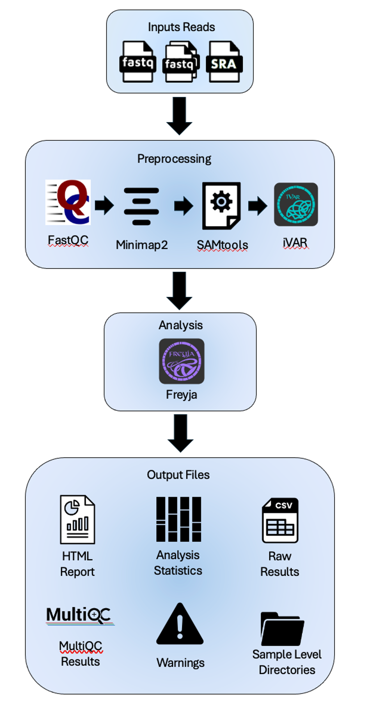
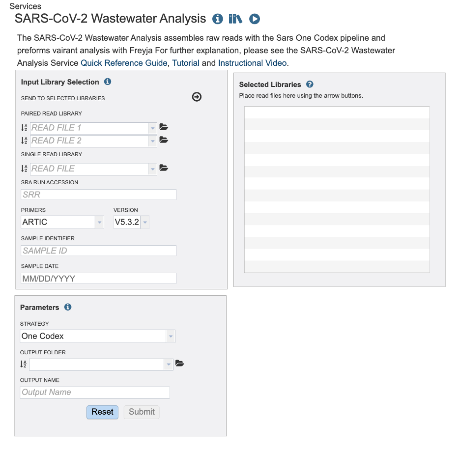
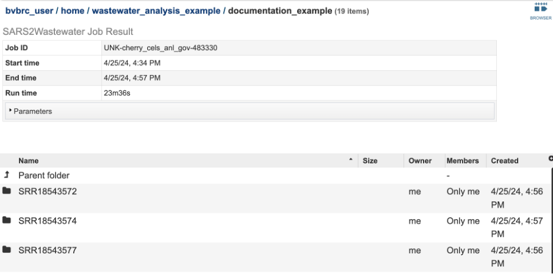

# SARS-Cov-2 Wastewater Analysis Service

## Overview
The SARS-CoV-2 Wastewater Analysis service is a comprehensive analysis of wastewater aimed at detecting and quantifying lineages and variants of concern (VOC) of the SARS-CoV-2 virus. 

The service accepts raw short amplicon reads from wastewater samples. The service analyzes reads by aligning them to the reference genome (Wuhan-Hu-1) and then analyzes the variants in the sample using [Freyja](https://andersen-lab.com/secrets/code/). Below is an overview of the service.

## See also
  * [SARSWastewater Service](https://bv-brc.org/app/SARSWastewater)
  * [SARSWastewater Service Tutorial](../../tutorial/sarswastewater/sarswastewater.html)

## Read Input File
This Service accepts read files uploaded to the workspace and SRA run accession values. This service is designed for short amplicon sequenced wastewater samples.

### Paired Read File
**Read File 1 & 2**: Many paired read libraries are given as file pairs, with each file containing half of each read pair. Paired read files are expected to be sorted such that each read in a pair occurs in the same Nth position as its mate in their respective files. These files are specified as READ FILE 1 and READ FILE 2. For a given file pair, the selection of which file is READ 1 and which is READ 2 does not matter.

### Single Read file 
**Read File**: The FASTQ file containing the reads.

### SRA Run Accession 
Allows direct upload of read files from the NCBI Sequence Read Archive to the Assembly Service. Entering the SRR accession number and clicking the arrow will add the file to the selected libraries box for use in the assembly.

### Primers / Version
Primer sequences play a crucial role in amplicon-based sequencing, a method used to analyze a specific region of DNA or RNA. These short, synthetic sequences of nucleotides are designed to bind (or anneal) to specific target sequences in the DNA that flank the region of interest. Once bound, primers initiate DNA amplification. The primers are specific to the target sequence. It is important to select the correct primer type and version so that the synthetic sequences can be removed from your sample.

### Sample Identifier 
The sample identifier Field will auto populate with the file name. Edit the field by clicking into the text box. The text entered to this the sample identifier fields will be used throughout the output files for the service. This documentation refers to this field as a sample id.

### Sample Date
Type the corresponding sample date if it is available to you. Take caution to format your date as Month, Day, Year, MM/DD/YYYY. You must type the “/” between Month and Day / Day and Year. For SRA samples the date may be available in the BioSample data.

## Selected Libraries
Reads placed here will be  submitted for analysis. You can review the metadata (sample id, primer information and date I given, by hovering over the ‘I’ icon. Notice the Sample ID and Date fields clear once samples are submitted to the selected libraries. The primer field remains the same. Take caution you are uploading reads with different primer sequences.

## Parameters

### Strategy
Currently there is only one strategy for this service.  The raw reads are aligned to the reference genome (Wuhan-Hu-1, NC_045512) with Minimap2 with MiniMap2  2]. Then SAMtools [3] converts the aligned FASTQs into BAM files. SAMtools [3] also sorts the aligned BAM files by the leftmost coordinates. Then the primers and low-quality sequences are trimmed by iVAR [4].  FastQC [5] offers a range of quality assessments for the raw FASTQ files, as well as the aligned and sorted BAM files.  

### Output Folder
Navigate the workspace to or create the directory for the results.

### Output Name 
The text entered here will be used to create the job results directory.

## Output Results
The following results are available in the landing directory on the results page:
*	SARS2Wastewater_report.html
*	Freyja_result.tsv - The relative variant and lineage abundances created from VARIANTS and DEPTHS files using the Freyja “demix” command. The file Freyja_result.tsv has these results from each sample compiled into one report. The columns are as follows:
    o	Summarized – Describes the variants and the percentage of the assigned to those variants in the sample.
    o	Lineages - Describes the variants and the percentage of the assigned to those variants in the sample.
    o	Abundances - The corresponding abundance estimate.
    o	Resid – Corresponds to the residual of the weighted abundances.
    o	Coverage – Provides the 10x coverage estimate (percent of sites with 10 or greater reads.
*	Job_stats.tsv - The table below tracks the progress of each sample through three main stages of analysis workflow: aligning the reads and variant calling, Freyja - Analysis, and Freyja - Visualization. If a sample is labeled as incomplete for any of the stages, please refer to the assembly and alignment statistics table in the SARS2Wastewater_report.html or the warnings at the end of the report.
*	Multiqc_report.html – An interactive report with the FastQC results and SAMtools flagstats compiled into one location.
*	Plots directory – A directory with the Freyja plots. The depth plots are available for download inside the report just right click on the image and save.
*	Sample_key.csv - An Excel compatible file displaying the user input SAMPLE IDENTIFIER used in the output files and the user input fille name.
*	Version_log.txt

### Sample level directories
The files that are generated to prepare the items in the landing directory are available in the sample level directories. This includes:
*	Assembly
    * <sample_id>.align - The consensus alignment of the reads against their template. This file also shows the 
    * <sample_id>.depth - Depth of support based on the reads at each position of the reference.
    * <sample_id>.png - Graph that shows the coverage depth for the assembly at the specific positions in the genome.
    * <sample_id>.detail.png - Graph that shows the same data as the <sample_id>.png capped at 250 also shown in the SARS2Wastewater Report.
    * <sample_id>.log.png - Graph that shows the same data as the <sample_id>.png where the depth has undergone a long transformation.
    * <sample_id>.fasta – The nucleotide sequence of the contig. Note: wastewater consensus sequences generated from this workflow are likely to contain a mixture of variants.
    * <sample_id>.ivar.bam – A bam file trimmed by iVar [4]. iVar [4] uses primer positions supplied in a BED file to soft clip primer sequences from an aligned and sorted BAM file. Following this, the reads are trimmed based on a quality threshold. We use the default threshold of 20. 
    * <sample_id>.ivar.fa - The nucleotide sequence of the contig after soft clipping by iVar [4]. Note: wastewater consensus sequences generated from this workflow are likely to contain a mixture of variants.
    * <sample_id>.ivar.qual.txt – This file contains the sequences that were removed by iVar.
    * <sample_id>.pileup – The results from SAMtools [3] pileup command. The TAB-separated lines, with each line representing the pileup of reads at a single genomic position.
    * <sample_id>.pileup.gz – The <sample_id>.pileup file compressed.
    * <sample_id>.primer-trim-tbl – A tab delaminated file where each row has the name of the primer and number of reads that had that primer.
    * <sample_id>.primer-trim.txt – Details about the primer trimming.
    * <sample_id>.sorted.bam – This is the same data as the other bam files but after alignment to the Wuhan-hu-1 reference genome. This file is given to Freyja and displayed on the genome browser.
    * <sample_id>.sorted.bam.bai  - This is the companion file to <sample_id>.sorted.bam and contains the index.
    * <sample_id>.statistics.tsv – This is the raw table of statistics shown in the SARS-CoV2-Wastewater report.
    * <sample_id>.variants.tsv – This is the variant calling results in VCF format.
    * <sample_id>_flagstat.txt – These are the results from the SAMtools [3] flagstats command. For more information, please review their [documentation](https://www.htslib.org/doc/samtools-flagstat.html)
*	FastQC results are available for each of the files below. These results are compiled into the MultiQC report.
    * <sample_id>.ivar_fastqc.html
    * <sample_id>.sorted_ fastqc.html
    * <sample_id> _fastqc.html
*	Freyja
    * <sample_id>_freyja.depths – Created by the Freyja Variants command, this is Freyja’s version of a DEPTH file.
    * <sample_id> _freyja_results.tsv –

## References
1.	Wattam AR, Davis JJ, Assaf R, Boisvert S, Brettin T, Bun C, Conrad N, Dietrich EM, Disz T, Gabbard JL, et al. 2017. Improvements to PATRIC, the all-bacterial Bioinformatics Database and Analysis Resource Center. Nucleic Acids Res 45:D535-D542.
2.	Li, H., Minimap2: pairwise alignment for nucleotide sequences. Bioinformatics, 2018. 34(18): p. 3094-3100.
3.	Etherington, G.J., R.H. Ramirez-Gonzalez, and D. MacLean, bio-samtools 2: a package for analysis and visualization of sequence and alignment data with SAMtools in Ruby. Bioinformatics, 2015. 31(15): p. 2565-2567.
4.	Grubaugh, N.D., Gangavarapu, K., Quick, J. et al. An amplicon-based sequencing framework for accurately measuring intrahost virus diversity using PrimalSeq and iVar. Genome Biol 20, 8 (2019). https://doi.org/10.1186/s13059-018-1618-7
5.	Andrews, S. (2010). FastQC:  A Quality Control Tool for High Throughput Sequence Data [Online]. Available online at: http://www.bioinformatics.babraham.ac.uk/projects/fastqc/
6.	Karthikeyan, S., Levy, J.I., De Hoff, P. et al. Wastewater sequencing reveals early cryptic SARS-CoV-2 variant transmission. Nature 609, 101–108 (2022). https://doi.org/10.1038/s41586-022-05049-6

