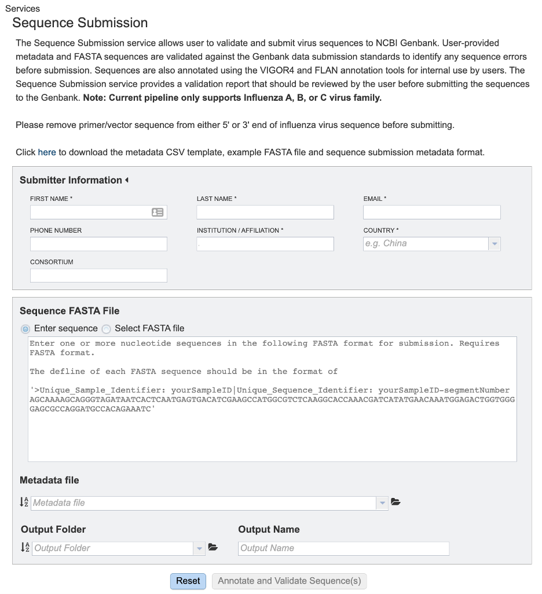
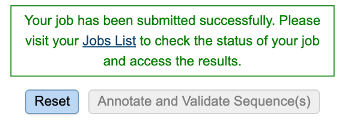
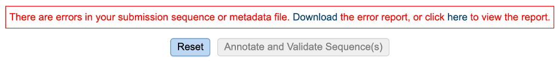
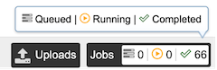
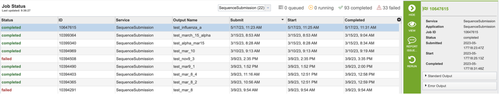
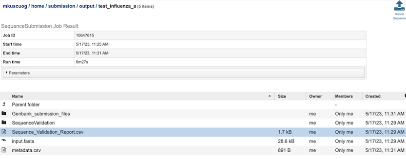
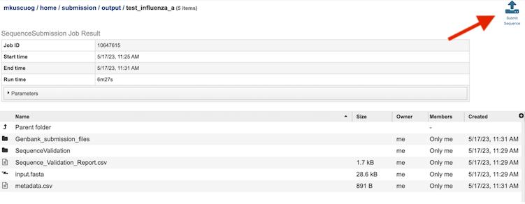

# Sequence Submission Service

*Revised February 22, 2024*

## Overview
The Sequence Submission service allows user to validate and submit virus sequences to NCBI Genbank. User-provided metadata and FASTA sequences are validated against the Genbank data submission standards to identify any sequence errors before submission. Sequences are also annotated using the VIGOR4 and FLAN annotation tools for internal use by users. The Sequence Submission service provides a validation report that should be reviewed by the user before submitting the sequences to the Genbank. 

Note: Current pipeline only supports Influenza A, B, or C virus family.

## See also
  * [Sequence Submission Service](https://bv-brc.org/app/SequenceSubmission)
  * [Sequence Submission Service Tutorial](/tutorial/sequence_submission/sequence_submission)

## Using the Sequence Submission Service

The **Seqeuence Submission** submenu option under the **"TOOLS & SERVICES"** main menu (Genomics category) opens the Sequence Submission Service input form. *Note: You must be logged into BV-BRC to use this service.*

 

## Parameters

Below is a screenshot of the Sequence Submission input form, as well as a summary of customizable parameters.  

 

## Submitter Information

**First Name:** The first name of the submitter (Required)

**Last Name:** The last name of the submitter (Required)

**Email:** The email id of the submitter (Required)

**Institution/Affiliation:** The institution/affiliation information of the submitter (Required)

**Country:** The country information of the submitter (Required)

**Phone Number:** The phone number of the submitter

**Consortium:** The consortium information of the submitter

## Sequence FASTA File

**Enter Sequence:** Paste the custom sequence in FASTA format.

**Select FASTA File:** Choose FASTA file that has been uploaded to the Workspace.

## Metadata File

Choose Metadata file (CSV Format) that has been uploaded to the Workspace.

## Output Folder

Folder in the Workspace where you want the results stored.

## Output Name

Name you provide to identify the results in the Workspace.

## Buttons

* **Reset:** Resets the input form to default values
* **Annotate and Validate Sequence(s):** 
  * Validates input data and launches the job if there is no error. A message will appear below the box to indicate that the job is now in the queue.

  * Validates input data and warns the user if there are error(s). A message will appear below the box to indicate that there are error(s).

## Output Results

Clicking on the Jobs indicator at the bottom of the BV-BRC page open the Jobs Status page that displays all current and previous service jobs and their status.

Once the job has completed, selecting the job by clicking on it and clicking the “View” button on the green vertical Action Bar on the right-hand side of the page displays the results files (red box).

## Results Page

The results page will consist of a header describing the job and a list of output files, as shown below.

The Sequence Submission Service generates several folders and files that are deposited in the Private Workspace in the designated Output Folder. These include:

* **input.fasta** - The fasta file that was submitted
* **metadata.csv** - A comma-separated file containing the metadata about the fasta
* **Sequence_Validation_Report.csv** - A comma separated value file of validation results for all the sequences allowing users to review segment, serotype, status and messages determined by VIGOR4 and FLAN for each sequence identifier
* **submission.xml** – an xml file for identifying the submission  
* **submission.zip** – a compressed file that includes all the required submission files 
* **submit.ready** - a submission ready flag for GenBank
* **.aln** - alignment of predicted protein(s) to reference, and reference protein to genome
* **.cds** - fasta file of predicted CDSs
* **.gff3** - lists all the features of the genome in General Feature Format (GFF3 is the most recent version of GFF)
* **.pep** - a fasta file of predicted proteins
* **.rpt** - a summary file of program results
* **.tbl** - predicted features in GenBank tbl format
* **.report** – a report file generated by FLAN

## Submission Button

Clicking the Submit Sequence button in the top right of the page to notify BV-BRC team for the submission is ready.

## Action Buttons

After selecting one of the output files by clicking it, a set of options becomes available in the vertical green Action Bar on the right side of the table. These include:
* **Hide/Show:** Toggles (hides) the right-hand side Details Pane.
* **Guide Link:** to the corresponding Quick Reference.
* **Download:** Downloads the selected item.
* **View:** Displays the content of the file, typically as plain text or rendered html, depending on filetype.
* **Delete:** Deletes the file.
* **Rename:** Allows renaming of the file.
* **Copy:** Copies the selected items to the clipboard.
* **Move:** Allows moving of the file to another folder.
