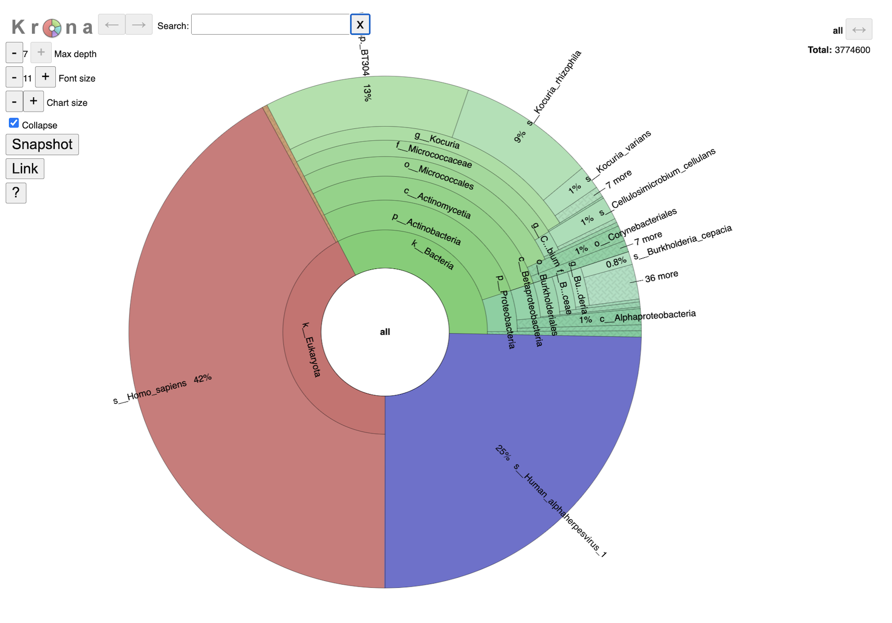
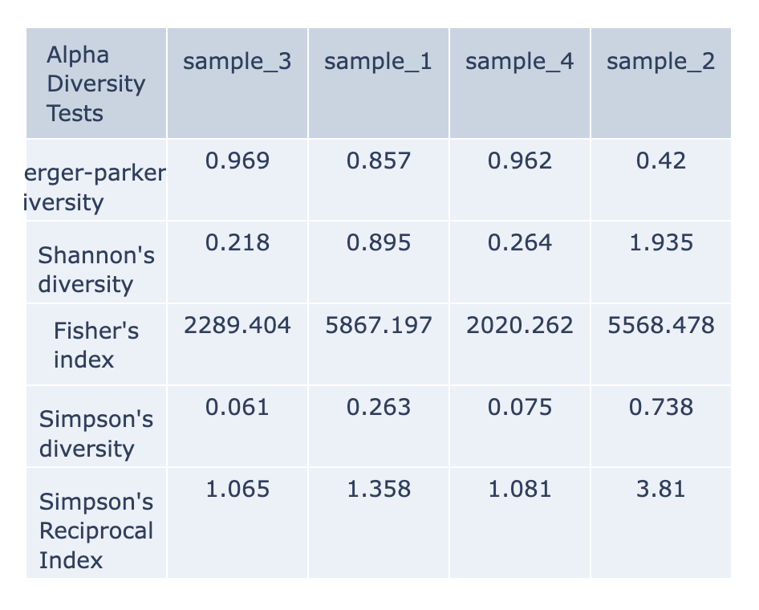
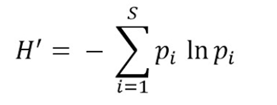
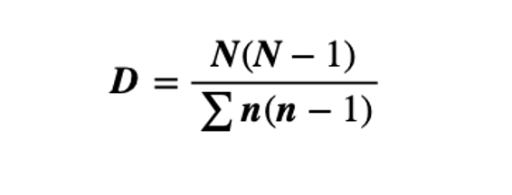

# Taxonomic Classification Service

## Overview
The Taxonomic Classification Service accepts reads or contigs from sequencing of a metagenomic sample and uses [Kraken 2](http://genomebiology.com/2014/15/3/R46) to assign the reads to taxonomic bins, providing an initial profile of the possible constituent organisms present in the sample.

### See also
 * [Taxonomic Classification Service](https://bv-brc.org/app/TaxonomicClassification)
 * [Taxonomic Classification Service Tutorial](../../tutorial/taxonomic_classification/taxonomic_classification.html)

/tutorial/taxonomic_classification/taxonomic_classification.html

## Using the Taxonomic Classification Service
The **Taxonomic Classification** submenu option under the **Services** main menu (Metagenomics category) opens the Taxonomic Classification input form (shown below). *Note: You must be logged into BV-BRC to use this service.*

## Options

## Input File
This service is designed to process short reads. This can be via single read files, paired read files or the SRA run accession. 

## Sample Identifiers
The SAMPLE IDENTIFIER Field will auto populate with the file name. Edit the field by clicking into the text box. The text entered to this the SAMPLE IDENTIFER fields will be used throughout the output files for the service. This documentation refers to this field as a sample id.
### Paired read library
**Read File 1 & 2:** Many paired read libraries are given as FASTQ file pairs, with each file containing half of each read pair. Paired read files are expected to be sorted such that each read in a pair occurs in the same Nth position as its mate in their respective files. These files are specified as READ FILE 1 and READ FILE 2. For a given file pair, the selection of which file is READ 1 and which is READ 2 does not matter.

### Single read library
**Read File:** The FASTQ file containing the reads.

### SRA run accession
Allows direct upload of read files from the [NCBI Sequence Read Archive](https://www.ncbi.nlm.nih.gov/sra) to the ervice. Entering the SRR accession number and clicking the arrow will add the file to the selected libraries box for use in the assembly.

## Selected libraries
Read files placed here will be submited to the service.

## Parameters

### Algorithm

 * [Kraken 2](http://genomebiology.com/2014/15/3/R46) - Assigns taxonomic labels to metagenomic DNA sequences using exact alignmnet of k-mers. [Kraken 2 source code](https://ccb.jhu.edu/software/kraken2/)

### Database
Reference taxonomic database used by the algorithm.

* [Kraken2 Standard Database](https://ccb.jhu.edu/software/kraken2/index.shtml?t=manual#standard-kraken-2-database) - Standard Kraken 2 database containing distinct 31-mers, based on completed microbial genomes from NCBI.
* [BV-BRC Database]( https://github.com/DerrickWood/kraken2/wiki/Manual#custom-databases) - The default Kraken 2 database at BV-BRC includes the following:

  * archaea: RefSeq complete archaeal genomes/proteins

  * bacteria: RefSeq complete bacterial genomes/proteins

  * plasmid: RefSeq plasmid nucleotide/protein sequences

  * viral: RefSeq complete viral genomes/proteins

  * human: GRCh38 human genome/proteins

  * fungi: RefSeq complete fungal genomes/proteins

  * plant: RefSeq complete plant genomes/proteins

  * protozoa: RefSeq complete protozoan genomes/proteins

  * UniVec: NCBI-supplied database of vector, adapter, linker, and primer sequences that may be contaminating sequencing projects and/or assemblies

### Output Folder
The workspace folder where results will be placed.

### Output Name
Name used to uniquely identify results.

## Output Results

The Taxonomic Classification Service generates several files that are deposited in the Private Workspace in the designated Output Folder.

### All Jobs Will Output
* **multiqc_report.html** - An interactive output report from [MultiQC]( https://multiqc.info/)
* **sample_key.csv** - An Excel compatible file displaying the user input SAMPLE IDENTIFIER used in the output files and the user input fille name.
* **SAMPLE IDENTIFIER_sankey.html** - A Sankey diagram for each sample named with sample identifier displays an overview of taxa at each domain level.

### Jobs With Multiple Samples Will Output
* **multi_sample_table** - An Excel compatible file of the data displayed in multisample_comparison.html
* **multisample_comparison.html** - An interactive chart displaying z-scores across multiple samples with heatmap style coloring.
* **multisample_krona.html** - Link to [Krona](https://www.ncbi.nlm.nih.gov/pmc/articles/PMC3190407/)-based interactive chart showing the taxonomic classification distribution for every sample in the analysis.
* **summary_table.csv** An Excel compatible file with the Kraken2 summary statistics for each sample.

### Microbiome Analysis Jobs Will Output
* **alpha_diversity.csv** - An Excel compatible file of the data displayed in alpha_diversity.html
* **alpha_diversity.html** - A data table with the alpha diversity (Berger-parker, Shannon, Fisher's index, Simpson, statistics Simpson's Reciprocal Index) for each sample.
* **beta_diversity.csv** - An Excel compatible file of the data displayed in beta_stats_heatmap.html
* **beta_stats_heatmap.html** - A heatmap with diversity statistics between each sample

### Krona Chart and Multiple Sample Krona

This interactive chart provides a visual representation of the reads mapping to each taxon. Clicking on a taxon within the pie chart will provide a summary of the reads mapping to that specific selection on the upper right corner. Double clicking with a section will open that specific section to view. It is possible to change the maximum depth, font size and chart size by clicking the plus and minus buttons. Clicking the colapse check box will detemrine if you show every taxa level that is currently selected. The sanpshot button will capture an image of the krona plot at the current.

Single sample Krona plots are available in the sample level directories. Multisample Krona plots are available in the landing page for the job. Navigating the multisample Krona plot is the same as navigating an indvidual Krona plot. To toggle between samples select the SAMPLE ID.b.krona in the box below the Krona logo. This is the name of the file used to create the plot. Thes start of the file name will be the SAMPLE ID.

### MultiQC Report

will display a compilation of sample results from FastQC and Kraken2 into one place. If you are new to MultiQC, an introductory video walkthrough is available above General Statistics. Use the toolbox to interact with the contents of the report.

### Sample Key
 

### Sankey Diagram

This is another interactive view of the taxa across every domain level at the same time. The key to reading and interpreting Sankey Diagrams is remembering that the width is proportional to the quantity represented. If features are overlapping, click and drag bars up and down. Specifically, the archaea feature may populate over the sample name. Simply click and drag down to view. 

### Multiple Sample Comparison

The goal of this table is to identify which microbes are unique within each sample and which are common among all samples. When intpreting this table it is important to consider the if a value is positive or negative, the mangitude of the value and the color of the value calculated from from the Kraken2 report. 

The robust z-score is the median absolute deviation. This method is chosen to reduce impact from outliers in the data, providing a more reliable measure of relative position within the data distribution. 

If the positive robust z-score indicates that t the number of fragments assigned to that taxa was above the median or central tendancy of the data. 

Conversly, a negitive robust z-score indicates that the number of fragments assigned to that taxa was below the median or central tendancy of the data. 

The magnitude (represented as the value of the z-score) indicates the distance of the data point from the central tendency in terms of the robust measure of dispersion. 

The intensity of the red for each cell is calculated by putting the read scores into quantiles probabilites ranging from 0.05 to 0.95 with an increment of 0.05. This means that the intensity of the color represents the relative position in the datasets disribution for that datapoint. A darker color indicates that value is more likely to be an outlier.

### Alpha Diversity

Alpha-diversity is measured as the observed richness (number of taxa) or evenness (the relative abundances of those taxa) of an average sample within one sample. (Anderson et al., 2006) These are calculated with the [KrakenTools](https://ccb.jhu.edu/software/krakentools/) alpha_diversity.py script. Each column of the table displays one sample at each alpha diversity level. Alpha results are available for individual samples at the sample level directory. The data displayed in the .HTML file is also available as .CSV

  
Shannon's diversity index quantifies the uncertainty in predicting the species identity of an individual that is taken at random from the dataset. ACE Index. (Shannon, 1948)

 
Berger-Parker’s The Berger-Parker index (Berger and Parker 1970) expresses the proportional importance of the most abundant type. This metric is highly biased by sample size and richness, moreover it does not make use of all the information available from sample. (Berger & Parker, 1970)

 
Simpson’s index is a measure of diversity which takes into account the number of species present, as well as the relative abundance of each species. As species richness and evenness increase, so diversity increases. (Simpson, 1949). The Simpson-based metrics are that they do not tend to be as affected by sampling effort as the Shannon’s index. 

 
Inverse Simpson’s: Simpson’s reciprocal index quantifies biodiversity by taking into account the richness and evenness. The greater the biodiversity in an area, the higher the value of D. The lowest possible defined value of D is 1and would occur if the
community contained only one species. The maximum value would occur if there
was perfect evenness and would be equal to the number of species.
(Simpson, 1949)

 
Fisher’s represented the first attempt to describe mathematically the relationship between the number of species and the number of individuals in those species. This index is most applicable when a sample has a small number of abundant species and the large proportion of 'rare' species (the class containing one individual is always the largest) predicted by the log series model. (Fisher et al., 1943)

### Beta Diversity Heatmap
Beta-diversity is quantified as the variability in community composition (the identity of taxa observed) between samples within a group of samples (Anderson et al., 2006). The data displayed in the .HTML file is also available as .CSV
 
 

Beta diversity is calculated with the [KrakenTools](https://ccb.jhu.edu/software/krakentools/) beta_diversity.py script to compute the Bray-Curtis dissimilarity matrix for pairwise dissimilalarities among three mircrobiome asmples. In this matrix, a 0 means the two samples were exactly the same and a 1 means they are maximally divergent. (Bray & Curtis, 1957).

### Action buttons
After selecting one of the output files by clicking it, a set of options becomes available in the vertical green Action Bar on the right side of the table. These include

* **Hide/Show:** Toggles (hides) the right-hand side Details Pane.
* **Guide** Link to the corresponding Quick Reference Guide.
* **Download:** Downloads the selected item.
* **View** Displays the content of the file, typically as plain text or rendered html, depending on filetype.
* **Delete** Deletes the file.
* **Rename** Allows renaming of the file.
* **Copy:** Copies the selected items to the clipboard.
* **Move** Allows moving of the file to another folder.

More details are available in the [Action Bar](../action_bar.html) Quick Reference Guide.

## References
 * Anderson MJ, Ellingsen KE, McArdle BH. Multivariate dispersion as a measure of beta diversity. Ecol Lett. 2006. June;9(6):683–93. 10.1111/j.1461-0248.2006.00926.
 * Andrews, S. (2010). FastQC:  A Quality Control Tool for High Throughput Sequence Data [Online]. Available online at: http://www.bioinformatics.babraham.ac.uk/projects/fastqc/
 * Breitwieser FP, Salzberg SL. Pavian: interactive analysis of metagenomics data for microbiome studies and pathogen identification. Bioinformatics. 2020 Feb 15;36(4):1303-1304. doi: 10.1093/bioinformatics/btz715. PMID: 31553437; PMCID: PMC8215911.
 * Ewels, P., Magnusson, M., Lundin, S., &amp; Käller, M. (2016). MultiQC: Summarize analysis results for multiple tools and samples in a single report. Bioinformatics, 32(19), 3047–3048. https://doi.org/10.1093/bioinformatics/btw354 
 * Fisher, R. A., Corbet, A. S. & Williams, C. B. The relation between the number of species and the number of individuals in a random sample of an animal population. J. Anim. Ecol. 12, 42–58 (1943)
 * Kim, D., Langmead, B., & Salzberg, S.L. (2015). HISAT: A afstq spliced aligner with low memory requirements. Nature Methods, 12(4), 357-360. https://doi.org/10.1038/nmeth.3317
 * Lu, J. & Salzberg, S. L. Ultrafast and accurate 16S rRNA microbial community analysis using Kraken 2. Microbiome 8, 1-11 (2020).
 * Lu, J., Rincon, N., Wood, D. E., Breitwieser, F. P., Pockrandt, C., Langmead, B., Salzberg, S. L., &amp; Steinegger, M. (2022). Metagenome analysis using the Kraken Software Suite. Nature Protocols, 17(12), 2815–2839. https://doi.org/10.1038/s41596-022-00738-y 
 * Maidak, Bonnie L., et al. "The RDP (ribosomal database project)." Nucleic acids research 25.1 (1997): 109-110.
 * Ondov BD, Bergman NH, and Phillippy AM. Interactive metagenomic visualization in a Web browser. BMC Bioinformatics. 2011 Sep 30; 12(1):385.
 * Wood DE, Salzberg SL: Kraken: ultrafast metagenomic sequence classification using exact alignments. Genome Biology 2014, 15:R46.
 * Shannon, C. E. A mathematical theory of communication. Bell Syst. Tech. J. 27, 379–423 (1948).
 * Simpson, E. H. Measurement of diversity. Nature 163, 688–688 (1949)
 * Yilmaz P, Parfrey LW, Yarza P, Gerken J, Pruesse E, Quast C, Schweer T, Peplies J, Ludwig W, Glöckner FO. The SILVA and “All-species Living Tree Project (LTP)” taxonomic frameworks. Nucleic Acids Res. 2014; 42(Database issue):643–8.
 
 
